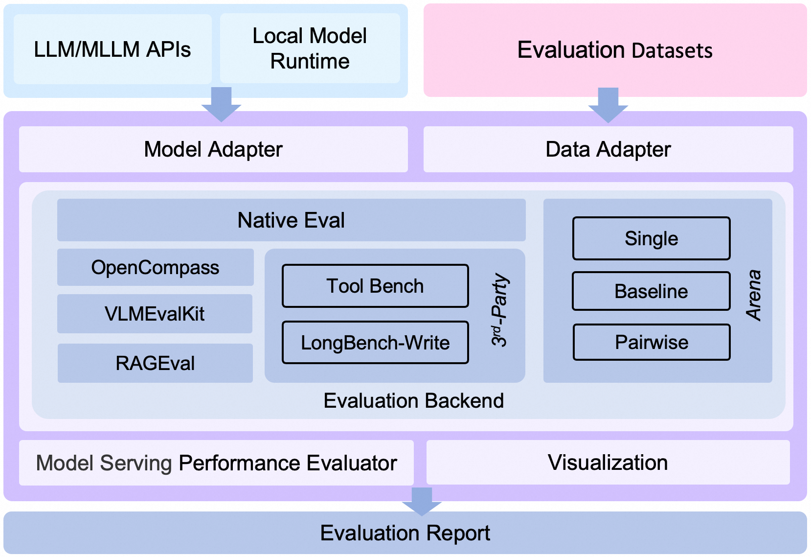
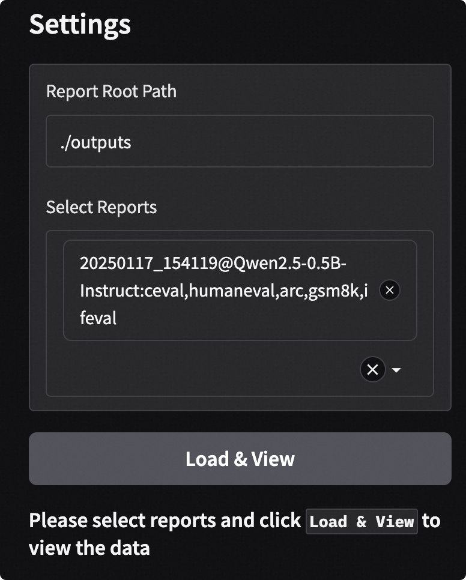
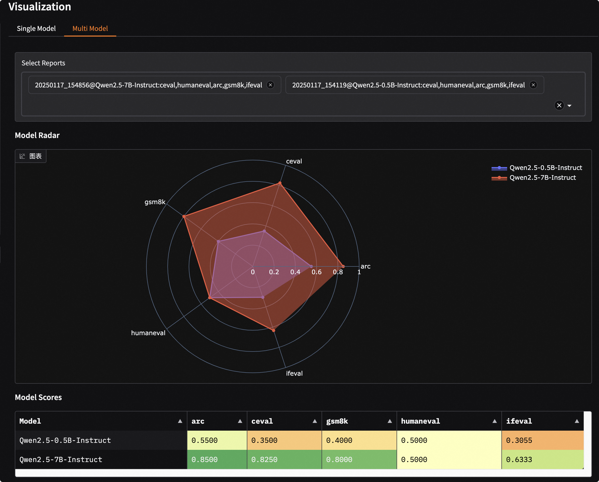
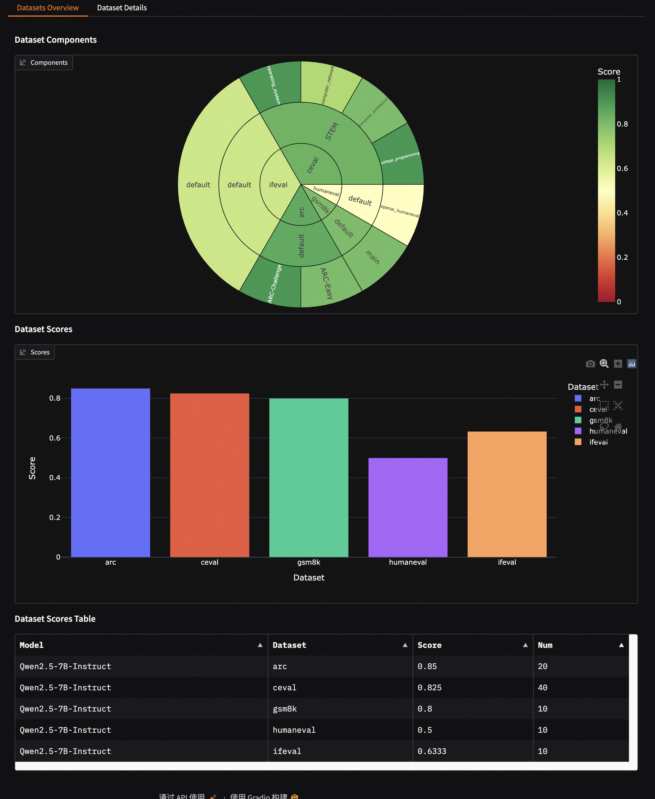
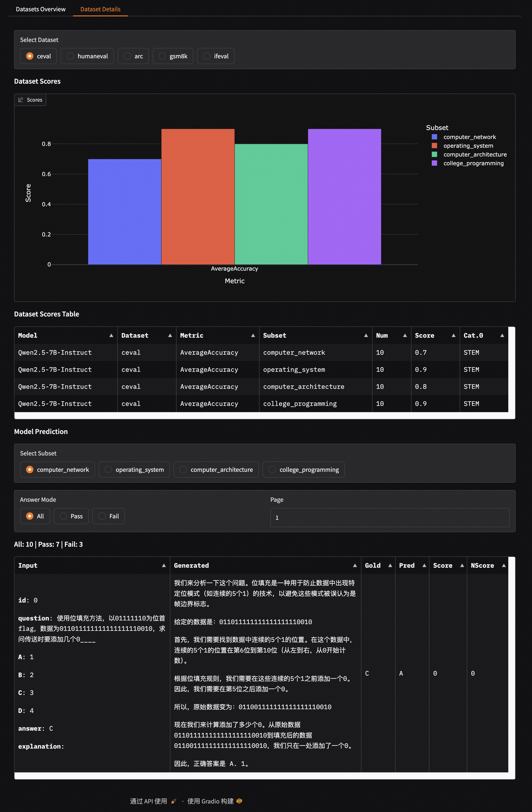
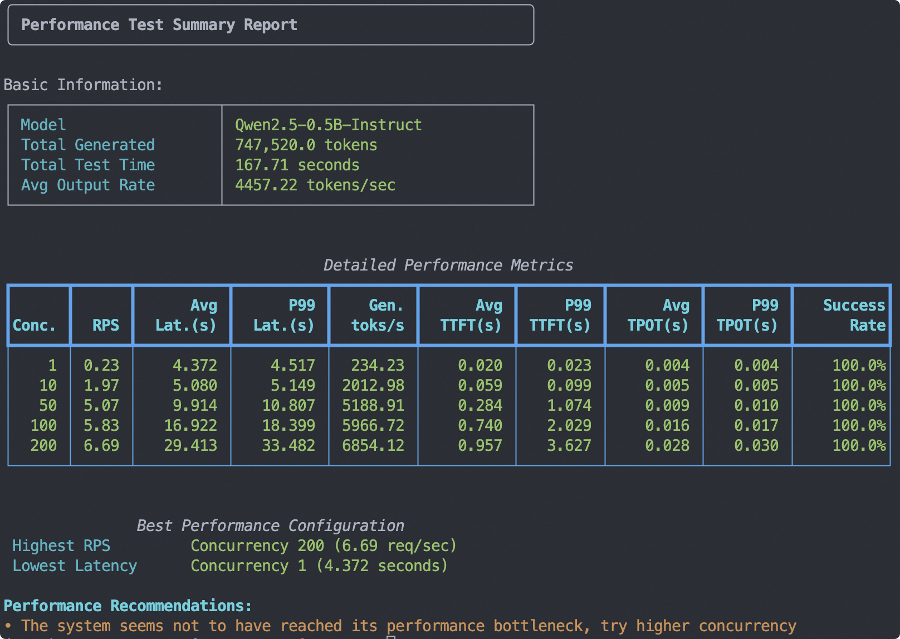

<p align="center">
    <br>
    
    <br>
<p>


<p align="center">
  <a href="README_zh.md">中文</a> &nbsp ｜ &nbsp English &nbsp
</p>

<p align="center">

<a href="https://badge.fury.io/py/evalscope"></a>
<a href="https://pypi.org/project/evalscope"></a>
<a href="https://github.com/modelscope/evalscope/pulls"></a>
<a href='https://evalscope.readthedocs.io/en/latest/?badge=latest'></a>
<p>

<p align="center">
<a href="https://evalscope.readthedocs.io/zh-cn/latest/"> 📖  中文文档</a> &nbsp ｜ &nbsp <a href="https://evalscope.readthedocs.io/en/latest/"> 📖  English Documents</a>
<p>

> ⭐ If you like this project, please click the "Star" button at the top right to support us. Your support is our motivation to keep going!

## 📋 Contents
- [📋 Contents](#-contents)
- [📝 Introduction](#-introduction)
- [☎ User Groups](#-user-groups)
- [🎉 News](#-news)
- [🛠️ Installation](#️-installation)
  - [Method 1: Install Using pip](#method-1-install-using-pip)
  - [Method 2: Install from Source](#method-2-install-from-source)
- [🚀 Quick Start](#-quick-start)
  - [Method 1. Using Command Line](#method-1-using-command-line)
  - [Method 2. Using Python Code](#method-2-using-python-code)
  - [Basic Parameter](#basic-parameter)
  - [Output Results](#output-results)
- [📈 Visualization of Evaluation Results](#-visualization-of-evaluation-results)
- [🌐 Evaluation of Specified Model API](#-evaluation-of-specified-model-api)
- [⚙️ Custom Parameter Evaluation](#️-custom-parameter-evaluation)
  - [Parameter](#parameter)
- [Evaluation Backend](#evaluation-backend)
- [📈 Model Serving Performance Evaluation](#-model-serving-performance-evaluation)
- [🖊️ Custom Dataset Evaluation](#️-custom-dataset-evaluation)
- [🏟️ Arena Mode](#️-arena-mode)
- [👷‍♂️ Contribution](#️-contribution)
- [🔜 Roadmap](#-roadmap)
- [Star History](#star-history)


## 📝 Introduction

EvalScope is a comprehensive model evaluation and performance benchmarking framework meticulously crafted by the [ModelScope Community](https://modelscope.cn/), offering a one-stop solution for your model assessment needs. Regardless of the type of model you are developing, EvalScope is equipped to cater to your requirements:

- 🧠 Large Language Models
- 🎨 Multimodal Models
- 🔍 Embedding Models
- 🏆 Reranker Models
- 🖼️ CLIP Models
- 🎭 AIGC Models (Image-to-Text/Video)
- ...and more!

EvalScope is not merely an evaluation tool; it is a valuable ally in your model optimization journey:

- 🏅 Equipped with multiple industry-recognized benchmarks and evaluation metrics: MMLU, CMMLU, C-Eval, GSM8K, etc.
- 📊 Model inference performance stress testing: Ensuring your model excels in real-world applications.
- 🚀 Seamless integration with the [ms-swift](https://github.com/modelscope/ms-swift) training framework, enabling one-click evaluations and providing full-chain support from training to assessment for your model development.

Below is the overall architecture diagram of EvalScope:

<p align="center">
  
  <br>EvalScope Framework.
</p>

<details><summary>Framework Description</summary>

The architecture includes the following modules:
1. **Model Adapter**: The model adapter is used to convert the outputs of specific models into the format required by the framework, supporting both API call models and locally run models.
2. **Data Adapter**: The data adapter is responsible for converting and processing input data to meet various evaluation needs and formats.
3. **Evaluation Backend**:
    - **Native**: EvalScope’s own **default evaluation framework**, supporting various evaluation modes, including single model evaluation, arena mode, baseline model comparison mode, etc.
    - **OpenCompass**: Supports [OpenCompass](https://github.com/open-compass/opencompass) as the evaluation backend, providing advanced encapsulation and task simplification, allowing you to submit tasks for evaluation more easily.
    - **VLMEvalKit**: Supports [VLMEvalKit](https://github.com/open-compass/VLMEvalKit) as the evaluation backend, enabling easy initiation of multi-modal evaluation tasks, supporting various multi-modal models and datasets.
    - **RAGEval**: Supports RAG evaluation, supporting independent evaluation of embedding models and rerankers using [MTEB/CMTEB](https://evalscope.readthedocs.io/en/latest/user_guides/backend/rageval_backend/mteb.html), as well as end-to-end evaluation using [RAGAS](https://evalscope.readthedocs.io/en/latest/user_guides/backend/rageval_backend/ragas.html).
    - **ThirdParty**: Other third-party evaluation tasks, such as ToolBench.
4. **Performance Evaluator**: Model performance evaluation, responsible for measuring model inference service performance, including performance testing, stress testing, performance report generation, and visualization.
5. **Evaluation Report**: The final generated evaluation report summarizes the model's performance, which can be used for decision-making and further model optimization.
6. **Visualization**: Visualization results help users intuitively understand evaluation results, facilitating analysis and comparison of different model performances.

</details>

## ☎ User Groups

Please scan the QR code below to join our community groups:

[Discord Group](https://discord.com/invite/D27yfEFVz5)              |  WeChat Group | DingTalk Group
:-------------------------:|:-------------------------:|:-------------------------:
  |   | 


## 🎉 News

- 🔥 **[2025.06.02]** Added support for the Needle-in-a-Haystack test. Simply specify `needle_haystack` to conduct the test, and a corresponding heatmap will be generated in the `outputs/reports` folder, providing a visual representation of the model's performance. Refer to the [documentation](https://evalscope.readthedocs.io/en/latest/third_party/needle_haystack.html) for more details.
- 🔥 **[2025.05.29]** Added support for two long document evaluation benchmarks: [DocMath](https://modelscope.cn/datasets/yale-nlp/DocMath-Eval/summary) and [FRAMES](https://modelscope.cn/datasets/iic/frames/summary). For usage guidelines, please refer to the [documentation](https://evalscope.readthedocs.io/en/latest/get_started/supported_dataset.html).
- 🔥 **[2025.05.16]** Model service performance stress testing now supports setting various levels of concurrency and outputs a performance test report. [Reference example](https://evalscope.readthedocs.io/en/latest/user_guides/stress_test/quick_start.html#id3).
- 🔥 **[2025.05.13]** Added support for the [ToolBench-Static](https://modelscope.cn/datasets/AI-ModelScope/ToolBench-Static) dataset to evaluate model's tool-calling capabilities. Refer to the [documentation](https://evalscope.readthedocs.io/en/latest/third_party/toolbench.html) for usage instructions. Also added support for the [DROP](https://modelscope.cn/datasets/AI-ModelScope/DROP/dataPeview) and [Winogrande](https://modelscope.cn/datasets/AI-ModelScope/winogrande_val) benchmarks to assess the reasoning capabilities of models.
- 🔥 **[2025.04.29]** Added Qwen3 Evaluation Best Practices, [welcome to read 📖](https://evalscope.readthedocs.io/en/latest/best_practice/qwen3.html)
- 🔥 **[2025.04.27]** Support for text-to-image evaluation: Supports 8 metrics including MPS, HPSv2.1Score, etc., and evaluation benchmarks such as EvalMuse, GenAI-Bench. Refer to the [user documentation](https://evalscope.readthedocs.io/en/latest/user_guides/aigc/t2i.html) for more details.
- 🔥 **[2025.04.10]** Model service stress testing tool now supports the `/v1/completions` endpoint (the default endpoint for vLLM benchmarking)
- 🔥 **[2025.04.08]** Support for evaluating embedding model services compatible with the OpenAI API has been added. For more details, check the [user guide](https://evalscope.readthedocs.io/en/latest/user_guides/backend/rageval_backend/mteb.html#configure-evaluation-parameters).
- 🔥 **[2025.03.27]** Added support for [AlpacaEval](https://www.modelscope.cn/datasets/AI-ModelScope/alpaca_eval/dataPeview) and [ArenaHard](https://modelscope.cn/datasets/AI-ModelScope/arena-hard-auto-v0.1/summary) evaluation benchmarks. For usage notes, please refer to the [documentation](https://evalscope.readthedocs.io/en/latest/get_started/supported_dataset.html)
- 🔥 **[2025.03.20]** The model inference service stress testing now supports generating prompts of specified length using random values. Refer to the [user guide](https://evalscope.readthedocs.io/en/latest/user_guides/stress_test/examples.html#using-the-random-dataset) for more details.
- 🔥 **[2025.03.13]** Added support for the [LiveCodeBench](https://www.modelscope.cn/datasets/AI-ModelScope/code_generation_lite/summary) code evaluation benchmark, which can be used by specifying `live_code_bench`. Supports evaluating QwQ-32B on LiveCodeBench, refer to the [best practices](https://evalscope.readthedocs.io/en/latest/best_practice/eval_qwq.html).
- 🔥 **[2025.03.11]** Added support for the [SimpleQA](https://modelscope.cn/datasets/AI-ModelScope/SimpleQA/summary) and [Chinese SimpleQA](https://modelscope.cn/datasets/AI-ModelScope/Chinese-SimpleQA/summary) evaluation benchmarks. These are used to assess the factual accuracy of models, and you can specify `simple_qa` and `chinese_simpleqa` for use. Support for specifying a judge model is also available. For more details, refer to the [relevant parameter documentation](https://evalscope.readthedocs.io/en/latest/get_started/parameters.html).
- 🔥 **[2025.03.07]** Added support for the [QwQ-32B](https://modelscope.cn/models/Qwen/QwQ-32B/summary) model, evaluate the model's reasoning ability and reasoning efficiency, refer to [📖 Best Practices for QwQ-32B Evaluation](https://evalscope.readthedocs.io/en/latest/best_practice/eval_qwq.html) for more details.
- 🔥 **[2025.03.04]** Added support for the [SuperGPQA](https://modelscope.cn/datasets/m-a-p/SuperGPQA/summary) dataset, which covers 13 categories, 72 first-level disciplines, and 285 second-level disciplines, totaling 26,529 questions. You can use it by specifying `super_gpqa`.
- 🔥 **[2025.03.03]** Added support for evaluating the IQ and EQ of models. Refer to [📖 Best Practices for IQ and EQ Evaluation](https://evalscope.readthedocs.io/en/latest/best_practice/iquiz.html) to find out how smart your AI is!
- 🔥 **[2025.02.27]** Added support for evaluating the reasoning efficiency of models. Refer to [📖 Best Practices for Evaluating Thinking Efficiency](https://evalscope.readthedocs.io/en/latest/best_practice/think_eval.html). This implementation is inspired by the works [Overthinking](https://doi.org/10.48550/arXiv.2412.21187) and [Underthinking](https://doi.org/10.48550/arXiv.2501.18585).
- 🔥 **[2025.02.25]** Added support for two model inference-related evaluation benchmarks: [MuSR](https://modelscope.cn/datasets/AI-ModelScope/MuSR) and [ProcessBench](https://www.modelscope.cn/datasets/Qwen/ProcessBench/summary). To use them, simply specify `musr` and `process_bench` respectively in the datasets parameter.
- 🔥 **[2025.02.18]** Supports the AIME25 dataset, which contains 15 questions (Grok3 scored 93 on this dataset).
- 🔥 **[2025.02.13]** Added support for evaluating DeepSeek distilled models, including AIME24, MATH-500, and GPQA-Diamond datasets，refer to [best practice](https://evalscope.readthedocs.io/en/latest/best_practice/deepseek_r1_distill.html); Added support for specifying the `eval_batch_size` parameter to accelerate model evaluation.
- 🔥 **[2025.01.20]** Support for visualizing evaluation results, including single model evaluation results and multi-model comparison, refer to the [📖 Visualizing Evaluation Results](https://evalscope.readthedocs.io/en/latest/get_started/visualization.html) for more details; Added [`iquiz`](https://modelscope.cn/datasets/AI-ModelScope/IQuiz/summary) evaluation example, evaluating the IQ and EQ of the model.
- 🔥 **[2025.01.07]** Native backend: Support for model API evaluation is now available. Refer to the [📖 Model API Evaluation Guide](https://evalscope.readthedocs.io/en/latest/get_started/basic_usage.html#api) for more details. Additionally, support for the `ifeval` evaluation benchmark has been added.
<details><summary>More</summary>

- 🔥🔥 **[2024.12.31]** Support for adding benchmark evaluations, refer to the [📖 Benchmark Evaluation Addition Guide](https://evalscope.readthedocs.io/en/latest/advanced_guides/add_benchmark.html); support for custom mixed dataset evaluations, allowing for more comprehensive model evaluations with less data, refer to the [📖 Mixed Dataset Evaluation Guide](https://evalscope.readthedocs.io/en/latest/advanced_guides/collection/index.html).
- 🔥 **[2024.12.13]** Model evaluation optimization: no need to pass the `--template-type` parameter anymore; supports starting evaluation with `evalscope eval --args`. Refer to the [📖 User Guide](https://evalscope.readthedocs.io/en/latest/get_started/basic_usage.html) for more details.
- 🔥 **[2024.11.26]** The model inference service performance evaluator has been completely refactored: it now supports local inference service startup and Speed Benchmark; asynchronous call error handling has been optimized. For more details, refer to the [📖 User Guide](https://evalscope.readthedocs.io/en/latest/user_guides/stress_test/index.html).
- 🔥 **[2024.10.31]** The best practice for evaluating Multimodal-RAG has been updated, please check the [📖 Blog](https://evalscope.readthedocs.io/zh-cn/latest/blog/RAG/multimodal_RAG.html#multimodal-rag) for more details.
- 🔥 **[2024.10.23]** Supports multimodal RAG evaluation, including the assessment of image-text retrieval using [CLIP_Benchmark](https://evalscope.readthedocs.io/en/latest/user_guides/backend/rageval_backend/clip_benchmark.html), and extends [RAGAS](https://evalscope.readthedocs.io/en/latest/user_guides/backend/rageval_backend/ragas.html) to support end-to-end multimodal metrics evaluation.
- 🔥 **[2024.10.8]** Support for RAG evaluation, including independent evaluation of embedding models and rerankers using [MTEB/CMTEB](https://evalscope.readthedocs.io/en/latest/user_guides/backend/rageval_backend/mteb.html), as well as end-to-end evaluation using [RAGAS](https://evalscope.readthedocs.io/en/latest/user_guides/backend/rageval_backend/ragas.html).
- 🔥 **[2024.09.18]** Our documentation has been updated to include a blog module, featuring some technical research and discussions related to evaluations. We invite you to [📖 read it](https://evalscope.readthedocs.io/en/refact_readme/blog/index.html).
- 🔥 **[2024.09.12]** Support for LongWriter evaluation, which supports 10,000+ word generation. You can use the benchmark [LongBench-Write](evalscope/third_party/longbench_write/README.md) to measure the long output quality as well as the output length.
- 🔥 **[2024.08.30]** Support for custom dataset evaluations, including text datasets and multimodal image-text datasets.
- 🔥 **[2024.08.20]** Updated the official documentation, including getting started guides, best practices, and FAQs. Feel free to [📖read it here](https://evalscope.readthedocs.io/en/latest/)!
- 🔥 **[2024.08.09]** Simplified the installation process, allowing for pypi installation of vlmeval dependencies; optimized the multimodal model evaluation experience, achieving up to 10x acceleration based on the OpenAI API evaluation chain.
- 🔥 **[2024.07.31]** Important change: The package name `llmuses` has been changed to `evalscope`. Please update your code accordingly.
- 🔥 **[2024.07.26]** Support for **VLMEvalKit** as a third-party evaluation framework to initiate multimodal model evaluation tasks.
- 🔥 **[2024.06.29]** Support for **OpenCompass** as a third-party evaluation framework, which we have encapsulated at a higher level, supporting pip installation and simplifying evaluation task configuration.
- 🔥 **[2024.06.13]** EvalScope seamlessly integrates with the fine-tuning framework SWIFT, providing full-chain support from LLM training to evaluation.
- 🔥 **[2024.06.13]** Integrated the Agent evaluation dataset ToolBench.

</details>

## 🛠️ Installation
### Method 1: Install Using pip
We recommend using conda to manage your environment and installing dependencies with pip:

1. Create a conda environment (optional)
    ```shell
    # It is recommended to use Python 3.10
    conda create -n evalscope python=3.10
    # Activate the conda environment
    conda activate evalscope
    ```

2. Install dependencies using pip
    ```shell
    pip install evalscope                # Install Native backend (default)
    # Additional options
    pip install 'evalscope[opencompass]'   # Install OpenCompass backend
    pip install 'evalscope[vlmeval]'       # Install VLMEvalKit backend
    pip install 'evalscope[rag]'           # Install RAGEval backend
    pip install 'evalscope[perf]'          # Install dependencies for the model performance testing module
    pip install 'evalscope[app]'           # Install dependencies for visualization
    pip install 'evalscope[all]'           # Install all backends (Native, OpenCompass, VLMEvalKit, RAGEval)
    ```

> [!WARNING]
> As the project has been renamed to `evalscope`, for versions `v0.4.3` or earlier, you can install using the following command:
> ```shell
> pip install llmuses<=0.4.3
> ```
> To import relevant dependencies using `llmuses`:
> ``` python
> from llmuses import ...
> ```

### Method 2: Install from Source
1. Download the source code
    ```shell
    git clone https://github.com/modelscope/evalscope.git
    ```

2. Install dependencies
    ```shell
    cd evalscope/
    pip install -e .                  # Install Native backend
    # Additional options
    pip install -e '.[opencompass]'   # Install OpenCompass backend
    pip install -e '.[vlmeval]'       # Install VLMEvalKit backend
    pip install -e '.[rag]'           # Install RAGEval backend
    pip install -e '.[perf]'          # Install Perf dependencies
    pip install -e '.[app]'           # Install visualization dependencies
    pip install -e '.[all]'           # Install all backends (Native, OpenCompass, VLMEvalKit, RAGEval)
    ```


## 🚀 Quick Start

To evaluate a model on specified datasets using default configurations, this framework supports two ways to initiate evaluation tasks: using the command line or using Python code.

### Method 1. Using Command Line

Execute the `eval` command in any directory:
```bash
evalscope eval \
 --model Qwen/Qwen2.5-0.5B-Instruct \
 --datasets gsm8k arc \
 --limit 5
```

### Method 2. Using Python Code

When using Python code for evaluation, you need to submit the evaluation task using the `run_task` function, passing a `TaskConfig` as a parameter. It can also be a Python dictionary, yaml file path, or json file path, for example:

**Using Python Dictionary**

```python
from evalscope.run import run_task

task_cfg = {
    'model': 'Qwen/Qwen2.5-0.5B-Instruct',
    'datasets': ['gsm8k', 'arc'],
    'limit': 5
}

run_task(task_cfg=task_cfg)
```

<details><summary>More Startup Methods</summary>

**Using `TaskConfig`**

```python
from evalscope.run import run_task
from evalscope.config import TaskConfig

task_cfg = TaskConfig(
    model='Qwen/Qwen2.5-0.5B-Instruct',
    datasets=['gsm8k', 'arc'],
    limit=5
)

run_task(task_cfg=task_cfg)
```

**Using `yaml` file**

`config.yaml`:
```yaml
model: Qwen/Qwen2.5-0.5B-Instruct
datasets:
  - gsm8k
  - arc
limit: 5
```

```python
from evalscope.run import run_task

run_task(task_cfg="config.yaml")
```

**Using `json` file**

`config.json`:
```json
{
    "model": "Qwen/Qwen2.5-0.5B-Instruct",
    "datasets": ["gsm8k", "arc"],
    "limit": 5
}
```

```python
from evalscope.run import run_task

run_task(task_cfg="config.json")
```
</details>

### Basic Parameter
- `--model`: Specifies the `model_id` of the model in [ModelScope](https://modelscope.cn/), which can be automatically downloaded, e.g., [Qwen/Qwen2.5-0.5B-Instruct](https://modelscope.cn/models/Qwen/Qwen2.5-0.5B-Instruct/summary); or use the local path of the model, e.g., `/path/to/model`
- `--datasets`: Dataset names, supports inputting multiple datasets separated by spaces. Datasets will be automatically downloaded from modelscope. For supported datasets, refer to the [Dataset List](https://evalscope.readthedocs.io/en/latest/get_started/supported_dataset.html)
- `--limit`: Maximum amount of evaluation data for each dataset. If not specified, it defaults to evaluating all data. Can be used for quick validation

### Output Results
```text
+-----------------------+----------------+-----------------+-----------------+---------------+-------+---------+
| Model Name            | Dataset Name   | Metric Name     | Category Name   | Subset Name   |   Num |   Score |
+=======================+================+=================+=================+===============+=======+=========+
| Qwen2.5-0.5B-Instruct | gsm8k          | AverageAccuracy | default         | main          |     5 |     0.4 |
+-----------------------+----------------+-----------------+-----------------+---------------+-------+---------+
| Qwen2.5-0.5B-Instruct | ai2_arc        | AverageAccuracy | default         | ARC-Easy      |     5 |     0.8 |
+-----------------------+----------------+-----------------+-----------------+---------------+-------+---------+
| Qwen2.5-0.5B-Instruct | ai2_arc        | AverageAccuracy | default         | ARC-Challenge |     5 |     0.4 |
+-----------------------+----------------+-----------------+-----------------+---------------+-------+---------+
```

## 📈 Visualization of Evaluation Results

1. Install the dependencies required for visualization, including gradio, plotly, etc.
```bash
pip install 'evalscope[app]'
```

2. Start the Visualization Service

Run the following command to start the visualization service.
```bash
evalscope app
```
You can access the visualization service in the browser if the following output appears.
```text
* Running on local URL:  http://127.0.0.1:7861

To create a public link, set `share=True` in `launch()`.
```

<table>
  <tr>
    <td style="text-align: center;">
      
      <p>Setting Interface</p>
    </td>
    <td style="text-align: center;">
      
      <p>Model Comparison</p>
    </td>
  </tr>
  <tr>
    <td style="text-align: center;">
      
      <p>Report Overview</p>
    </td>
    <td style="text-align: center;">
      
      <p>Report Details</p>
    </td>
  </tr>
</table>

For more details, refer to: [📖 Visualization of Evaluation Results](https://evalscope.readthedocs.io/en/latest/get_started/visualization.html)

## 🌐 Evaluation of Specified Model API

Specify the model API service address (api_url) and API Key (api_key) to evaluate the deployed model API service. In this case, the `eval-type` parameter must be specified as `service`, for example:

For example, to launch a model service using [vLLM](https://github.com/vllm-project/vllm):

```shell
export VLLM_USE_MODELSCOPE=True && python -m vllm.entrypoints.openai.api_server --model Qwen/Qwen2.5-0.5B-Instruct --served-model-name qwen2.5 --trust_remote_code --port 8801
```
Then, you can use the following command to evaluate the model API service:
```shell
evalscope eval \
 --model qwen2.5 \
 --api-url http://127.0.0.1:8801/v1 \
 --api-key EMPTY \
 --eval-type service \
 --datasets gsm8k \
 --limit 10
```

## ⚙️ Custom Parameter Evaluation

For more customized evaluations, such as customizing model parameters or dataset parameters, you can use the following command. The evaluation startup method is the same as simple evaluation. Below shows how to start the evaluation using the `eval` command:

```shell
evalscope eval \
 --model Qwen/Qwen3-0.6B \
 --model-args '{"revision": "master", "precision": "torch.float16", "device_map": "auto"}' \
 --generation-config '{"do_sample":true,"temperature":0.6,"max_new_tokens":512,"chat_template_kwargs":{"enable_thinking": false}}' \
 --dataset-args '{"gsm8k": {"few_shot_num": 0, "few_shot_random": false}}' \
 --datasets gsm8k \
 --limit 10
```

### Parameter Description
- `--model-args`: Model loading parameters, passed as a JSON string:
  - `revision`: Model version
  - `precision`: Model precision
  - `device_map`: Device allocation for the model
- `--generation-config`: Generation parameters, passed as a JSON string and parsed as a dictionary:
  - `do_sample`: Whether to use sampling
  - `temperature`: Generation temperature
  - `max_new_tokens`: Maximum length of generated tokens
  - `chat_template_kwargs`: Model inference template parameters
- `--dataset-args`: Settings for the evaluation dataset, passed as a JSON string where the key is the dataset name and the value is the parameters. Note that these need to correspond one-to-one with the values in the `--datasets` parameter:
  - `few_shot_num`: Number of few-shot examples
  - `few_shot_random`: Whether to randomly sample few-shot data; if not set, defaults to `true`

Reference: [Full Parameter Description](https://evalscope.readthedocs.io/en/latest/get_started/parameters.html)


## Evaluation Backend
EvalScope supports using third-party evaluation frameworks to initiate evaluation tasks, which we call Evaluation Backend. Currently supported Evaluation Backend includes:
- **Native**: EvalScope's own **default evaluation framework**, supporting various evaluation modes including single model evaluation, arena mode, and baseline model comparison mode.
- [OpenCompass](https://github.com/open-compass/opencompass): Initiate OpenCompass evaluation tasks through EvalScope. Lightweight, easy to customize, supports seamless integration with the LLM fine-tuning framework ms-swift. [📖 User Guide](https://evalscope.readthedocs.io/en/latest/user_guides/backend/opencompass_backend.html)
- [VLMEvalKit](https://github.com/open-compass/VLMEvalKit): Initiate VLMEvalKit multimodal evaluation tasks through EvalScope. Supports various multimodal models and datasets, and offers seamless integration with the LLM fine-tuning framework ms-swift. [📖 User Guide](https://evalscope.readthedocs.io/en/latest/user_guides/backend/vlmevalkit_backend.html)
- **RAGEval**: Initiate RAG evaluation tasks through EvalScope, supporting independent evaluation of embedding models and rerankers using [MTEB/CMTEB](https://evalscope.readthedocs.io/en/latest/user_guides/backend/rageval_backend/mteb.html), as well as end-to-end evaluation using [RAGAS](https://evalscope.readthedocs.io/en/latest/user_guides/backend/rageval_backend/ragas.html): [📖 User Guide](https://evalscope.readthedocs.io/en/latest/user_guides/backend/rageval_backend/index.html)
- **ThirdParty**: Third-party evaluation tasks, such as [ToolBench](https://evalscope.readthedocs.io/en/latest/third_party/toolbench.html) and [LongBench-Write](https://evalscope.readthedocs.io/en/latest/third_party/longwriter.html).


## 📈 Model Serving Performance Evaluation
A stress testing tool focused on large language models, which can be customized to support various dataset formats and different API protocol formats.

Reference: Performance Testing [📖 User Guide](https://evalscope.readthedocs.io/en/latest/user_guides/stress_test/index.html)

**Output example**




**Supports wandb for recording results**


**Supports swanlab for recording results**


**Supports Speed Benchmark**

It supports speed testing and provides speed benchmarks similar to those found in the [official Qwen](https://qwen.readthedocs.io/en/latest/benchmark/speed_benchmark.html) reports:

```text
Speed Benchmark Results:
+---------------+-----------------+----------------+
| Prompt Tokens | Speed(tokens/s) | GPU Memory(GB) |
+---------------+-----------------+----------------+
|       1       |      50.69      |      0.97      |
|     6144      |      51.36      |      1.23      |
|     14336     |      49.93      |      1.59      |
|     30720     |      49.56      |      2.34      |
+---------------+-----------------+----------------+
```

## 🖊️ Custom Dataset Evaluation
EvalScope supports custom dataset evaluation. For detailed information, please refer to the Custom Dataset Evaluation [📖User Guide](https://evalscope.readthedocs.io/en/latest/advanced_guides/custom_dataset/index.html)


## 🏟️ Arena Mode
The Arena mode allows multiple candidate models to be evaluated through pairwise battles, and can choose to use the AI Enhanced Auto-Reviewer (AAR) automatic evaluation process or manual evaluation to obtain the evaluation report.

Refer to: Arena Mode [📖 User Guide](https://evalscope.readthedocs.io/en/latest/user_guides/arena.html)

## 👷‍♂️ Contribution

EvalScope, as the official evaluation tool of [ModelScope](https://modelscope.cn), is continuously optimizing its benchmark evaluation features! We invite you to refer to the [Contribution Guide](https://evalscope.readthedocs.io/en/latest/advanced_guides/add_benchmark.html) to easily add your own evaluation benchmarks and share your contributions with the community. Let’s work together to support the growth of EvalScope and make our tools even better! Join us now!

<a href="https://github.com/modelscope/evalscope/graphs/contributors" target="_blank">
  <table>
    <tr>
      <th colspan="2">
        <br><br><br>
      </th>
    </tr>
  </table>
</a>

## 🔜 Roadmap
- [x] Support for better evaluation report visualization
- [x] Support for mixed evaluations across multiple datasets
- [x] RAG evaluation
- [x] VLM evaluation
- [x] Agents evaluation
- [x] vLLM
- [ ] Distributed evaluating
- [x] Multi-modal evaluation
- [ ] Benchmarks
  - [ ] GAIA
  - [x] GPQA
  - [x] MBPP


## Star History

[](https://star-history.com/#modelscope/evalscope&Date)
