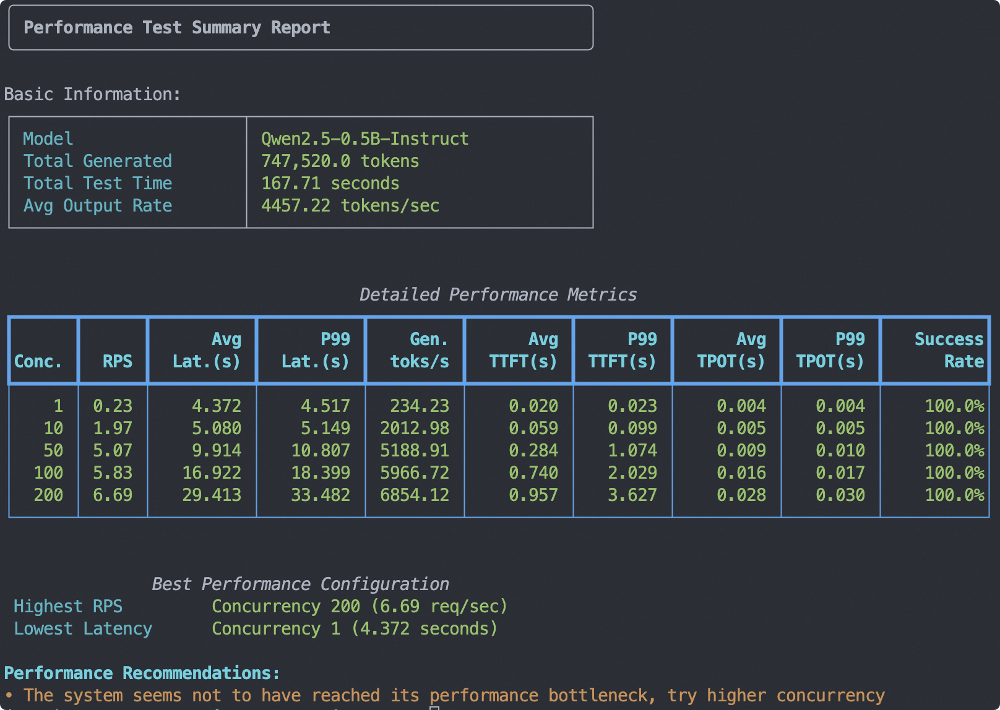
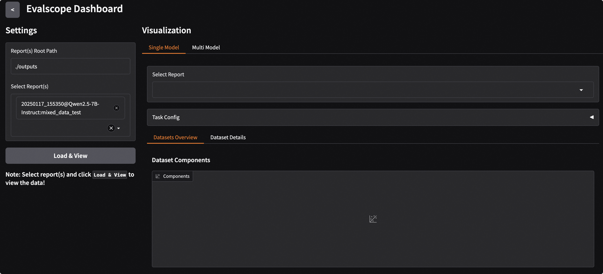
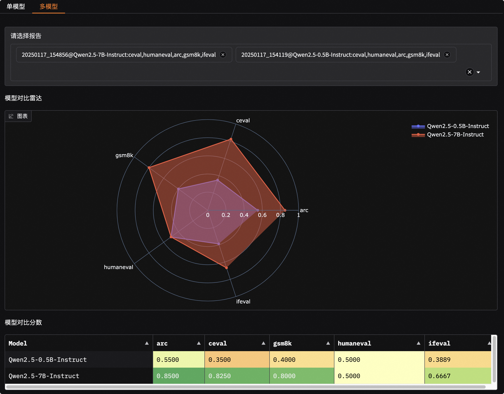
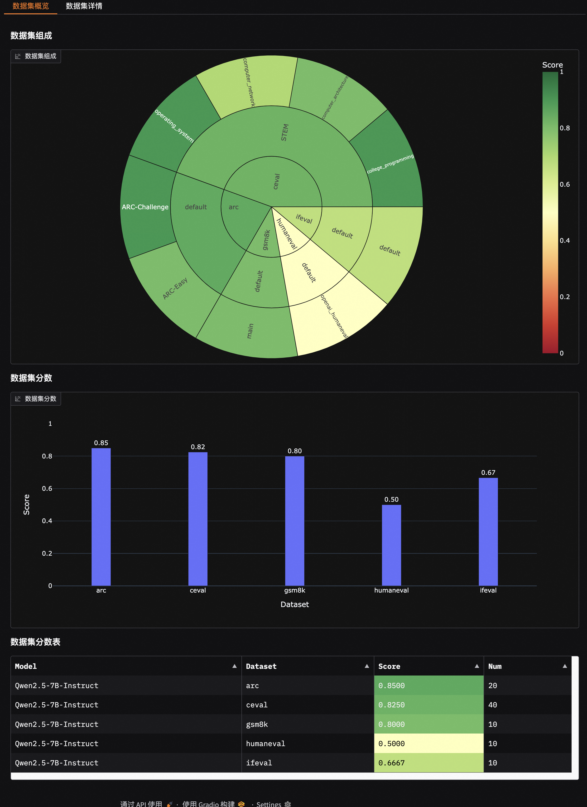
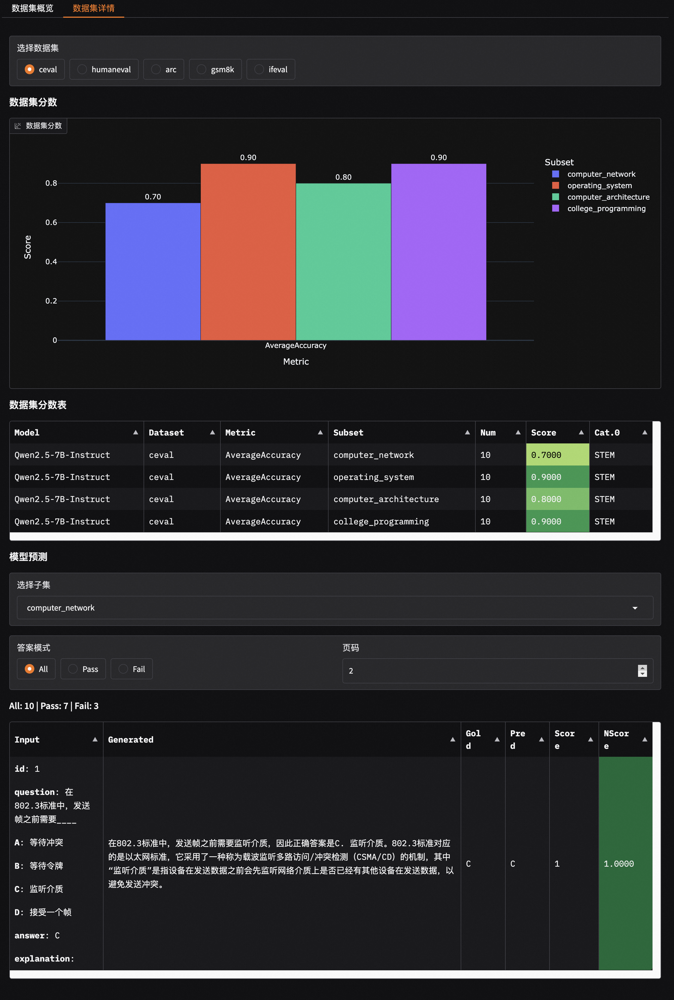

<p align="center">
    <br>
    
    <br>
<p>

<p align="center">
  中文 &nbsp ｜ &nbsp <a href="README.md">English</a> &nbsp
</p>

<p align="center">

<a href="https://badge.fury.io/py/evalscope"></a>
<a href="https://pypi.org/project/evalscope"></a>
<a href="https://github.com/modelscope/evalscope/pulls"></a>
<a href='https://evalscope.readthedocs.io/zh-cn/latest/?badge=latest'></a>
<p>

<p align="center">
<a href="https://evalscope.readthedocs.io/zh-cn/latest/"> 📖  中文文档</a> &nbsp ｜ &nbsp <a href="https://evalscope.readthedocs.io/en/latest/"> 📖  English Documents</a>
<p>


> ⭐ 如果你喜欢这个项目，请点击右上角的 "Star" 按钮支持我们。你的支持是我们前进的动力！

## 📝 简介

EvalScope 是由[魔搭社区](https://modelscope.cn/)打造的一款功能强大、易于扩展的模型评测框架，旨在为大模型开发者提供一站式评测解决方案。

无论您是想评估模型的通用能力、进行多模型性能对比，还是需要对模型进行压力测试，EvalScope 都能满足您的需求。

## ✨ 主要特性

- **📚 全面的评测基准**: 内置 MMLU, C-Eval, GSM8K 等多个业界公认的评测基准。
- **🧩 多模态与多领域支持**: 支持大语言模型 (LLM)、多模态 (VLM)、Embedding、Reranker、AIGC 等多种模型的评测。
- **🚀 多后端集成**: 无缝集成 OpenCompass, VLMEvalKit, RAGEval 等多种评测后端，满足不同评测需求。
- **⚡ 推理性能测试**: 提供强大的模型服务压力测试工具，支持 TTFT, TPOT 等多项性能指标。
- **📊 交互式报告**: 提供 WebUI 可视化界面，支持多维度模型对比、报告概览和详情查阅。
- **⚔️ 竞技场模式**: 支持多模型对战 (Pairwise Battle)，直观地对模型进行排名和评估。
- **🔧 高度可扩展**: 开发者可以轻松添加自定义数据集、模型和评测指标。

<details><summary>🏛️ 整体架构</summary>

<p align="center">
    
    <br>EvalScope 整体架构图.
</p>

1.  **输入层**
    - **模型来源**: API模型（OpenAI API）、本地模型（ModelScope）
    - **数据集**: 标准评测基准（MMLU/GSM8k等）、自定义数据（MCQ/QA）

2.  **核心功能**
    - **多后端评估**: 原生后端、OpenCompass、MTEB、VLMEvalKit、RAGAS
    - **性能监控**: 支持多种模型服务 API 和数据格式，追踪 TTFT/TPOP 等指标
    - **工具扩展**: 集成 Tool-Bench, Needle-in-a-Haystack 等

3.  **输出层**
    - **结构化报告**: 支持 JSON, Table, Logs
    - **可视化平台**: 支持 Gradio, Wandb, SwanLab

</details>

## 🎉 内容更新

> [!IMPORTANT]
> **版本 1.0 重构**
>
> 版本 1.0 对评测框架进行了重大重构，在 `evalscope/api` 下建立了全新的、更模块化且易扩展的 API 层。主要改进包括：为基准、样本和结果引入了标准化数据模型；对基准和指标等组件采用注册表式设计；并重写了核心评测器以协同新架构。现有的基准已迁移到这一 API，实现更加简洁、一致且易于维护。

- 🔥 **[2025.11.07]** 新增支持τ²-bench，是 τ-bench 的扩展与增强版本，包含一系列代码修复，并新增了电信（telecom）领域的故障排查场景，参考[使用文档](https://evalscope.readthedocs.io/zh-cn/latest/third_party/tau2_bench.html)。
- 🔥 **[2025.10.30]** 新增支持BFCL-v4，支持agent的网络搜索和长期记忆能力的评测，参考[使用文档](https://evalscope.readthedocs.io/zh-cn/latest/third_party/bfcl_v4.html)。
- 🔥 **[2025.10.27]** 新增支持LogiQA, HaluEval, MathQA, MRI-QA, PIQA, QASC, CommonsenseQA等评测基准。感谢 @[penguinwang96825](https://github.com/penguinwang96825) 提供代码实现。
- 🔥 **[2025.10.26]** 新增支持Conll-2003, CrossNER, Copious, GeniaNER, HarveyNER, MIT-Movie-Trivia, MIT-Restaurant, OntoNotes5, WNUT2017 等命名实体识别评测基准。感谢 @[penguinwang96825](https://github.com/penguinwang96825) 提供代码实现。
- 🔥 **[2025.10.21]** 优化代码评测中的沙箱环境使用，支持在本地和远程两种模式下运行，具体参考[使用文档](https://evalscope.readthedocs.io/zh-cn/latest/user_guides/sandbox.html)。
- 🔥 **[2025.10.20]** 新增支持PolyMath, SimpleVQA, MathVerse, MathVision, AA-LCR 等评测基准；优化evalscope perf表现，对齐vLLM Bench，具体参考[使用文档](https://evalscope.readthedocs.io/zh-cn/latest/user_guides/stress_test/vs_vllm_bench.html)。
- 🔥 **[2025.10.14]** 新增支持OCRBench, OCRBench-v2, DocVQA, InfoVQA, ChartQA, BLINK 等图文多模态评测基准。
- 🔥 **[2025.09.22]** 代码评测基准(HumanEval, LiveCodeBench)支持在沙箱环境中运行，要使用该功能需先安装[ms-enclave](https://github.com/modelscope/ms-enclave)。
- 🔥 **[2025.09.19]** 新增支持RealWorldQA、AI2D、MMStar、MMBench、OmniBench等图文多模态评测基准，和Multi-IF、HealthBench、AMC等纯文本评测基准。
- 🔥 **[2025.09.05]** 支持视觉-语言多模态大模型的评测任务，例如：MathVista、MMMU，更多支持数据集请[参考](https://evalscope.readthedocs.io/zh-cn/latest/get_started/supported_dataset/vlm.html)。
- 🔥 **[2025.09.04]** 支持图像编辑任务评测，支持[GEdit-Bench](https://modelscope.cn/datasets/stepfun-ai/GEdit-Bench) 评测基准，使用方法[参考](https://evalscope.readthedocs.io/zh-cn/latest/user_guides/aigc/image_edit.html)。
- 🔥 **[2025.08.22]** Version 1.0 重构，不兼容的更新请[参考](https://evalscope.readthedocs.io/zh-cn/latest/get_started/basic_usage.html#v1-0)。
- 🔥 **[2025.07.18]** 模型压测支持随机生成图文数据，用于多模态模型压测，使用方法[参考](https://evalscope.readthedocs.io/zh-cn/latest/user_guides/stress_test/examples.html#id4)。
- 🔥 **[2025.07.16]** 支持[τ-bench](https://github.com/sierra-research/tau-bench)，用于评估 AI Agent在动态用户和工具交互的实际环境中的性能和可靠性，使用方法[参考](https://evalscope.readthedocs.io/zh-cn/latest/get_started/supported_dataset/llm.html#bench)。
- 🔥 **[2025.07.14]** 支持“人类最后的考试”([Humanity's-Last-Exam](https://modelscope.cn/datasets/cais/hle))，这一高难度评测基准，使用方法[参考](https://evalscope.readthedocs.io/zh-cn/latest/get_started/supported_dataset/llm.html#humanity-s-last-exam)。
- 🔥 **[2025.07.03]** 重构了竞技场模式，支持自定义模型对战，输出模型排行榜，以及对战结果可视化，使用[参考](https://evalscope.readthedocs.io/zh-cn/latest/user_guides/arena.html)。
<details> <summary>更多</summary>

- 🔥 **[2025.06.28]** 优化自定义数据集评测，支持无参考答案评测；优化LLM裁判使用，预置“无参考答案直接打分” 和 “判断答案是否与参考答案一致”两种模式，使用[参考](https://evalscope.readthedocs.io/zh-cn/latest/advanced_guides/custom_dataset/llm.html#qa)
- 🔥 **[2025.06.19]** 新增支持[BFCL-v3](https://modelscope.cn/datasets/AI-ModelScope/bfcl_v3)评测基准，用于评测模型在多种场景下的函数调用能力，使用[参考](https://evalscope.readthedocs.io/zh-cn/latest/third_party/bfcl_v3.html)。
- 🔥 **[2025.06.02]** 新增支持大海捞针测试（Needle-in-a-Haystack），指定`needle_haystack`即可进行测试，并在`outputs/reports`文件夹下生成对应的heatmap，直观展现模型性能，使用[参考](https://evalscope.readthedocs.io/zh-cn/latest/third_party/needle_haystack.html)。
- 🔥 **[2025.05.29]** 新增支持[DocMath](https://modelscope.cn/datasets/yale-nlp/DocMath-Eval/summary)和[FRAMES](https://modelscope.cn/datasets/iic/frames/summary)两个长文档评测基准，使用注意事项请查看[文档](https://evalscope.readthedocs.io/zh-cn/latest/get_started/supported_dataset/index.html)
- 🔥 **[2025.05.16]** 模型服务性能压测支持设置多种并发，并输出性能压测报告，[参考示例](https://evalscope.readthedocs.io/zh-cn/latest/user_guides/stress_test/quick_start.html#id3)。
- 🔥 **[2025.05.13]** 新增支持[ToolBench-Static](https://modelscope.cn/datasets/AI-ModelScope/ToolBench-Static)数据集，评测模型的工具调用能力，参考[使用文档](https://evalscope.readthedocs.io/zh-cn/latest/third_party/toolbench.html)；支持[DROP](https://modelscope.cn/datasets/AI-ModelScope/DROP/dataPeview)和[Winogrande](https://modelscope.cn/datasets/AI-ModelScope/winogrande_val)评测基准，评测模型的推理能力。
- 🔥 **[2025.04.29]** 新增Qwen3评测最佳实践，[欢迎阅读📖](https://evalscope.readthedocs.io/zh-cn/latest/best_practice/qwen3.html)
- 🔥 **[2025.04.27]** 支持文生图评测：支持MPS、HPSv2.1Score等8个指标，支持EvalMuse、GenAI-Bench等评测基准，参考[使用文档](https://evalscope.readthedocs.io/zh-cn/latest/user_guides/aigc/t2i.html)
- 🔥 **[2025.04.10]** 模型服务压测工具支持`/v1/completions`端点（也是vLLM基准测试的默认端点）
- 🔥 **[2025.04.08]** 支持OpenAI API兼容的Embedding模型服务评测，查看[使用文档](https://evalscope.readthedocs.io/zh-cn/latest/user_guides/backend/rageval_backend/mteb.html#configure-evaluation-parameters)
- 🔥 **[2025.03.27]** 新增支持[AlpacaEval](https://www.modelscope.cn/datasets/AI-ModelScope/alpaca_eval/dataPeview)和[ArenaHard](https://modelscope.cn/datasets/AI-ModelScope/arena-hard-auto-v0.1/summary)评测基准，使用注意事项请查看[文档](https://evalscope.readthedocs.io/zh-cn/latest/get_started/supported_dataset/index.html)
- 🔥 **[2025.03.20]** 模型推理服务压测支持random生成指定范围长度的prompt，参考[使用指南](https://evalscope.readthedocs.io/zh-cn/latest/user_guides/stress_test/examples.html#random)
- 🔥 **[2025.03.13]** 新增支持[LiveCodeBench](https://www.modelscope.cn/datasets/AI-ModelScope/code_generation_lite/summary)代码评测基准，指定`live_code_bench`即可使用；支持QwQ-32B 在LiveCodeBench上评测，参考[最佳实践](https://evalscope.readthedocs.io/zh-cn/latest/best_practice/eval_qwq.html)。
- 🔥 **[2025.03.11]** 新增支持[SimpleQA](https://modelscope.cn/datasets/AI-ModelScope/SimpleQA/summary)和[Chinese SimpleQA](https://modelscope.cn/datasets/AI-ModelScope/Chinese-SimpleQA/summary)评测基准，用与评测模型的事实正确性，指定`simple_qa`和`chinese_simpleqa`使用。同时支持指定裁判模型，参考[相关参数说明](https://evalscope.readthedocs.io/zh-cn/latest/get_started/parameters.html)。
- 🔥 **[2025.03.07]** 新增QwQ-32B模型评测最佳实践，评测了模型的推理能力以及推理效率，参考[📖QwQ-32B模型评测最佳实践](https://evalscope.readthedocs.io/zh-cn/latest/best_practice/eval_qwq.html)。
- 🔥 **[2025.03.04]** 新增支持[SuperGPQA](https://modelscope.cn/datasets/m-a-p/SuperGPQA/summary)数据集，其覆盖 13 个门类、72 个一级学科和 285 个二级学科，共 26,529 个问题，指定`super_gpqa`即可使用。
- 🔥 **[2025.03.03]** 新增支持评测模型的智商和情商，参考[📖智商和情商评测最佳实践](https://evalscope.readthedocs.io/zh-cn/latest/best_practice/iquiz.html)，来测测你家的AI有多聪明？
- 🔥 **[2025.02.27]** 新增支持评测推理模型的思考效率，参考[📖思考效率评测最佳实践](https://evalscope.readthedocs.io/zh-cn/latest/best_practice/think_eval.html)，该实现参考了[Overthinking](https://doi.org/10.48550/arXiv.2412.21187) 和 [Underthinking](https://doi.org/10.48550/arXiv.2501.18585)两篇工作。
- 🔥 **[2025.02.25]** 新增支持[MuSR](https://modelscope.cn/datasets/AI-ModelScope/MuSR)和[ProcessBench](https://www.modelscope.cn/datasets/Qwen/ProcessBench/summary)两个模型推理相关评测基准，datasets分别指定`musr`和`process_bench`即可使用。
- 🔥 **[2025.02.18]** 支持AIME25数据集，包含15道题目（Grok3 在该数据集上得分为93分）
- 🔥 **[2025.02.13]** 支持DeepSeek蒸馏模型评测，包括AIME24, MATH-500, GPQA-Diamond数据集，参考[最佳实践](https://evalscope.readthedocs.io/zh-cn/latest/best_practice/deepseek_r1_distill.html)；支持指定`eval_batch_size`参数，加速模型评测
- 🔥 **[2025.01.20]** 支持可视化评测结果，包括单模型评测结果和多模型评测结果对比，参考[📖可视化评测结果](https://evalscope.readthedocs.io/zh-cn/latest/get_started/visualization.html)；新增[`iquiz`](https://modelscope.cn/datasets/AI-ModelScope/IQuiz/summary)评测样例，评测模型的IQ和EQ。
- 🔥 **[2025.01.07]** Native backend: 支持模型API评测，参考[📖模型API评测指南](https://evalscope.readthedocs.io/zh-cn/latest/get_started/basic_usage.html#api)；新增支持`ifeval`评测基准。
- 🔥🔥 **[2024.12.31]** 支持基准评测添加，参考[📖基准评测添加指南](https://evalscope.readthedocs.io/zh-cn/latest/advanced_guides/add_benchmark.html)；支持自定义混合数据集评测，用更少的数据，更全面的评测模型，参考[📖混合数据集评测指南](https://evalscope.readthedocs.io/zh-cn/latest/advanced_guides/collection/index.html)
- 🔥 **[2024.12.13]** 模型评测优化，不再需要传递`--template-type`参数；支持`evalscope eval --args`启动评测，参考[📖使用指南](https://evalscope.readthedocs.io/zh-cn/latest/get_started/basic_usage.html)
- 🔥 **[2024.11.26]** 模型推理压测工具重构完成：支持本地启动推理服务、支持Speed Benchmark；优化异步调用错误处理，参考[📖使用指南](https://evalscope.readthedocs.io/zh-cn/latest/user_guides/stress_test/index.html)
- 🔥 **[2024.10.31]** 多模态RAG评测最佳实践发布，参考[📖博客](https://evalscope.readthedocs.io/zh-cn/latest/blog/RAG/multimodal_RAG.html#multimodal-rag)
- 🔥 **[2024.10.23]** 支持多模态RAG评测，包括[CLIP_Benchmark](https://evalscope.readthedocs.io/zh-cn/latest/user_guides/backend/rageval_backend/clip_benchmark.html)评测图文检索器，以及扩展了[RAGAS](https://evalscope.readthedocs.io/zh-cn/latest/user_guides/backend/rageval_backend/ragas.html)以支持端到端多模态指标评测。
- 🔥 **[2024.10.8]** 支持RAG评测，包括使用[MTEB/CMTEB](https://evalscope.readthedocs.io/zh-cn/latest/user_guides/backend/rageval_backend/mteb.html)进行embedding模型和reranker的独立评测，以及使用[RAGAS](https://evalscope.readthedocs.io/zh-cn/latest/user_guides/backend/rageval_backend/ragas.html)进行端到端评测。
- 🔥 **[2024.09.18]** 我们的文档增加了博客模块，包含一些评测相关的技术调研和分享，欢迎[📖阅读](https://evalscope.readthedocs.io/zh-cn/latest/blog/index.html)
- 🔥 **[2024.09.12]** 支持 LongWriter 评测，您可以使用基准测试 [LongBench-Write](evalscope/third_party/longbench_write/README.md) 来评测长输出的质量以及输出长度。
- 🔥 **[2024.08.30]** 支持自定义数据集评测，包括文本数据集和多模态图文数据集。
- 🔥 **[2024.08.20]** 更新了官方文档，包括快速上手、最佳实践和常见问题等，欢迎[📖阅读](https://evalscope.readthedocs.io/zh-cn/latest/)。
- 🔥 **[2024.08.09]** 简化安装方式，支持pypi安装vlmeval相关依赖；优化多模态模型评测体验，基于OpenAI API方式的评测链路，最高加速10倍。
- 🔥 **[2024.07.31]** 重要修改：`llmuses`包名修改为`evalscope`，请同步修改您的代码。
- 🔥 **[2024.07.26]** 支持**VLMEvalKit**作为第三方评测框架，发起多模态模型评测任务。
- 🔥 **[2024.06.29]** 支持**OpenCompass**作为第三方评测框架，我们对其进行了高级封装，支持pip方式安装，简化了评测任务配置。
- 🔥 **[2024.06.13]** EvalScope与微调框架SWIFT进行无缝对接，提供LLM从训练到评测的全链路支持 。
- 🔥 **[2024.06.13]** 接入Agent评测集ToolBench。
</details>

## ❤️ 社区与支持

欢迎加入我们的社区，与其他开发者交流并获取帮助。

[Discord Group](https://discord.com/invite/D27yfEFVz5)              |  微信群 | 钉钉群
:-------------------------:|:-------------------------:|:-------------------------:
  |   | 


## 🛠️ 环境准备

我们推荐使用 `conda` 创建虚拟环境，并使用 `pip` 安装。

1.  **创建并激活 Conda 环境** (推荐使用 Python 3.10)
    ```shell
    conda create -n evalscope python=3.10
    conda activate evalscope
    ```

2.  **安装 EvalScope**

    - **方式一：通过 PyPI 安装 (推荐)**
      ```shell
      pip install evalscope
      ```

    - **方式二：通过源码安装 (用于开发)**
      ```shell
      git clone https://github.com/modelscope/evalscope.git
      cd evalscope
      pip install -e .
      ```

3.  **安装额外依赖** (可选)
    根据您的需求，安装相应的功能扩展：
    ```shell
    # 性能测试
    pip install 'evalscope[perf]'

    # 可视化App
    pip install 'evalscope[app]'

    # 其他评测后端
    pip install 'evalscope[opencompass]'
    pip install 'evalscope[vlmeval]'
    pip install 'evalscope[rag]'

    # 安装所有依赖
    pip install 'evalscope[all]'
    ```
    > 如果您通过源码安装，请将 `evalscope` 替换为 `.`，例如 `pip install '.[perf]'`。

> [!NOTE]
> 本项目曾用名 `llmuses`。如果您需要使用 `v0.4.3` 或更早版本，请运行 `pip install llmuses<=0.4.3` 并使用 `from llmuses import ...` 导入。


## 🚀 快速开始

您可以通过**命令行**或 **Python 代码**两种方式启动评测任务。

### 方式1. 使用命令行

在任意路径下执行 `evalscope eval` 命令即可开始评测。以下命令将在 `gsm8k` 和 `arc` 数据集上评测 `Qwen/Qwen2.5-0.5B-Instruct` 模型，每个数据集只取 5 个样本。

```bash
evalscope eval \
 --model Qwen/Qwen2.5-0.5B-Instruct \
 --datasets gsm8k arc \
 --limit 5
```

### 方式2. 使用Python代码

使用 `run_task` 函数和 `TaskConfig` 对象来配置和启动评测任务。

```python
from evalscope import run_task, TaskConfig

# 配置评测任务
task_cfg = TaskConfig(
    model='Qwen/Qwen2.5-0.5B-Instruct',
    datasets=['gsm8k', 'arc'],
    limit=5
)

# 启动评测
run_task(task_cfg)
```

<details><summary><b>💡 提示：</b> `run_task` 还支持字典、YAML 或 JSON 文件作为配置。</summary>

**使用 Python 字典**

```python
from evalscope.run import run_task

task_cfg = {
    'model': 'Qwen/Qwen2.5-0.5B-Instruct',
    'datasets': ['gsm8k', 'arc'],
    'limit': 5
}
run_task(task_cfg=task_cfg)
```

**使用 YAML 文件** (`config.yaml`)
```yaml
model: Qwen/Qwen2.5-0.5B-Instruct
datasets:
  - gsm8k
  - arc
limit: 5
```
```python
from evalscope.run import run_task

run_task(task_cfg="config.yaml")
```
</details>

### 输出结果
评测完成后，您将在终端看到如下格式的报告：
```text
+-----------------------+----------------+-----------------+-----------------+---------------+-------+---------+
| Model Name            | Dataset Name   | Metric Name     | Category Name   | Subset Name   |   Num |   Score |
+=======================+================+=================+=================+===============+=======+=========+
| Qwen2.5-0.5B-Instruct | gsm8k          | AverageAccuracy | default         | main          |     5 |     0.4 |
+-----------------------+----------------+-----------------+-----------------+---------------+-------+---------+
| Qwen2.5-0.5B-Instruct | ai2_arc        | AverageAccuracy | default         | ARC-Easy      |     5 |     0.8 |
+-----------------------+----------------+-----------------+-----------------+---------------+-------+---------+
| Qwen2.5-0.5B-Instruct | ai2_arc        | AverageAccuracy | default         | ARC-Challenge |     5 |     0.4 |
+-----------------------+----------------+-----------------+-----------------+---------------+-------+---------+
```

## 📈 进阶用法

### 自定义评测参数

您可以通过命令行参数精细化控制模型加载、推理和数据集配置。

```shell
evalscope eval \
 --model Qwen/Qwen3-0.6B \
 --model-args '{"revision": "master", "precision": "torch.float16", "device_map": "auto"}' \
 --generation-config '{"do_sample":true,"temperature":0.6,"max_tokens":512}' \
 --dataset-args '{"gsm8k": {"few_shot_num": 0, "few_shot_random": false}}' \
 --datasets gsm8k \
 --limit 10
```

- `--model-args`: 模型加载参数，如 `revision`, `precision` 等。
- `--generation-config`: 模型生成参数，如 `temperature`, `max_tokens` 等。
- `--dataset-args`: 数据集配置参数，如 `few_shot_num` 等。

详情请参考 [📖 全部参数说明](https://evalscope.readthedocs.io/zh-cn/latest/get_started/parameters.html)。

### 评测在线模型 API

EvalScope 支持评测通过 API 部署的模型服务（如 vLLM 部署的服务）。只需指定服务地址和 API Key 即可。

1.  **启动模型服务** (以 vLLM 为例)
    ```shell
    export VLLM_USE_MODELSCOPE=True
    python -m vllm.entrypoints.openai.api_server \
      --model Qwen/Qwen2.5-0.5B-Instruct \
      --served-model-name qwen2.5 \
      --port 8801
    ```

2.  **运行评测**
    ```shell
    evalscope eval \
     --model qwen2.5 \
     --eval-type service \
     --api-url http://127.0.0.1:8801/v1 \
     --api-key EMPTY \
     --datasets gsm8k \
     --limit 10
    ```

### ⚔️ 竞技场模式 (Arena)

竞技场模式通过模型间的两两对战（Pairwise Battle）来评估模型性能，并给出胜率和排名，非常适合多模型横向对比。

```text
# 评测结果示例
Model           WinRate (%)  CI (%)
------------  -------------  ---------------
qwen2.5-72b            69.3  (-13.3 / +12.2)
qwen2.5-7b             50    (+0.0 / +0.0)
qwen2.5-0.5b            4.7  (-2.5 / +4.4)
```
详情请参考 [📖 竞技场模式使用指南](https://evalscope.readthedocs.io/zh-cn/latest/user_guides/arena.html)。

### 🖊️ 自定义数据集评测

EvalScope 允许您轻松添加和评测自己的数据集。详情请参考 [📖 自定义数据集评测指南](https://evalscope.readthedocs.io/zh-cn/latest/advanced_guides/custom_dataset/index.html)。


## 🧪 其他评测后端
EvalScope 支持通过第三方评测框架（我们称之为“后端”）发起评测任务，以满足多样化的评测需求。

- **Native**: EvalScope 的默认评测框架，功能全面。
- **OpenCompass**: 专注于纯文本评测。 [📖 使用指南](https://evalscope.readthedocs.io/zh-cn/latest/user_guides/backend/opencompass_backend.html)
- **VLMEvalKit**: 专注于多模态评测。 [📖 使用指南](https://evalscope.readthedocs.io/zh-cn/latest/user_guides/backend/vlmevalkit_backend.html)
- **RAGEval**: 专注于 RAG 评测，支持 Embedding 和 Reranker 模型。 [📖 使用指南](https://evalscope.readthedocs.io/zh-cn/latest/user_guides/backend/rageval_backend/index.html)
- **第三方评测工具**: 支持 [ToolBench](https://evalscope.readthedocs.io/zh-cn/latest/third_party/toolbench.html) 等评测任务。

## ⚡ 推理性能评测工具
EvalScope 提供了一个强大的压力测试工具，用于评估大语言模型服务的性能。

- **关键指标**: 支持吞吐量 (Tokens/s)、首字延迟 (TTFT)、Token 生成延迟 (TPOT) 等。
- **结果记录**: 支持将结果记录到 `wandb` 和 `swanlab`。
- **速度基准**: 可生成类似官方报告的速度基准测试结果。

详情请参考 [📖 性能测试使用指南](https://evalscope.readthedocs.io/zh-cn/latest/user_guides/stress_test/index.html)。

输出示例如下：
<p align="center">
    
</p>


## 📊 可视化评测结果

EvalScope 提供了一个基于 Gradio 的 WebUI，用于交互式地分析和比较评测结果。

1.  **安装依赖**
    ```bash
    pip install 'evalscope[app]'
    ```

2.  **启动服务**
    ```bash
    evalscope app
    ```
    访问 `http://127.0.0.1:7861` 即可打开可视化界面。

<table>
  <tr>
    <td style="text-align: center;">
      
      <p>设置界面</p>
    </td>
    <td style="text-align: center;">
      
      <p>模型比较</p>
    </td>
  </tr>
  <tr>
    <td style="text-align: center;">
      
      <p>报告概览</p>
    </td>
    <td style="text-align: center;">
      
      <p>报告详情</p>
    </td>
  </tr>
</table>

详情请参考 [📖 可视化评测结果](https://evalscope.readthedocs.io/zh-cn/latest/get_started/visualization.html)。

## 👷‍♂️ 贡献

我们欢迎来自社区的任何贡献！如果您希望添加新的评测基准、模型或功能，请参考我们的 [贡献指南](https://evalscope.readthedocs.io/zh-cn/latest/advanced_guides/add_benchmark.html)。

感谢所有为 EvalScope 做出贡献的开发者！

<a href="https://github.com/modelscope/evalscope/graphs/contributors" target="_blank">
  <table>
    <tr>
      <th colspan="2">
        <br><br><br>
      </th>
    </tr>
  </table>
</a>


## 📚 引用

如果您在研究中使用了 EvalScope，请引用我们的工作：
```bibtex
@misc{evalscope_2024,
    title={{EvalScope}: Evaluation Framework for Large Models},
    author={ModelScope Team},
    year={2024},
    url={https://github.com/modelscope/evalscope}
}
```


## ⭐ Star History

[](https://star-history.com/#modelscope/evalscope&Date)
