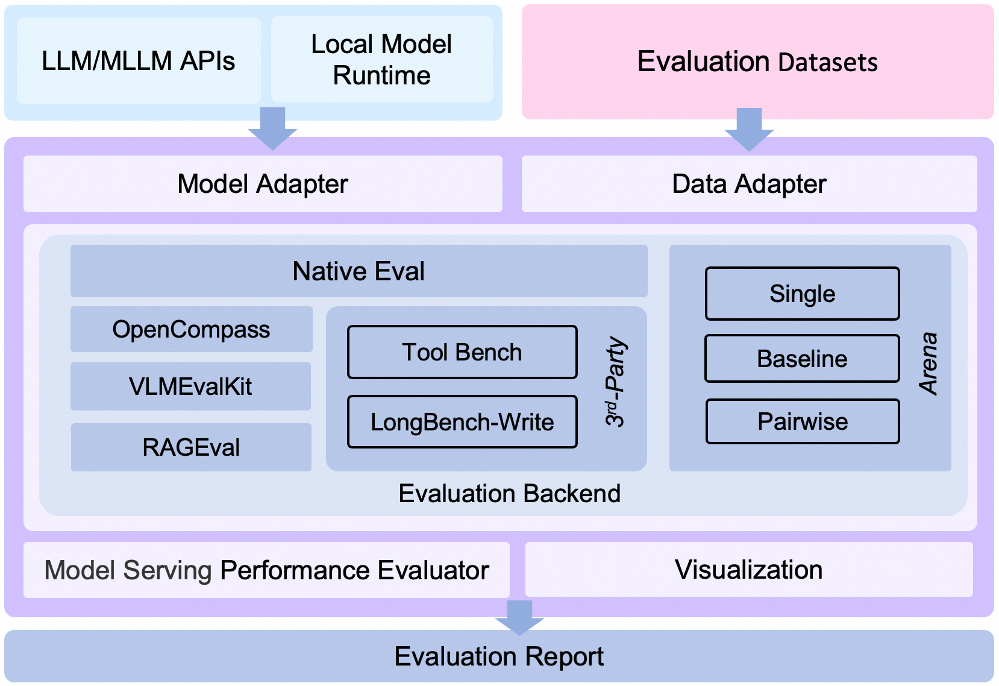

<p align="center">
    <br>
    
    <br>
<p>

<p align="center">
  中文 &nbsp ｜ &nbsp <a href="README.md">English</a> &nbsp
</p>

<p align="center">

<a href="https://badge.fury.io/py/evalscope"></a>
<a href="https://pypi.org/project/evalscope"></a>
<a href="https://github.com/modelscope/evalscope/pulls"></a>
<a href='https://evalscope.readthedocs.io/zh-cn/latest/?badge=latest'></a>
<p>

<p align="center">
<a href="https://evalscope.readthedocs.io/zh-cn/latest/"> 📖  中文文档</a> &nbsp ｜ &nbsp <a href="https://evalscope.readthedocs.io/en/latest/"> 📖  English Documents</a>
<p>


> ⭐ 如果你喜欢这个项目，请点击右上角的 "Star" 按钮支持我们。你的支持是我们前进的动力！

## 📋 目录
- [简介](#-简介)
- [新闻](#-新闻)
- [环境准备](#️-环境准备)
- [快速开始](#-快速开始)
- [其他评测后端](#-其他评测后端)
- [自定义数据集评测](#-自定义数据集评测)
- [竞技场模式](#-竞技场模式)
- [性能评测工具](#-推理性能评测工具)
- [贡献](#️-贡献)


## 📝 简介

EvalScope是[魔搭社区](https://modelscope.cn/)官方推出的模型评测与性能基准测试框架，专为多样化的模型评估需求而设计。它支持广泛的模型类型，包括但不限于大语言模型、多模态模型、Embedding 模型、Reranker 模型和 CLIP 模型。

EvalScope还适用于多种评测场景，如端到端RAG评测、竞技场模式和模型推理性能压测等，其内置多个常用测试基准和评测指标，如MMLU、CMMLU、C-Eval、GSM8K等。此外，通过与[ms-swift](https://github.com/modelscope/ms-swift)训练框架的无缝集成，可一键发起评测，为模型训练和评测提供全链路支持🚀

<p align="center">
    
    <br>EvalScope 整体架构图.
</p>

<details><summary>架构介绍</summary>

1. **Model Adapter**: 模型适配器，用于将特定模型的输出转换为框架所需的格式，支持API调用的模型和本地运行的模型。

2. **Data Adapter**: 数据适配器，负责转换和处理输入数据，以便适应不同的评测需求和格式。

3. **Evaluation Backend**:
    - **Native**：EvalScope自身的**默认评测框架**，支持多种评测模式，包括单模型评测、竞技场模式、Baseline模型对比模式等。
    - **OpenCompass**：支持[OpenCompass](https://github.com/open-compass/opencompass)作为评测后端，对其进行了高级封装和任务简化，您可以更轻松地提交任务进行评测。
    - **VLMEvalKit**：支持[VLMEvalKit](https://github.com/open-compass/VLMEvalKit)作为评测后端，轻松发起多模态评测任务，支持多种多模态模型和数据集。
    - **RAGEval**：支持RAG评测，支持使用[MTEB/CMTEB](https://evalscope.readthedocs.io/zh-cn/latest/user_guides/backend/rageval_backend/mteb.html)进行embedding模型和reranker的独立评测，以及使用[RAGAS](https://evalscope.readthedocs.io/zh-cn/latest/user_guides/backend/rageval_backend/ragas.html)进行端到端评测。
    - **ThirdParty**：其他第三方评测任务，如ToolBench。

4. **Performance Evaluator**: 模型性能评测，负责具体衡量模型推理服务性能，包括性能评测、压力测试、性能评测报告生成、可视化。

5. **Evaluation Report**: 最终生成的评测报告，总结模型的性能表现，报告可以用于决策和进一步的模型优化。

6. **Visualization**: 可视化结果，帮助用户更直观地理解评测结果，便于分析和比较不同模型的表现。

</details>

## ☎ 用户群

请扫描下面的二维码来加入我们的交流群：

[Discord Group](https://discord.com/invite/D27yfEFVz5)              |  微信群 | 钉钉群
:-------------------------:|:-------------------------:|:-------------------------:
  |   | 


## 🎉 新闻
- 🔥 **[2025.04.10]** 模型服务压测工具支持`/v1/completions`端点（也是vLLM基准测试的默认端点）
- 🔥 **[2025.04.08]** 支持OpenAI API兼容的Embedding模型服务评测，查看[使用文档](https://evalscope.readthedocs.io/zh-cn/latest/user_guides/backend/rageval_backend/mteb.html#configure-evaluation-parameters)
- 🔥 **[2025.03.27]** 新增支持[AlpacaEval](https://www.modelscope.cn/datasets/AI-ModelScope/alpaca_eval/dataPeview)和[ArenaHard](https://modelscope.cn/datasets/AI-ModelScope/arena-hard-auto-v0.1/summary)评测基准，使用注意事项请查看[文档](https://evalscope.readthedocs.io/zh-cn/latest/get_started/supported_dataset.html)
- 🔥 **[2025.03.20]** 模型推理服务压测支持random生成指定范围长度的prompt，参考[使用指南](https://evalscope.readthedocs.io/zh-cn/latest/user_guides/stress_test/examples.html#random)
- 🔥 **[2025.03.13]** 新增支持[LiveCodeBench](https://www.modelscope.cn/datasets/AI-ModelScope/code_generation_lite/summary)代码评测基准，指定`live_code_bench`即可使用；支持QwQ-32B 在LiveCodeBench上评测，参考[最佳实践](https://evalscope.readthedocs.io/zh-cn/latest/best_practice/eval_qwq.html)。
- 🔥 **[2025.03.11]** 新增支持[SimpleQA](https://modelscope.cn/datasets/AI-ModelScope/SimpleQA/summary)和[Chinese SimpleQA](https://modelscope.cn/datasets/AI-ModelScope/Chinese-SimpleQA/summary)评测基准，用与评测模型的事实正确性，指定`simple_qa`和`chinese_simpleqa`使用。同时支持指定裁判模型，参考[相关参数说明](https://evalscope.readthedocs.io/zh-cn/latest/get_started/parameters.html)。
- 🔥 **[2025.03.07]** 新增QwQ-32B模型评测最佳实践，评测了模型的推理能力以及推理效率，参考[📖QwQ-32B模型评测最佳实践](https://evalscope.readthedocs.io/zh-cn/latest/best_practice/eval_qwq.html)。
- 🔥 **[2025.03.04]** 新增支持[SuperGPQA](https://modelscope.cn/datasets/m-a-p/SuperGPQA/summary)数据集，其覆盖 13 个门类、72 个一级学科和 285 个二级学科，共 26,529 个问题，指定`super_gpqa`即可使用。
- 🔥 **[2025.03.03]** 新增支持评测模型的智商和情商，参考[📖智商和情商评测最佳实践](https://evalscope.readthedocs.io/zh-cn/latest/best_practice/iquiz.html)，来测测你家的AI有多聪明？
- 🔥 **[2025.02.27]** 新增支持评测推理模型的思考效率，参考[📖思考效率评测最佳实践](https://evalscope.readthedocs.io/zh-cn/latest/best_practice/think_eval.html)，该实现参考了[Overthinking](https://doi.org/10.48550/arXiv.2412.21187) 和 [Underthinking](https://doi.org/10.48550/arXiv.2501.18585)两篇工作。
- 🔥 **[2025.02.25]** 新增支持[MuSR](https://modelscope.cn/datasets/AI-ModelScope/MuSR)和[ProcessBench](https://www.modelscope.cn/datasets/Qwen/ProcessBench/summary)两个模型推理相关评测基准，datasets分别指定`musr`和`process_bench`即可使用。
- 🔥 **[2025.02.18]** 支持AIME25数据集，包含15道题目（Grok3 在该数据集上得分为93分）
- 🔥 **[2025.02.13]** 支持DeepSeek蒸馏模型评测，包括AIME24, MATH-500, GPQA-Diamond数据集，参考[最佳实践](https://evalscope.readthedocs.io/zh-cn/latest/best_practice/deepseek_r1_distill.html)；支持指定`eval_batch_size`参数，加速模型评测
- 🔥 **[2025.01.20]** 支持可视化评测结果，包括单模型评测结果和多模型评测结果对比，参考[📖可视化评测结果](https://evalscope.readthedocs.io/zh-cn/latest/get_started/visualization.html)；新增[`iquiz`](https://modelscope.cn/datasets/AI-ModelScope/IQuiz/summary)评测样例，评测模型的IQ和EQ。
- 🔥 **[2025.01.07]** Native backend: 支持模型API评测，参考[📖模型API评测指南](https://evalscope.readthedocs.io/zh-cn/latest/get_started/basic_usage.html#api)；新增支持`ifeval`评测基准。
<details> <summary>更多</summary>

- 🔥🔥 **[2024.12.31]** 支持基准评测添加，参考[📖基准评测添加指南](https://evalscope.readthedocs.io/zh-cn/latest/advanced_guides/add_benchmark.html)；支持自定义混合数据集评测，用更少的数据，更全面的评测模型，参考[📖混合数据集评测指南](https://evalscope.readthedocs.io/zh-cn/latest/advanced_guides/collection/index.html)
- 🔥 **[2024.12.13]** 模型评测优化，不再需要传递`--template-type`参数；支持`evalscope eval --args`启动评测，参考[📖使用指南](https://evalscope.readthedocs.io/zh-cn/latest/get_started/basic_usage.html)
- 🔥 **[2024.11.26]** 模型推理压测工具重构完成：支持本地启动推理服务、支持Speed Benchmark；优化异步调用错误处理，参考[📖使用指南](https://evalscope.readthedocs.io/zh-cn/latest/user_guides/stress_test/index.html)
- 🔥 **[2024.10.31]** 多模态RAG评测最佳实践发布，参考[📖博客](https://evalscope.readthedocs.io/zh-cn/latest/blog/RAG/multimodal_RAG.html#multimodal-rag)
- 🔥 **[2024.10.23]** 支持多模态RAG评测，包括[CLIP_Benchmark](https://evalscope.readthedocs.io/zh-cn/latest/user_guides/backend/rageval_backend/clip_benchmark.html)评测图文检索器，以及扩展了[RAGAS](https://evalscope.readthedocs.io/zh-cn/latest/user_guides/backend/rageval_backend/ragas.html)以支持端到端多模态指标评测。
- 🔥 **[2024.10.8]** 支持RAG评测，包括使用[MTEB/CMTEB](https://evalscope.readthedocs.io/zh-cn/latest/user_guides/backend/rageval_backend/mteb.html)进行embedding模型和reranker的独立评测，以及使用[RAGAS](https://evalscope.readthedocs.io/zh-cn/latest/user_guides/backend/rageval_backend/ragas.html)进行端到端评测。
- 🔥 **[2024.09.18]** 我们的文档增加了博客模块，包含一些评测相关的技术调研和分享，欢迎[📖阅读](https://evalscope.readthedocs.io/zh-cn/latest/blog/index.html)
- 🔥 **[2024.09.12]** 支持 LongWriter 评测，您可以使用基准测试 [LongBench-Write](evalscope/third_party/longbench_write/README.md) 来评测长输出的质量以及输出长度。
- 🔥 **[2024.08.30]** 支持自定义数据集评测，包括文本数据集和多模态图文数据集。
- 🔥 **[2024.08.20]** 更新了官方文档，包括快速上手、最佳实践和常见问题等，欢迎[📖阅读](https://evalscope.readthedocs.io/zh-cn/latest/)。
- 🔥 **[2024.08.09]** 简化安装方式，支持pypi安装vlmeval相关依赖；优化多模态模型评测体验，基于OpenAI API方式的评测链路，最高加速10倍。
- 🔥 **[2024.07.31]** 重要修改：`llmuses`包名修改为`evalscope`，请同步修改您的代码。
- 🔥 **[2024.07.26]** 支持**VLMEvalKit**作为第三方评测框架，发起多模态模型评测任务。
- 🔥 **[2024.06.29]** 支持**OpenCompass**作为第三方评测框架，我们对其进行了高级封装，支持pip方式安装，简化了评测任务配置。
- 🔥 **[2024.06.13]** EvalScope与微调框架SWIFT进行无缝对接，提供LLM从训练到评测的全链路支持 。
- 🔥 **[2024.06.13]** 接入Agent评测集ToolBench。
</details>

## 🛠️ 环境准备
### 方式1. 使用pip安装
我们推荐使用conda来管理环境，并使用pip安装依赖:
1. 创建conda环境 (可选)
```shell
# 建议使用 python 3.10
conda create -n evalscope python=3.10

# 激活conda环境
conda activate evalscope
```
2. pip安装依赖
```shell
pip install evalscope                # 安装 Native backend (默认)
# 额外选项
pip install 'evalscope[opencompass]'   # 安装 OpenCompass backend
pip install 'evalscope[vlmeval]'       # 安装 VLMEvalKit backend
pip install 'evalscope[rag]'           # 安装 RAGEval backend
pip install 'evalscope[perf]'          # 安装 模型压测模块 依赖
pip install 'evalscope[app]'           # 安装 可视化 相关依赖
pip install 'evalscope[all]'           # 安装所有 backends (Native, OpenCompass, VLMEvalKit, RAGEval)
```


> [!WARNING]
> 由于项目更名为`evalscope`，对于`v0.4.3`或更早版本，您可以使用以下命令安装：
> ```shell
>  pip install llmuses<=0.4.3
> ```
> 使用`llmuses`导入相关依赖：
> ``` python
> from llmuses import ...
> ```


### 方式2. 使用源码安装
1. 下载源码
```shell
git clone https://github.com/modelscope/evalscope.git
```
2. 安装依赖
```shell
cd evalscope/

pip install -e .                  # 安装 Native backend
# 额外选项
pip install -e '.[opencompass]'   # 安装 OpenCompass backend
pip install -e '.[vlmeval]'       # 安装 VLMEvalKit backend
pip install -e '.[rag]'           # 安装 RAGEval backend
pip install -e '.[perf]'          # 安装 模型压测模块 依赖
pip install -e '.[app]'           # 安装 可视化 相关依赖
pip install -e '.[all]'           # 安装所有 backends (Native, OpenCompass, VLMEvalKit, RAGEval)
```


## 🚀 快速开始

在指定的若干数据集上使用默认配置评测某个模型，本框架支持两种启动评测任务的方式：使用命令行启动或使用Python代码启动评测任务。

### 方式1. 使用命令行

在任意路径下执行`eval`命令：
```bash
evalscope eval \
 --model Qwen/Qwen2.5-0.5B-Instruct \
 --datasets gsm8k arc \
 --limit 5
```


### 方式2. 使用Python代码

使用python代码进行评测时需要用`run_task`函数提交评测任务，传入一个`TaskConfig`作为参数，也可以为python字典、yaml文件路径或json文件路径，例如：

**使用Python 字典**

```python
from evalscope.run import run_task

task_cfg = {
    'model': 'Qwen/Qwen2.5-0.5B-Instruct',
    'datasets': ['gsm8k', 'arc'],
    'limit': 5
}

run_task(task_cfg=task_cfg)
```

<details><summary>更多启动方式</summary>

**使用`TaskConfig`**

```python
from evalscope.run import run_task
from evalscope.config import TaskConfig

task_cfg = TaskConfig(
    model='Qwen/Qwen2.5-0.5B-Instruct',
    datasets=['gsm8k', 'arc'],
    limit=5
)

run_task(task_cfg=task_cfg)
```

**使用`yaml`文件**

`config.yaml`:
```yaml
model: Qwen/Qwen2.5-0.5B-Instruct
datasets:
  - gsm8k
  - arc
limit: 5
```

```python
from evalscope.run import run_task

run_task(task_cfg="config.yaml")
```

**使用`json`文件**

`config.json`:
```json
{
    "model": "Qwen/Qwen2.5-0.5B-Instruct",
    "datasets": ["gsm8k", "arc"],
    "limit": 5
}
```

```python
from evalscope.run import run_task

run_task(task_cfg="config.json")
```
</details>

### 基本参数说明
- `--model`: 指定了模型在[ModelScope](https://modelscope.cn/)中的`model_id`，可自动下载，例如[Qwen/Qwen2.5-0.5B-Instruct](https://modelscope.cn/models/Qwen/Qwen2.5-0.5B-Instruct/summary)；也可使用模型的本地路径，例如`/path/to/model`
- `--datasets`: 数据集名称，支持输入多个数据集，使用空格分开，数据集将自动从modelscope下载，支持的数据集参考[数据集列表](https://evalscope.readthedocs.io/zh-cn/latest/get_started/supported_dataset.html)
- `--limit`: 每个数据集最大评测数据量，不填写则默认为全部评测，可用于快速验证

### 输出结果
```text
+-----------------------+----------------+-----------------+-----------------+---------------+-------+---------+
| Model Name            | Dataset Name   | Metric Name     | Category Name   | Subset Name   |   Num |   Score |
+=======================+================+=================+=================+===============+=======+=========+
| Qwen2.5-0.5B-Instruct | gsm8k          | AverageAccuracy | default         | main          |     5 |     0.4 |
+-----------------------+----------------+-----------------+-----------------+---------------+-------+---------+
| Qwen2.5-0.5B-Instruct | ai2_arc        | AverageAccuracy | default         | ARC-Easy      |     5 |     0.8 |
+-----------------------+----------------+-----------------+-----------------+---------------+-------+---------+
| Qwen2.5-0.5B-Instruct | ai2_arc        | AverageAccuracy | default         | ARC-Challenge |     5 |     0.4 |
+-----------------------+----------------+-----------------+-----------------+---------------+-------+---------+
```

## 📈 可视化评测结果

1. 安装可视化所需的依赖，包括gradio、plotly等。
```bash
pip install 'evalscope[app]'
```

2. 启动可视化服务

运行如下命令启动可视化服务。
```bash
evalscope app
```
输出如下内容即可在浏览器中访问可视化服务。
```text
* Running on local URL:  http://127.0.0.1:7861

To create a public link, set `share=True` in `launch()`.
```
<table>
  <tr>
    <td style="text-align: center;">
      
      <p>设置界面</p>
    </td>
    <td style="text-align: center;">
      
      <p>模型比较</p>
    </td>
  </tr>
  <tr>
    <td style="text-align: center;">
      
      <p>报告概览</p>
    </td>
    <td style="text-align: center;">
      
      <p>报告详情</p>
    </td>
  </tr>
</table>


详情参考：[📖可视化评测结果](https://evalscope.readthedocs.io/zh-cn/latest/get_started/visualization.html)


## 🌐 指定模型API评测

指定模型API服务地址(api_url)和API Key(api_key)，评测部署的模型API服务，*此时`eval-type`参数必须指定为`service`*

例如使用[vLLM](https://github.com/vllm-project/vllm)拉起模型服务：
```shell
export VLLM_USE_MODELSCOPE=True && python -m vllm.entrypoints.openai.api_server --model Qwen/Qwen2.5-0.5B-Instruct --served-model-name qwen2.5 --trust_remote_code --port 8801
```
然后使用以下命令评测模型API服务：
```shell
evalscope eval \
 --model qwen2.5 \
 --api-url http://127.0.0.1:8801/v1 \
 --api-key EMPTY \
 --eval-type service \
 --datasets gsm8k \
 --limit 10
```

## ⚙️ 自定义参数评测
若想进行更加自定义的评测，例如自定义模型参数，或者数据集参数，可以使用以下命令，启动评测方式与简单评测一致，下面展示了使用`eval`命令启动评测：

```shell
evalscope eval \
 --model Qwen/Qwen2.5-0.5B-Instruct \
 --model-args revision=master,precision=torch.float16,device_map=auto \
 --generation-config do_sample=true,temperature=0.5 \
 --dataset-args '{"gsm8k": {"few_shot_num": 0, "few_shot_random": false}}' \
 --datasets gsm8k \
 --limit 10
```

### 参数说明
- `--model-args`: 模型加载参数，以逗号分隔，`key=value`形式，默认参数：
  - `revision`: 模型版本，默认为`master`
  - `precision`: 模型精度，默认为`auto`
  - `device_map`: 模型分配设备，默认为`auto`
- `--generation-config`: 生成参数，以逗号分隔，`key=value`形式，默认参数：
  - `do_sample`: 是否使用采样，默认为`false`
  - `max_length`: 最大长度，默认为2048
  - `max_new_tokens`: 生成最大长度，默认为512
- `--dataset-args`: 评测数据集的设置参数，以`json`格式传入，key为数据集名称，value为参数，注意需要跟`--datasets`参数中的值一一对应：
  - `few_shot_num`: few-shot的数量
  - `few_shot_random`: 是否随机采样few-shot数据，如果不设置，则默认为`true`

参考：[全部参数说明](https://evalscope.readthedocs.io/zh-cn/latest/get_started/parameters.html)


## 🧪 其他评测后端
EvalScope支持使用第三方评测框架发起评测任务，我们称之为评测后端 (Evaluation Backend)。目前支持的Evaluation Backend有：
- **Native**：EvalScope自身的**默认评测框架**，支持多种评测模式，包括单模型评测、竞技场模式、Baseline模型对比模式等。
- [OpenCompass](https://github.com/open-compass/opencompass)：通过EvalScope作为入口，发起OpenCompass的评测任务，轻量级、易于定制、支持与LLM微调框架[ms-wift](https://github.com/modelscope/swift)的无缝集成：[📖使用指南](https://evalscope.readthedocs.io/zh-cn/latest/user_guides/backend/opencompass_backend.html)
- [VLMEvalKit](https://github.com/open-compass/VLMEvalKit)：通过EvalScope作为入口，发起VLMEvalKit的多模态评测任务，支持多种多模态模型和数据集，支持与LLM微调框架[ms-wift](https://github.com/modelscope/swift)的无缝集成：[📖使用指南](https://evalscope.readthedocs.io/zh-cn/latest/user_guides/backend/vlmevalkit_backend.html)
- **RAGEval**：通过EvalScope作为入口，发起RAG评测任务，支持使用[MTEB/CMTEB](https://evalscope.readthedocs.io/zh-cn/latest/user_guides/backend/rageval_backend/mteb.html)进行embedding模型和reranker的独立评测，以及使用[RAGAS](https://evalscope.readthedocs.io/zh-cn/latest/user_guides/backend/rageval_backend/ragas.html)进行端到端评测：[📖使用指南](https://evalscope.readthedocs.io/zh-cn/latest/user_guides/backend/rageval_backend/index.html)
- **ThirdParty**: 第三方评测任务，如[ToolBench](https://evalscope.readthedocs.io/zh-cn/latest/third_party/toolbench.html)、[LongBench-Write](https://evalscope.readthedocs.io/zh-cn/latest/third_party/longwriter.html)。

## 📈 推理性能评测工具
一个专注于大型语言模型的压力测试工具，可以自定义以支持各种数据集格式和不同的API协议格式。

参考：性能测试[📖使用指南](https://evalscope.readthedocs.io/zh-cn/latest/user_guides/stress_test/index.html)

**支持wandb记录结果**


**支持swanlab记录结果**


**支持Speed Benchmark**

支持速度测试，得到类似[Qwen官方](https://qwen.readthedocs.io/en/latest/benchmark/speed_benchmark.html)报告的速度基准：

```text
Speed Benchmark Results:
+---------------+-----------------+----------------+
| Prompt Tokens | Speed(tokens/s) | GPU Memory(GB) |
+---------------+-----------------+----------------+
|       1       |      50.69      |      0.97      |
|     6144      |      51.36      |      1.23      |
|     14336     |      49.93      |      1.59      |
|     30720     |      49.56      |      2.34      |
+---------------+-----------------+----------------+
```


## 🖊️ 自定义数据集评测
EvalScope支持自定义数据集评测，具体请参考：自定义数据集评测[📖使用指南](https://evalscope.readthedocs.io/zh-cn/latest/advanced_guides/custom_dataset/index.html)


## 🏟️ 竞技场模式
竞技场模式允许多个候选模型通过两两对比(pairwise battle)的方式进行评测，并可以选择借助AI Enhanced Auto-Reviewer（AAR）自动评测流程或者人工评测的方式，最终得到评测报告。参考：竞技场模式[📖使用指南](https://evalscope.readthedocs.io/zh-cn/latest/user_guides/arena.html)

## 👷‍♂️ 贡献

EvalScope作为[ModelScope](https://modelscope.cn)的官方评测工具，其基准评测功能正在持续优化中！我们诚邀您参考[贡献指南](https://evalscope.readthedocs.io/zh-cn/latest/advanced_guides/add_benchmark.html)，轻松添加自己的评测基准，并与广大社区成员分享您的贡献。一起助力EvalScope的成长，让我们的工具更加出色！快来加入我们吧！

<a href="https://github.com/modelscope/evalscope/graphs/contributors" target="_blank">
  <table>
    <tr>
      <th colspan="2">
        <br><br><br>
      </th>
    </tr>
  </table>
</a>

## 🔜  Roadmap
- [ ] 支持更好的评测报告可视化
- [x] 支持多数据集混合评测
- [x] RAG evaluation
- [x] VLM evaluation
- [x] Agents evaluation
- [x] vLLM
- [ ] Distributed evaluating
- [x] Multi-modal evaluation
- [ ] Benchmarks
  - [ ] GAIA
  - [ ] GPQA
  - [x] MBPP


## Star History

[](https://star-history.com/#modelscope/evalscope&Date)
