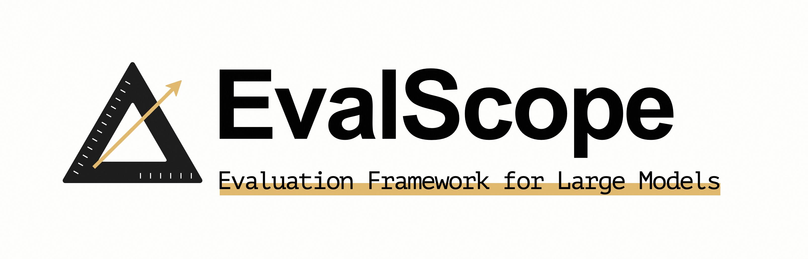

[English](README.md) | 简体中文



<p align="center">
  <a href="https://badge.fury.io/py/evalscope"></a>
  <a href="https://pypi.org/project/evalscope">
  </a>
  <a href="https://github.com/modelscope/evalscope/pulls"></a>
  <a href='https://evalscope.readthedocs.io/zh-cn/latest/?badge=latest'>
      
  </a>
  <br>
 <a href="https://evalscope.readthedocs.io/en/latest/"><span style="font-size: 16px;">📖 Documents</span></a> &nbsp | &nbsp<a href="https://evalscope.readthedocs.io/zh-cn/latest/"><span style="font-size: 16px;"> 📖  中文文档</span></a>
<p>


## 📋 目录
- [简介](#简介)
- [新闻](#新闻)
- [环境准备](#环境准备)
- [快速开始](#快速开始)
- [使用其他评测后端](#使用其他评测后端)
- [自定义数据集评测](#自定义数据集评测)
- [离线环境评测](#离线环境评测)
- [竞技场模式](#竞技场模式)
- [性能评测工具](#性能评测工具)
- [Leaderboard榜单](#leaderboard-榜单)


## 📝 简介
大模型（包括大语言模型和多模态模型）评估，已成为评价和改进大模型的重要流程和手段，为了更好地支持大模型的评测，我们提出了EvalScope框架。

### 框架特点
- **基准数据集**：预置了多个常用测试基准，包括：MMLU、CMMLU、C-Eval、GSM8K、ARC、HellaSwag、TruthfulQA、MATH、HumanEval等。
- **评估指标**：实现了多种常用评估指标。
- **模型接入**：统一的模型接入机制，兼容多个系列模型的Generate、Chat接口。
- **自动评估**：包括客观题自动评估和使用专家模型进行的复杂任务评估。
- **评估报告**：自动生成评估报告。
- **竞技场(Arena)模式**：用于模型间的比较以及模型的客观评估，支持多种评估模式，包括：
  - **Single mode**：对单个模型进行评分。
  - **Pairwise-baseline mode**：与基线模型进行对比。
  - **Pairwise (all) mode**：所有模型间的两两对比。
- **可视化工具**：提供直观的评估结果展示。
- **模型性能评估**：提供模型推理服务压测工具和详细统计，详见[模型性能评估文档](https://evalscope.readthedocs.io/zh-cn/latest/user_guides/stress_test.html)。
- **OpenCompass集成**：支持OpenCompass作为评测后段，对其进行了高级封装和任务简化，您可以更轻松地提交任务进行评估。
- **VLMEvalKit集成**：支持VLMEvalKit作为评测后端，轻松发起多模态评测任务，支持多种多模态模型和数据集。
- **全链路支持**：通过与[ms-swift](https://github.com/modelscope/ms-swift)训练框架的无缝集成，实现模型训练、模型部署、模型评测、评测报告查看的一站式开发流程，提升用户的开发效率。

<details><summary>框架架构</summary>

<p align="center">
    
    <br>图 1. EvalScope 整体架构图.
</p>

包括以下模块：

1. **Model Adapter**: 模型适配器，用于将特定模型的输出转换为框架所需的格式，支持API调用的模型和本地运行的模型。

2. **Data Adapter**: 数据适配器，负责转换和处理输入数据，以便适应不同的评估需求和格式。

3. **Evaluation Backend**: 
    - **Native**：EvalScope自身的**默认评测框架**，支持多种评估模式，包括单模型评估、竞技场模式、Baseline模型对比模式等。
    - **OpenCompass**：支持[OpenCompass](https://github.com/open-compass/opencompass)作为评测后段，对其进行了高级封装和任务简化，您可以更轻松地提交任务进行评估。
    - **VLMEvalKit**：支持[VLMEvalKit](https://github.com/open-compass/VLMEvalKit)作为评测后端，轻松发起多模态评测任务，支持多种多模态模型和数据集。
    - **ThirdParty**：其他第三方评估任务，如ToolBench。

4. **Performance Evaluator**: 模型性能评测，负责具体衡量模型推理服务性能，包括性能评测、压力测试、性能评测报告生成、可视化。

5. **Evaluation Report**: 最终生成的评估报告，总结模型的性能表现，报告可以用于决策和进一步的模型优化。

6. **Visualization**: 可视化结果，帮助用户更直观地理解评估结果，便于分析和比较不同模型的表现。

</details>

## 🎉 新闻
- 🔥 **[2024.08.30]** 支持自定义数据集评测，包括文本数据集和多模态图文数据集。
- 🔥 **[2024.08.20]** 更新了官方文档，包括快速上手、最佳实践和常见问题等，欢迎[📖阅读](https://evalscope.readthedocs.io/zh-cn/latest/)。
- 🔥 **[2024.08.09]** 简化安装方式，支持pypi安装vlmeval相关依赖；优化多模态模型评估体验，基于OpenAI API方式的评估链路，最高加速10倍。
- 🔥 **[2024.07.31]** 重要修改：`llmuses`包名修改为`evalscope`，请同步修改您的代码。
- 🔥 **[2024.07.26]** 支持**VLMEvalKit**作为第三方评测框架，发起多模态模型评测任务。
- 🔥 **[2024.06.29]** 支持**OpenCompass**作为第三方评测框架，我们对其进行了高级封装，支持pip方式安装，简化了评估任务配置。
- 🔥 **[2024.06.13]** EvalScope与微调框架SWIFT进行无缝对接，提供LLM从训练到评测的全链路支持 。
- 🔥 **[2024.06.13]** 接入Agent评测集ToolBench。


## 🛠️ 环境准备
### 方式1. 使用pip安装
我们推荐使用conda来管理环境，并使用pip安装依赖:
1. 创建conda环境 (可选)
```shell
# 建议使用 python 3.10
conda create -n evalscope python=3.10

# 激活conda环境
conda activate evalscope
```
2. pip安装依赖
```shell
pip install evalscope                # 安装 Native backend (默认)
# 额外选项
pip install evalscope[opencompass]   # 安装 OpenCompass backend
pip install evalscope[vlmeval]       # 安装 VLMEvalKit backend
pip install evalscope[all]           # 安装所有 backends (Native, OpenCompass, VLMEvalKit)
```


> [!WARNING]
> 由于项目更名为`evalscope`，对于`v0.4.3`或更早版本，您可以使用以下命令安装：
> ```shell
>  pip install llmuses<=0.4.3
> ```
> 使用`llmuses`导入相关依赖：
> ``` python
> from llmuses import ...
> ```


### 方式2. 使用源码安装
1. 下载源码
```shell
git clone https://github.com/modelscope/evalscope.git
```
2. 安装依赖
```shell
cd evalscope/

pip install -e .                  # 安装 Native backend
# 额外选项
pip install -e '.[opencompass]'   # 安装 OpenCompass backend
pip install -e '.[vlmeval]'       # 安装 VLMEvalKit backend
pip install -e '.[all]'           # 安装所有 backends (Native, OpenCompass, VLMEvalKit)
```


## 🚀 快速开始

### 1. 简单评估
在指定的若干数据集上使用默认配置评估某个模型，流程如下：

#### 使用pip安装

可在任意路径下执行：
```bash
python -m evalscope.run \
 --model qwen/Qwen2-0.5B-Instruct \
 --template-type qwen \
 --datasets arc 
```

#### 使用源码安装

在`evalscope`路径下执行：
```bash
python evalscope/run.py \
 --model qwen/Qwen2-0.5B-Instruct \
 --template-type qwen \
 --datasets arc
```

如遇到 `Do you wish to run the custom code? [y/N]` 请键入 `y`


#### 基本参数说明
- `--model`: 指定了模型在[ModelScope](https://modelscope.cn/)中的`model_id`，可自动下载，例如[Qwen2-0.5B-Instruct模型链接](https://modelscope.cn/models/qwen/Qwen2-0.5B-Instruct/summary)；也可使用模型的本地路径，例如`/path/to/model`
- `--template-type`: 指定了模型对应的模板类型，参考[模板表格](https://swift.readthedocs.io/zh-cn/latest/LLM/%E6%94%AF%E6%8C%81%E7%9A%84%E6%A8%A1%E5%9E%8B%E5%92%8C%E6%95%B0%E6%8D%AE%E9%9B%86.html#id4)中的`Default Template`字段填写
- `--datasets`: 数据集名称，支持输入多个数据集，使用空格分开，数据集将自动下载，支持的数据集参考[数据集列表](https://evalscope.readthedocs.io/zh-cn/latest/get_started/supported_dataset.html)


### 2. 带参数评估
若想进行更加自定义的评估，例如自定义模型参数，或者数据集参数，可以使用以下命令：

**示例1：**
```shell
python evalscope/run.py \
 --model qwen/Qwen2-0.5B-Instruct \
 --template-type qwen \
 --model-args revision=v1.0.2,precision=torch.float16,device_map=auto \
 --datasets mmlu ceval \
 --use-cache true \
 --limit 10
```

**示例2：**
```shell
python evalscope/run.py \ 
 --model qwen/Qwen2-0.5B-Instruct \
 --template-type qwen \
 --generation-config do_sample=false,temperature=0.0 \
 --datasets ceval \
 --dataset-args '{"ceval": {"few_shot_num": 0, "few_shot_random": false}}' \
 --limit 10
```

#### 参数说明
除开上述三个[基本参数](#基本参数说明)，其他参数如下：
- `--model-args`: 模型加载参数，以逗号分隔，key=value形式
- `--generation-config`: 生成参数，以逗号分隔，key=value形式
  - `do_sample`: 是否使用采样，默认为`false`
  - `max_new_tokens`: 生成最大长度，默认为1024
  - `temperature`: 采样温度
  - `top_p`: 采样阈值
  - `top_k`: 采样阈值
- `--use-cache`: 是否使用本地缓存，默认为`false`；如果为`true`，则已经评估过的模型和数据集组合将不会再次评估，直接从本地缓存读取
- `--dataset-args`: 评估数据集的设置参数，以json格式传入，key为数据集名称，value为参数，注意需要跟`--datasets`参数中的值一一对应
  - `--few_shot_num`: few-shot的数量
  - `--few_shot_random`: 是否随机采样few-shot数据，如果不设置，则默认为`true`
- `--limit`: 每个数据集最大评估数据量，不填写则默认为全部评估，可用于快速验证


### 3. 使用run_task函数提交评估任务

使用`run_task`函数提交评估任务所需参数与命令行启动评估任务相同。

需要传入一个字典作为参数，字典中包含以下字段：

#### 1. 配置任务字典参数
```python
import torch
from evalscope.constants import DEFAULT_ROOT_CACHE_DIR

# 示例
your_task_cfg = {
        'model_args': {'revision': None, 'precision': torch.float16, 'device_map': 'auto'},
        'generation_config': {'do_sample': False, 'repetition_penalty': 1.0, 'max_new_tokens': 512},
        'dataset_args': {},
        'dry_run': False,
        'model': 'qwen/Qwen2-0.5B-Instruct',
        'template_type': 'qwen', 
        'datasets': ['arc', 'hellaswag'],
        'work_dir': DEFAULT_ROOT_CACHE_DIR,
        'outputs': DEFAULT_ROOT_CACHE_DIR,
        'mem_cache': False,
        'dataset_hub': 'ModelScope',
        'dataset_dir': DEFAULT_ROOT_CACHE_DIR,
        'limit': 10,
        'debug': False
    }
```
其中`DEFAULT_ROOT_CACHE_DIR` 为 `'~/.cache/evalscope'`

#### 2. run_task执行任务
```python
from evalscope.run import run_task

run_task(task_cfg=your_task_cfg)
```

## 使用其他评测后端
EvalScope支持使用第三方评测框架发起评测任务，我们称之为评测后端 (Evaluation Backend)。目前支持的Evaluation Backend有：
- **Native**：EvalScope自身的**默认评测框架**，支持多种评估模式，包括单模型评估、竞技场模式、Baseline模型对比模式等。
- [OpenCompass](https://github.com/open-compass/opencompass)：通过EvalScope作为入口，发起OpenCompass的评测任务，轻量级、易于定制、支持与LLM微调框架[ms-wift](https://github.com/modelscope/swift)的无缝集成，[📖使用指南](https://evalscope.readthedocs.io/zh-cn/latest/user_guides/opencompass_backend.html)
- [VLMEvalKit](https://github.com/open-compass/VLMEvalKit)：通过EvalScope作为入口，发起VLMEvalKit的多模态评测任务，支持多种多模态模型和数据集，支持与LLM微调框架[ms-wift](https://github.com/modelscope/swift)的无缝集成，[📖使用指南](https://evalscope.readthedocs.io/zh-cn/latest/user_guides/vlmevalkit_backend.html)
- **ThirdParty**: 第三方评估任务，如[ToolBench](https://evalscope.readthedocs.io/zh-cn/latest/third_party/toolbench.html)。

## 自定义数据集评测
EvalScope支持自定义数据集评测，具体请参考：自定义数据集评测[📖使用指南](https://evalscope.readthedocs.io/zh-cn/latest/advanced_guides/custom_dataset.html)

## 离线环境评测
数据集默认托管在[ModelScope](https://modelscope.cn/datasets)上，加载需要联网。如果是无网络环境，参考：离线环境评估[📖使用指南](https://evalscope.readthedocs.io/zh-cn/latest/user_guides/offline_evaluation.html)


## 竞技场模式
竞技场模式允许多个候选模型通过两两对比(pairwise battle)的方式进行评估，并可以选择借助AI Enhanced Auto-Reviewer（AAR）自动评估流程或者人工评估的方式，最终得到评估报告。参考：竞技场模式[📖使用指南](https://evalscope.readthedocs.io/zh-cn/latest/user_guides/arena.html)


## 性能评测工具
一个专注于大型语言模型的压力测试工具，可以自定义以支持各种数据集格式和不同的API协议格式。参考：性能测试[📖使用指南](https://evalscope.readthedocs.io/zh-cn/latest/user_guides/stress_test.html)


## Leaderboard 榜单
ModelScope LLM Leaderboard大模型评测榜单旨在提供一个客观、全面的评估标准和平台，帮助研究人员和开发者了解和比较ModelScope上的模型在各种任务上的性能表现。

[Leaderboard](https://modelscope.cn/leaderboard/58/ranking?type=free)


## TO-DO List
- [x] Agents evaluation
- [x] vLLM
- [ ] Distributed evaluating
- [x] Multi-modal evaluation
- [ ] Benchmarks
  - [ ] GAIA
  - [ ] GPQA
  - [x] MBPP
- [ ] Auto-reviewer
  - [ ] Qwen-max


