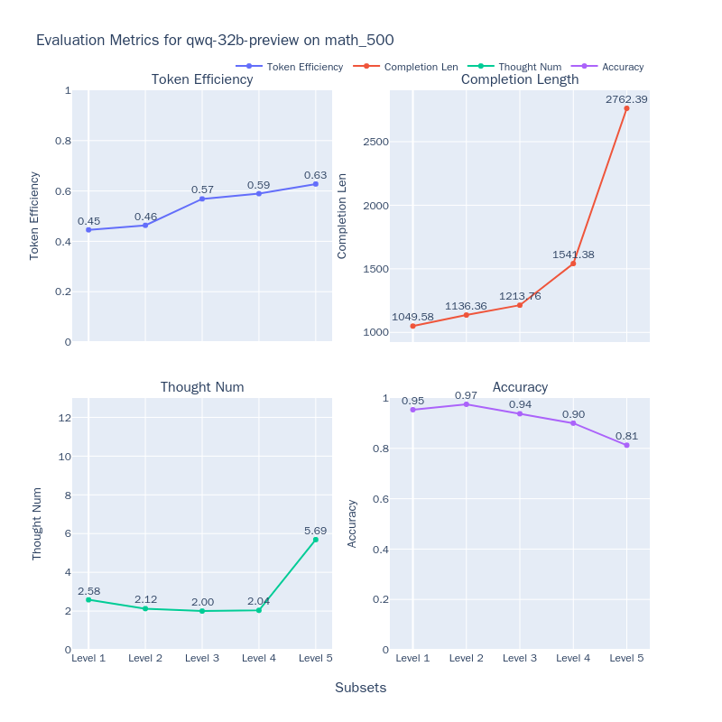

# Best Practices for Evaluating the QwQ Model

Today (March 6, 2025), the Qwen team released the QwQ-32B model, which matches the performance of DeepSeek-R1-671B across a range of benchmark tests. The results below showcase the performance comparison of QwQ-32B with other leading models.


In this best practice guide, we will use the [EvalScope](https://github.com/modelscope/evalscope) model evaluation framework to test the reasoning capabilities and thought efficiency of the QwQ-32B model.

The process of this best practice includes installing dependencies, preparing the model, evaluating the model, and visualizing the evaluation results. Let's get started.

## Install Dependencies

First, install the [EvalScope](https://github.com/modelscope/evalscope) model evaluation framework:

```bash
pip install 'evalscope[app,perf]' -U
```

## Model Inference

### Prepare the Evaluation Model

First, we need to connect to a model capable of inference via an OpenAI API-compatible service for evaluation. Notably, EvalScope also supports using transformers for model inference evaluation; detailed information can be found in the EvalScope documentation.

In addition to deploying the model on cloud services that support OpenAI interfaces, you can choose to run the model locally using frameworks like vLLM, ollama, etc. These inference frameworks support concurrent requests well, thus speeding up the evaluation process. Especially for R1 class models, which usually produce long reasoning chains with output token counts often exceeding 10,000, deploying the model on an efficient inference framework can significantly improve reasoning speed.

```bash
VLLM_USE_MODELSCOPE=True CUDA_VISIBLE_DEVICES=0 python -m vllm.entrypoints.openai.api_server --model Qwen/QwQ-32B --served-model-name QwQ-32B --trust_remote_code --port 8801
```

**Model Inference Speed Test**

```{seealso}
[QwQ-32B-Preview Model Inference Speed Test](../experiments/speed_benchmark/QwQ-32B-Preview.md)
```

### Evaluate the Model Using EvalScope

Run the following command to have the model perform inference on the MATH-500 dataset and obtain the output for each question, as well as the overall accuracy:

```python
from evalscope import TaskConfig, run_task

task_config = TaskConfig(
    api_url='http://0.0.0.0:8801/v1',  # Inference service address
    model='Qwen/QwQ-32B',  # Model name (must match the name during deployment)
    eval_type='service',  # Evaluation type, SERVICE indicates evaluation of inference service
    datasets=['math_500'],  # Dataset name
    dataset_args={'math_500': {'few_shot_num': 0}},  # Dataset parameters
    eval_batch_size=32,  # Number of concurrent requests
    generation_config={
        'max_tokens': 32000,  # Maximum number of tokens to generate; suggested to set high to avoid truncation
        'temperature': 0.6,  # Sampling temperature (recommended value from Qwen report)
        'top_p': 0.95,  # Top-p sampling (recommended value from Qwen report)
        'top_k': 40,  # Top-k sampling (recommended value from Qwen report)
        'n': 1,  # Number of responses per request
    },
)
run_task(task_config)
```

The output results are as follows, showing the model's accuracy on each level of questions:

```text
+---------+-----------+---------------+----------+-------+---------+---------+
| Model   | Dataset   | Metric        | Subset   |   Num |   Score | Cat.0   |
+=========+===========+===============+==========+=======+=========+=========+
| QwQ-32B | math_500  | AveragePass@1 | Level 1  |    43 |  0.9535 | default |
+---------+-----------+---------------+----------+-------+---------+---------+
| QwQ-32B | math_500  | AveragePass@1 | Level 2  |    90 |  1      | default |
+---------+-----------+---------------+----------+-------+---------+---------+
| QwQ-32B | math_500  | AveragePass@1 | Level 3  |   105 |  0.9714 | default |
+---------+-----------+---------------+----------+-------+---------+---------+
| QwQ-32B | math_500  | AveragePass@1 | Level 4  |   128 |  0.9375 | default |
+---------+-----------+---------------+----------+-------+---------+---------+
| QwQ-32B | math_500  | AveragePass@1 | Level 5  |   134 |  0.9403 | default |
+---------+-----------+---------------+----------+-------+---------+---------+ 
```

To run on [other datasets](../get_started/supported_dataset.md#1-native-supported-datasets), you can modify the `datasets` and `dataset_args` parameters in the above configuration as follows:

```python
datasets=[
    # 'math_500',  # Dataset name
    'gpqa',
    'aime24'
],
dataset_args={
    # 'math_500': {'few_shot_num': 0 } ,
    'gpqa': {'subset_list': ['gpqa_diamond'], 'few_shot_num': 0},
    'aime24': {'few_shot_num': 0}
},
```

The results are as follows:
```text
+---------+-----------+---------------+--------------+-------+---------+---------+
| Model   | Dataset   | Metric        | Subset       |   Num |   Score | Cat.0   |
+=========+===========+===============+==============+=======+=========+=========+
| QwQ-32B | aime24    | AveragePass@1 | default      |    30 |     0.8 | default |
+---------+-----------+---------------+--------------+-------+---------+---------+ 
| QwQ-32B | gpqa      | AveragePass@1 | gpqa_diamond |   198 |  0.6717 | default |
+---------+-----------+---------------+--------------+-------+---------+---------+
```

## Visualizing Evaluation Results

EvalScope supports visualizing results, allowing you to see the specific outputs of the model.

Run the following command to start the visualization interface:

```bash
evalscope app --lang en
```

Select the evaluation report and click load to view the model's outputs for each question, along with the overall accuracy:


## Evaluating Thought Efficiency

Inference models may encounter two extreme problems during reasoning: **Underthinking** and **Overthinking**:

- **Underthinking** refers to the phenomenon where the model frequently shifts reasoning and repeatedly uses phrases like “alternatively,” “but wait,” “let me reconsider,” etc., failing to focus on a correct line of thought and deepening its reasoning, leading to incorrect answers. This phenomenon is akin to "Attention Deficit Hyperactivity Disorder" in humans, affecting the model's reasoning quality.

- **Overthinking** manifests as the model generating excessively long reasoning chains unnecessarily, wasting significant computational resources. For instance, for a simple question like "2+3=?", some long reasoning models may consume over 900 tokens exploring multiple solving strategies. Although such reasoning chain strategies are very helpful for complex problems, repeatedly validating existing answers and overextending explorations for simple questions clearly wastes computational resources.

Both phenomena underscore a key issue: how to enhance the model's thinking efficiency while ensuring answer quality? In other words, **we want the model to arrive at the correct answer in as short an output as possible**. Next, we will measure the thinking efficiency of models like QwQ-32B using the [MATH-500](https://www.modelscope.cn/datasets/AI-ModelScope/MATH-500) dataset, evaluating the model's performance from four dimensions: token efficiency, reasoning length, number of sub-reasoning chains, and accuracy. Specific metric definitions can be referenced in [ThinkEval](./think_eval.md).

Run the following command to start the thought efficiency evaluation:

```python
from evalscope.third_party.thinkbench import run_task

judge_config = dict(  # Evaluation service configuration
    api_key='EMPTY',
    base_url='http://0.0.0.0:8801/v1',
    model_name='Qwen2.5-72B-Instruct',
)

model_config = dict(
    report_path='./outputs/2025xxxx',  # Path to the previous model inference results
    model_name='QwQ-32B',  # Model name
    tokenizer_path='Qwen/QwQ-32B',  # Tokenizer path for the model to calculate token count
    dataset_name='math_500',  # Name of the dataset from the previous step
    subsets=['Level 1', 'Level 2', 'Level 3', 'Level 4', 'Level 5'],  # Subsets of the dataset from the previous step
    split_strategies='separator',  # Inference step splitting strategy, options include separator, keywords, llm
    judge_config=judge_config
)

max_tokens = 8000  # Filter outputs with token counts less than max_tokens to improve evaluation efficiency
count = 50  # Filter count outputs from each subset to improve evaluation efficiency

# Evaluate the model's thinking efficiency
run_task(model_config, output_dir='outputs', max_tokens=max_tokens, count=count)
```

The results are displayed as follows:


We also tested the QwQ-32B-Preview model, and the results are displayed as follows:



Compared to the QwQ-32B-Preview model, the QwQ-32B model is more powerful, but it also has a greater occurrence of Overthinking, longer reasoning lengths, and a larger number of sub-reasoning chains.