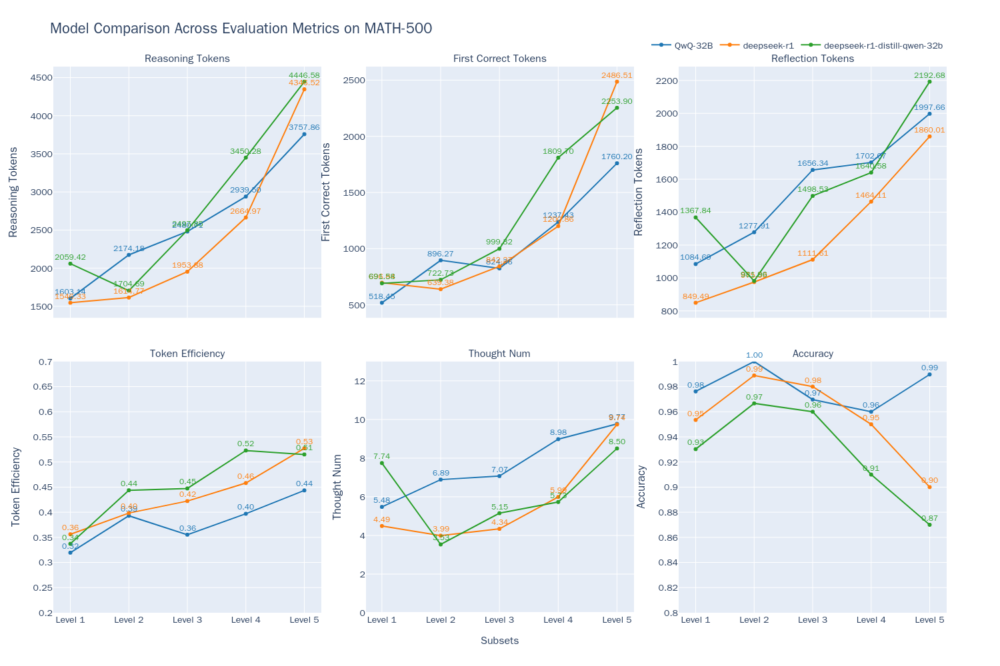

# Best Practices for Evaluating the QwQ Model

Today (March 6, 2025), the Qwen team released the QwQ-32B model, which matches the performance of DeepSeek-R1-671B across a range of benchmark tests. The results below show a performance comparison between QwQ-32B and other leading models.


In this best practice guide, we will use the [EvalScope](https://github.com/modelscope/evalscope) model evaluation framework to test the reasoning capabilities and cognitive efficiency of the QwQ-32B model.

The process for this best practice includes installing dependencies, preparing the model, evaluating the model, and visualizing the evaluation results. Let’s get started.

## Installing Dependencies

First, install the [EvalScope](https://github.com/modelscope/evalscope) model evaluation framework:

```bash
pip install 'evalscope[app,perf]' -U
```

## Model Inference

### Preparing the Evaluation Model

To evaluate the model, we first need to access its capabilities through an OpenAI API-compatible inference service. Notably, EvalScope also supports model inference evaluation using transformers; detailed information can be found in the EvalScope documentation.

In addition to deploying the model to a cloud service that supports the OpenAI interface, you can also choose to run the model locally using frameworks like vLLM or Ollama. These inference frameworks can effectively handle multiple concurrent requests, thus speeding up the evaluation process. This is particularly important for R1 models, as their outputs often include lengthy reasoning chains, with the output token count frequently exceeding 10,000. Utilizing efficient inference frameworks to deploy the model can significantly enhance reasoning speed.

```bash
VLLM_USE_MODELSCOPE=True CUDA_VISIBLE_DEVICES=0 python -m vllm.entrypoints.openai.api_server --model Qwen/QwQ-32B  --served-model-name QwQ-32B --trust_remote_code --port 8801
```

**Model Inference Speed Testing**

```{seealso}
[QwQ-32B-Preview Model Inference Speed Test](../experiments/speed_benchmark/QwQ-32B-Preview.md)
```

### Evaluating the Model Using EvalScope

Run the following command to perform inference on the MATH-500 dataset and obtain the model's output for each question, as well as the overall accuracy:

```python
from evalscope import TaskConfig, run_task

task_config = TaskConfig(
    api_url='http://0.0.0.0:8801/v1',  # Inference service address
    model='Qwen/QwQ-32B',  # Model name (must match the name used during deployment)
    eval_type='service',  # Evaluation type, SERVICE indicates evaluation of the inference service
    datasets=['math_500'],  # Dataset name
    dataset_args={'math_500': {'few_shot_num': 0}},  # Dataset parameters
    eval_batch_size=32,  # Number of concurrent requests
    generation_config={
        'max_tokens': 32000,  # Maximum number of tokens to generate; suggested to set high to avoid truncation
        'temperature': 0.6,  # Sampling temperature (recommended value from the Qwen report)
        'top_p': 0.95,  # Top-p sampling (recommended value from the Qwen report)
        'top_k': 40,  # Top-k sampling (recommended value from the Qwen report)
        'n': 1,  # Number of replies generated per request
    },
)
run_task(task_config)
```

The output will show the model's accuracy for each level of questions:

```text
+---------+-----------+---------------+----------+-------+---------+---------+
| Model   | Dataset   | Metric        | Subset   |   Num |   Score | Cat.0   |
+=========+===========+===============+==========+=======+=========+=========+
| QwQ-32B | math_500  | AveragePass@1 | Level 1  |    43 |  0.9535 | default |
+---------+-----------+---------------+----------+-------+---------+---------+
| QwQ-32B | math_500  | AveragePass@1 | Level 2  |    90 |  1      | default |
+---------+-----------+---------------+----------+-------+---------+---------+
| QwQ-32B | math_500  | AveragePass@1 | Level 3  |   105 |  0.9714 | default |
+---------+-----------+---------------+----------+-------+---------+---------+
| QwQ-32B | math_500  | AveragePass@1 | Level 4  |   128 |  0.9375 | default |
+---------+-----------+---------------+----------+-------+---------+---------+
| QwQ-32B | math_500  | AveragePass@1 | Level 5  |   134 |  0.9403 | default |
+---------+-----------+---------------+----------+-------+---------+---------+ 
```

To run the evaluation using [other datasets](../get_started/supported_dataset.md#1-原生支持的数据集), you can modify the `datasets` and `dataset_args` parameters in the configuration as follows:

```python
datasets=[
    # 'math_500',  # Dataset name
    'gpqa',
    'aime24'
],
dataset_args={
    # 'math_500': {'few_shot_num': 0 } ,
    'gpqa': {'subset_list': ['gpqa_diamond'], 'few_shot_num': 0},
    'aime24': {'few_shot_num': 0}
},
```

The output will look like this:
```text
+---------+-----------+---------------+--------------+-------+---------+---------+
| Model   | Dataset   | Metric        | Subset       |   Num |   Score | Cat.0   |
+=========+===========+===============+==============+=======+=========+=========+
| QwQ-32B | aime24    | AveragePass@1 | default      |    30 |     0.8 | default |
+---------+-----------+---------------+--------------+-------+---------+---------+ 
| QwQ-32B | gpqa      | AveragePass@1 | gpqa_diamond |   198 |  0.6717 | default |
+---------+-----------+---------------+--------------+-------+---------+---------+
```

## Visualizing Evaluation Results

EvalScope supports visualization of results, allowing you to examine the specific outputs from the model.

Run the following command to launch the visualization interface:

```bash
evalscope app --lang en
```

Select the evaluation report and click to load it to see the model's outputs for each question, as well as the overall accuracy:


## Evaluating Cognitive Efficiency

These inference models may experience two extreme issues during reasoning: **Underthinking** and **Overthinking**:

- **Underthinking** refers to the phenomenon where the model frequently jumps between ideas during reasoning, repeatedly using phrases like “alternatively,” “but wait,” or “let me reconsider,” failing to concentrate on a single correct approach and delving deeper into it, resulting in incorrect answers. This phenomenon is similar to human "attention deficit hyperactivity disorder" and impacts the model's reasoning quality.

- **Overthinking** is characterized by the model generating unnecessarily lengthy reasoning chains, wasting substantial computational resources. For instance, for a simple question like "2+3=?", some long reasoning models might consume over 900 tokens exploring various problem-solving strategies. While this reasoning chain strategy is very helpful for complex problems, repeatedly validating existing answers and overly broad exploration for simple issues is clearly a waste of computational resources.

Both phenomena highlight a key issue: how to improve the model's cognitive efficiency while ensuring answer quality? In other words, **we want the model to obtain the correct answer with the shortest possible output**. We will subsequently measure the cognitive efficiency of QwQ-32B and other models using the [MATH-500](https://www.modelscope.cn/datasets/AI-ModelScope/MATH-500) dataset, evaluating the model's performance across six dimensions:

- Total reasoning tokens ($T$): The total number of reasoning content tokens during the model's inference, generally the portion before the `</think>` tag.
- First correct tokens ($\hat{T}$): The number of tokens from the start to the first token that can be recognized as a correct answer during inference.
- Remaining reflection tokens: $T - \hat{T}$, the number of tokens from the first correct answer position to the end of reasoning.
- Reflection verification efficiency (Token Efficiency): $\hat{T}/T$, the proportion of tokens from the start to the first correct answer position compared to the total tokens.
- Number of sub-thought chains (Thought Num): The count of sub-thought chains during the model's reasoning, assessed by counting specific keywords (e.g., `alternatively`, `but wait`, `let me reconsider`, etc.).
- Accuracy: The proportion of correct samples to total samples during the model's reasoning.

For detailed evaluation methods, please refer to [ThinkEval](./think_eval.md).

Run the following command to initiate the cognitive efficiency evaluation:

```python
from evalscope.third_party.thinkbench import run_task

judge_config = dict(  # Evaluation service configuration
    api_key='EMPTY',
    base_url='http://0.0.0.0:8801/v1',
    model_name='Qwen2.5-72B-Instruct',
)

model_config = dict(
    report_path='./outputs/2025xxxx',  # Path to the model inference results from the previous step
    model_name='QwQ-32B',  # Model name
    tokenizer_path='Qwen/QwQ-32B',  # Path to the model tokenizer for calculating token counts
    dataset_name='math_500',  # Name of the dataset from the previous step
    subsets=['Level 1', 'Level 2', 'Level 3', 'Level 4', 'Level 5'],  # Subsets of the dataset from the previous step
    split_strategies='separator',  # Inference step splitting strategy; options are separator, keywords, llm
    judge_config=judge_config
)

max_tokens = 8000  # Filter outputs with token counts less than max_tokens for improved evaluation efficiency
count = 100  # Filter count outputs for each subset to enhance evaluation efficiency

# Evaluate the model's cognitive efficiency
run_task(model_config, output_dir='outputs', max_tokens=max_tokens, count=count)
```

**Note:** Here, we set `max_tokens` to 8000 and `count` to 100 to improve evaluation efficiency, reducing evaluation time. If you need more precise evaluation results, you can set a larger `max_tokens` and `count`.

The results are shown in the figure below:


We also tested the DeepSeek-R1-671B model and the DeepSeek-R1-Distill-Qwen-32B model, and the results are consolidated in the figure below:



Based on this chart, I can analyze some advantages and disadvantages of the QwQ-32B model compared to the other two models:

Advantages:
- In terms of accuracy, QwQ-32B performs best across most levels, particularly excelling at Level 5, which features more difficult questions.
- QwQ-32B shows strong performance in terms of the number of first correct tokens, especially excelling in high-difficulty problems, allowing it to reach correct answers more quickly.

Disadvantages:
- Regarding reasoning efficiency, QwQ-32B uses more tokens in lower levels (Level 1-3) and has a higher number of reflection verification tokens, which may indicate lower efficiency on simpler tasks and a tendency towards over-analysis.

Overall, the QwQ-32B model appears to perform better when handling complex tasks, demonstrating high accuracy and deep reasoning capabilities. However, it may not be as efficient as other models when dealing with simpler tasks. This model could be more suited for complex reasoning tasks, while it may seem somewhat "overkill" for everyday or simple queries.