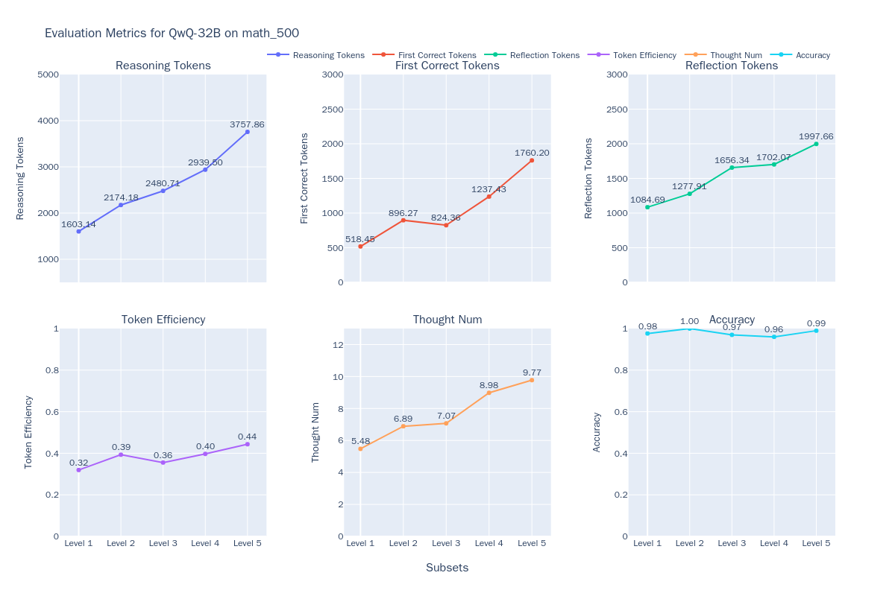

# Evaluating the QwQ Model

Today (March 6, 2025), the Qwen team released the QwQ-32B model, which has demonstrated performance comparable to DeepSeek-R1-671B in a series of benchmark tests. The results below showcase the performance comparison of QwQ-32B with other leading models.


In this best practice guide, we will use the [EvalScope](https://github.com/modelscope/evalscope) model evaluation framework to test the reasoning capabilities and thinking efficiency of the QwQ-32B model.

The process outlined in this guide includes installing relevant dependencies, preparing the model, evaluating the model, and visualizing the results. Let's get started.

## Installing Dependencies

First, install the [EvalScope](https://github.com/modelscope/evalscope) evaluation framework:

```bash
pip install 'evalscope[app,perf]' -U
```

## Model Reasoning

### Preparing the Model for Evaluation

First, we need to access the model capabilities via an OpenAI API-compatible inference service for evaluation. Notably, EvalScope also supports model inference evaluation using transformers; refer to the EvalScope documentation for detailed information.

In addition to deploying the model to a cloud service that supports the OpenAI API, you can also choose to launch the model locally using frameworks such as vLLM or Ollama. These inference frameworks effectively support concurrent requests, thereby speeding up the evaluation process. Particularly for R1-type models, the output typically contains long chains of thought, with the number of output tokens often exceeding 10,000. Deploying the model using an efficient inference framework can significantly enhance reasoning speed.

```bash
VLLM_USE_MODELSCOPE=True CUDA_VISIBLE_DEVICES=0 python -m vllm.entrypoints.openai.api_server --model Qwen/QwQ-32B  --served-model-name QwQ-32B --trust_remote_code --port 8801
```

**Model Inference Speed Test**

```{seealso}
[QwQ-32B-Preview Model Inference Speed Test](../experiments/speed_benchmark/QwQ-32B-Preview.md)
```

### Evaluating the Model for Mathematical Reasoning

Run the following command to have the model reason through the MATH-500 dataset and obtain output results for each question, as well as the overall accuracy:

```python
from evalscope import TaskConfig, run_task

task_config = TaskConfig(
    api_url='http://0.0.0.0:8801/v1',  # Inference service address
    model='Qwen/QwQ-32B',  # Model name (must match the deployed model name)
    eval_type='openai_api',  # Evaluation type; 'openai_api' indicates evaluating the inference service
    datasets=['math_500'],  # Dataset name
    dataset_args={'math_500': {'few_shot_num': 0}},  # Dataset parameters
    eval_batch_size=32,  # Number of concurrent requests
    generation_config={
        'max_tokens': 32000,  # Maximum number of tokens to generate; recommended to set a high value to avoid truncation
        'temperature': 0.6,  # Sampling temperature (recommended value from Qwen)
        'top_p': 0.95,  # Top-p sampling (recommended value from Qwen)
        'top_k': 40,  # Top-k sampling (recommended value from Qwen)
        'n': 1,  # Number of responses generated for each request
    },
)
run_task(task_config)
```

The output will look as follows, displaying the model's accuracy on problems at each difficulty level:

```text
+---------+-----------+---------------+----------+-------+---------+---------+
| Model   | Dataset   | Metric        | Subset   |   Num |   Score | Cat.0   |
+=========+===========+===============+==========+=======+=========+=========+
| QwQ-32B | math_500  | AveragePass@1 | Level 1  |    43 |  0.9535 | default |
+---------+-----------+---------------+----------+-------+---------+---------+
| QwQ-32B | math_500  | AveragePass@1 | Level 2  |    90 |  1      | default |
+---------+-----------+---------------+----------+-------+---------+---------+
| QwQ-32B | math_500  | AveragePass@1 | Level 3  |   105 |  0.9714 | default |
+---------+-----------+---------------+----------+-------+---------+---------+
| QwQ-32B | math_500  | AveragePass@1 | Level 4  |   128 |  0.9375 | default |
+---------+-----------+---------------+----------+-------+---------+---------+
| QwQ-32B | math_500  | AveragePass@1 | Level 5  |   134 |  0.9403 | default |
+---------+-----------+---------------+----------+-------+---------+---------+
```

If you want to run the model on [other datasets](../get_started/supported_dataset/llm.md), you can modify the `datasets` and `dataset_args` parameters in the configuration as follows:

```python
datasets=[
    # 'math_500',  # Dataset name
    'gpqa_diamond',
    'aime24'
],
dataset_args={
    # 'math_500': {'few_shot_num': 0 } ,
    'gpqa_diamond': {'few_shot_num': 0},
    'aime24': {'few_shot_num': 0}
},
```

The results will be:

```text
+---------+-----------+---------------+--------------+-------+---------+---------+
| Model   | Dataset   | Metric        | Subset       |   Num |   Score | Cat.0   |
+=========+===========+===============+==============+=======+=========+=========+
| QwQ-32B | aime24    | AveragePass@1 | default      |    30 |     0.8 | default |
+---------+-----------+---------------+--------------+-------+---------+---------+
| QwQ-32B | gpqa      | AveragePass@1 | gpqa_diamond |   198 |  0.6717 | default |
+---------+-----------+---------------+--------------+-------+---------+---------+
```

### Evaluating Code Capability

We use [LiveCodeBench](https://www.modelscope.cn/datasets/AI-ModelScope/code_generation_lite) to evaluate the model's code capability. The following configuration is required:

```python
# ...
datasets=['live_code_bench'],
dataset_args={
    'live_code_bench': {
        'extra_params': {
            'start_date': '2024-08-01',
            'end_date': '2025-02-28'
        },
        "filters": {"remove_until": "</think>"}  # Filter out the thinking part of the model inference process
    }
},
```

The output results are as follows:

```text
+---------+-----------------+----------+----------------+-------+---------+---------+
| Model   | Dataset         | Metric   | Subset         |   Num |   Score | Cat.0   |
+=========+=================+==========+================+=======+=========+=========+
| qwq-32b | live_code_bench | Pass@1   | release_latest |   279 |  0.6237 | default |
+---------+-----------------+----------+----------------+-------+---------+---------+
```

## Visualizing Evaluation Results

EvalScope supports visualizing results, allowing you to see the specific outputs of the model.

Run the following command to launch the visualization interface:

```bash
evalscope app --lang en
```

Select the evaluation report and click to load it, allowing you to view the model's output for each question, as well as the overall accuracy:


## Evaluating Thinking Efficiency

These reasoning models may exhibit two extreme issues during reasoning: **Underthinking** and **Overthinking**:

- The phenomenon of **Underthinking** refers to the model frequently shifting its thought process during reasoning, repeatedly using phrases such as "alternatively," "but wait," and "let me reconsider," which prevents the model from focusing on a correct thought process and deeply analyzing it, leading to incorrect answers. This phenomenon is similar to "Attention Deficit Hyperactivity Disorder" in humans, negatively impacting the quality of the model's reasoning.

- The phenomenon of **Overthinking** manifests as the model generating unnecessarily long chains of thought, wasting substantial computational resources. For example, for a simple question like "2+3=?," some long reasoning models might consume over 900 tokens exploring various problem-solving strategies. While such chain-of-thought strategies are beneficial for complex problems, repeatedly validating existing answers and conducting overly broad explorations for simple problems is clearly a waste of computational resources.

Both phenomena highlight a key question: how can we improve the thinking efficiency of models while ensuring the quality of their answers? In other words, **we want models to arrive at correct answers with outputs as brief as possible**. We will evaluate the thinking efficiency of QwQ-32B and other models using the [MATH-500](https://www.modelscope.cn/datasets/AI-ModelScope/MATH-500) dataset, assessing model performance across the following six dimensions:

- **Reasoning Tokens** ($T$): The total number of reasoning tokens generated by the model during the reasoning process, typically measured from the start of reasoning to the `</think>` tag.
- **First Correct Tokens** ($\hat{T}$): The number of tokens from the start of the reasoning process to the first position that can be recognized as the correct answer.
- **Reflection Tokens**: $T - \hat{T}$, which represents the number of tokens from the first correct answer position to the end of reasoning.
- **Token Efficiency**: $\hat{T}/T$, which is the ratio of first correct tokens to total tokens.
- **Thought Num**: The number of sub-thought chains generated by the model during reasoning, which can be determined by counting specific keywords (e.g., `alternatively`, `but wait`, `let me reconsider`).
- **Accuracy**: The ratio of correct samples to the total number of samples during the reasoning process.

For specific evaluation methods, refer to [ThinkEval](./think_eval.md).

To evaluate thinking efficiency, run the following command:

```python
from evalscope.third_party.thinkbench import run_task

judge_config = dict(  # Evaluation service configuration
    api_key='EMPTY',
    base_url='http://0.0.0.0:8801/v1',
    model_name='Qwen2.5-72B-Instruct',
)

model_config = dict(
    report_path='./outputs/2025xxxx',  # Path to the model reasoning results from the previous step
    model_name='QwQ-32B',  # Model name
    tokenizer_path='Qwen/QwQ-32B',  # Path to the model tokenizer for token count calculation
    dataset_name='math_500',  # Dataset name from the previous step
    subsets=['Level 1', 'Level 2', 'Level 3', 'Level 4', 'Level 5'],  # Subsets from the previous step
    split_strategies='separator',  # Strategy for splitting reasoning steps; options are separator, keywords, llm
    judge_config=judge_config
)

max_tokens = 20000  # Filter outputs with token counts less than max_tokens to improve evaluation efficiency
count = 200  # Filter count outputs for each subset to improve evaluation efficiency

# Evaluate model thinking efficiency
run_task(model_config, output_dir='outputs', max_tokens=max_tokens, count=count)
```

The results will be displayed as shown in the following image:



We also tested the DeepSeek-R1-671B and DeepSeek-R1-Distill-Qwen-32B models, consolidating the results as illustrated below:


Using the same methodology, we evaluated four additional reasoning models: QwQ-32B, QwQ-32B-Preview, DeepSeek-R1, DeepSeek-R1-Distill-Qwen-32B, and one non-reasoning model, Qwen2.5-Math-7B-Instruct (considering all tokens in the model output as part of the thought process) to observe the performance of different types of models. The specific results are summarized as follows:

1. As the difficulty of problems increases, the accuracy of most models tends to decline; however, both QwQ-32B and DeepSeek-R1 perform exceptionally well, maintaining high accuracy even on difficult problems, with QwQ-32B achieving the best performance at the highest difficulty level.
2. For O1/R1 type reasoning models, as the difficulty level of problems rises, although the output length consistently increases, token efficiency also improves (DeepSeek-R1 increased from 36% to 54%, QwQ-32B increased from 31% to 49%).
3. The output length of all models increases with the difficulty of the problems, indicating that models require longer "thinking time" to tackle more complex issues, which aligns with the Inference-Time Scaling phenomenon.
4. In relatively simple problems, all types of reasoning models exhibit some degree of token wastage, with repeated validations of already outputted answers.

In summary, exploring how to more accurately and granularly assess the reasoning efficiency of models is a highly worthwhile topic for further investigation. Additionally, the related testing conclusions hold significant reference value for the GRPO and SFT training processes, aiding in the development of models that are "more efficient" and capable of "adaptive reasoning" based on problem difficulty.
