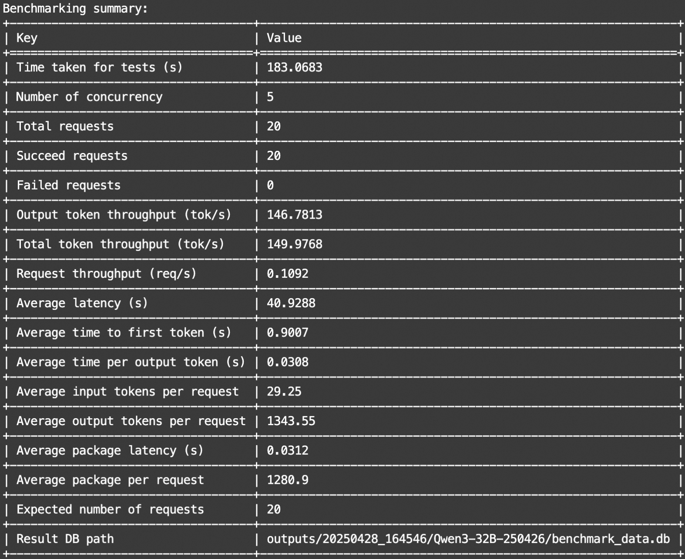
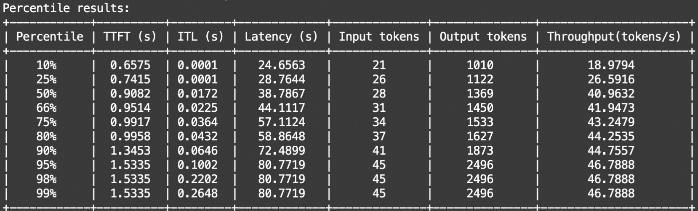
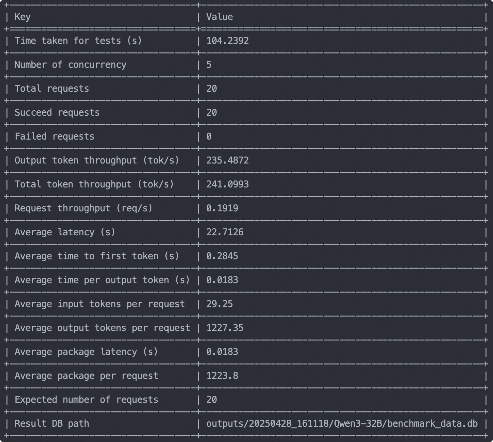
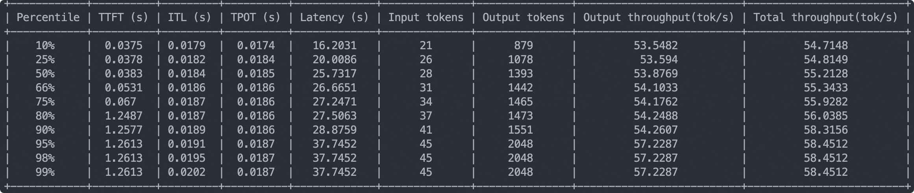
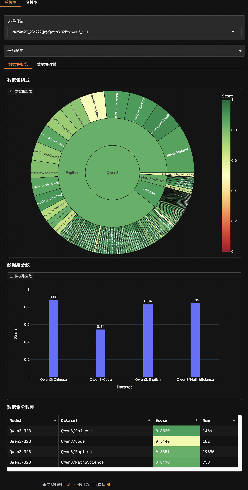
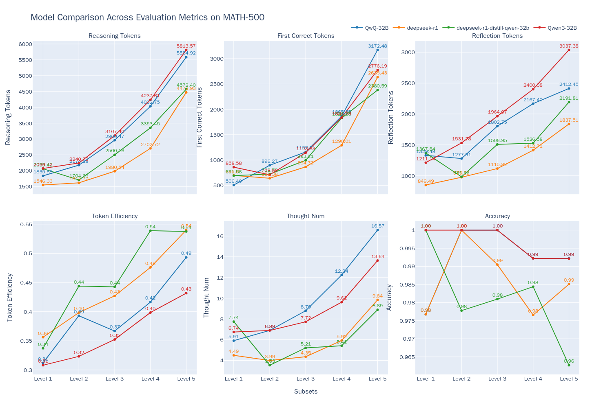

# Evaluating the Qwen3 Model

Qwen3 is the latest generation of the Qwen series of large language models, offering a range of dense and mixed expert (MoE) models. Based on extensive training, Qwen3 has made groundbreaking advances in reasoning, instruction following, agency capabilities, and multilingual support, enabling seamless switching between thinking and non-thinking modes. In this best practices article, we will use the EvalScope framework to conduct a comprehensive evaluation of the Qwen3-32B model, covering model service inference performance evaluation, model capability evaluation, and model thinking efficiency evaluation.

## Install Dependencies

First, install the [EvalScope](https://github.com/modelscope/evalscope) model evaluation framework:

```bash
pip install 'evalscope[app,perf]' -U
```

## Model Service Inference Performance Evaluation

To start, we need to access the model capabilities via an OpenAI API-compatible inference service for evaluation. It's worth noting that EvalScope also supports using transformers for model inference evaluation. For more information, refer to the [documentation](https://evalscope.readthedocs.io/en/latest/get_started/basic_usage.html#id2).

Besides deploying the model on cloud services that support the OpenAI interface, you can choose to locally start the model using frameworks like vLLM or ollama. These inference frameworks can support multiple concurrent requests, accelerating the evaluation process. Especially for inference models, whose output typically contains long chains of thought, often generating over 10,000 tokens. Using efficient inference frameworks to deploy the model can significantly increase inference speed.

### ModelScope API Inference Service Performance Evaluation

Users can access Qwen3 through the online model inference service provided by ModelScope. For details, refer to: [https://modelscope.cn/docs/model-service/API-Inference/intro](https://modelscope.cn/docs/model-service/API-Inference/intro)

> **Client-side Example**

```python
from openai import OpenAI

client = OpenAI(
    api_key="MODELSCOPE_SDK_TOKEN",  # Replace with your ModelScope SDK Token, see: https://modelscope.cn/my/myaccesstoken
    base_url="https://api-inference.modelscope.cn/v1/"
)

response = client.chat.completions.create(
    model="Qwen/Qwen3-32B",    # ModelScope model_id
    messages=[
        {
            'role': 'system',
            'content': 'You are a helpful assistant.'
        },
        {
            'role': 'user',
            'content': 'Write a quicksort in Python.'
        }
    ],
    stream=True
)

for chunk in response:
    if chunk.choices[0].delta.reasoning_content:
        print(chunk.choices[0].delta.reasoning_content, end='', flush=True)
    else:
        print(chunk.choices[0].delta.content, end='', flush=True)
```

> **Performance Test Command**

```shell
evalscope perf \
    --model Qwen/Qwen3-32B \
    --url "https://api-inference.modelscope.cn/v1/chat/completions" \
    --api-key "YOUR_MODELSCOPE_SDK_TOKEN" \
    --parallel 5 \
    --number 20 \
    --api openai \
    --dataset openqa \
    --stream \
    --wandb-api-key "YOUR_WANDB_API_KEY"  # Optional
```

*   Refer to [https://modelscope.cn/my/myaccesstoken](https://modelscope.cn/my/myaccesstoken) for obtaining YOUR\_MODELSCOPE\_SDK\_TOKEN
    

Example output:





### Local Model Service Performance Evaluation

The command to start the model service locally using the vLLM framework (vLLM version >= 0.8.5) is as follows (default is **thinking mode**):

```bash
VLLM_USE_MODELSCOPE=True CUDA_VISIBLE_DEVICES=0 vllm serve Qwen/Qwen3-32B --gpu-memory-utilization 0.9 --served-model-name Qwen3-32B --trust_remote_code --port 8801
```

> **Performance Test Command**

```shell
evalscope perf \
    --url "http://127.0.0.1:8801/v1/chat/completions" \
    --parallel 5 \
    --model Qwen3-32B \
    --number 20 \
    --api openai \
    --dataset openqa \
    --stream 
```

For detailed parameter explanations, refer to [Performance Evaluation](https://evalscope.readthedocs.io/en/latest/user_guides/stress_test/quick_start.html)

Example output:





## Model Capability Evaluation

Now let's proceed with the model capability evaluation process.

Note: Subsequent evaluation processes are based on models started using the vLLM framework. You can start the model service according to the previous step's model service performance evaluation steps or use the local model service. The model defaults to using thinking mode.

### Building Evaluation Sets (Optional)

To comprehensively evaluate the model's capabilities, we can mix the benchmarks already supported by EvalScope to create a comprehensive evaluation set. Below is an example of an evaluation set covering mainstream benchmarks, evaluating the model's coding ability (LiveCodeBench), mathematical ability (AIME2024, AIME2025), knowledge ability (MMLU-Pro, CEVAL), instruction following (IFEval), and more.

Run the following code to automatically download and mix datasets based on the defined schema and save the constructed evaluation set in a local jsonl file. Of course, you can skip this step and directly use the processed data set we placed in the [ModelScope repository](https://modelscope.cn/datasets/evalscope/Qwen3-Test-Collection/summary).

```python
from evalscope.collections import CollectionSchema, DatasetInfo, WeightedSampler
from evalscope.utils.io_utils import dump_jsonl_data

schema = CollectionSchema(name='Qwen3', datasets=[
    CollectionSchema(name='English', datasets=[
        DatasetInfo(name='mmlu_pro', weight=1, task_type='exam', tags=['en'], args={'few_shot_num': 0}),
        DatasetInfo(name='mmlu_redux', weight=1, task_type='exam', tags=['en'], args={'few_shot_num': 0}),
        DatasetInfo(name='ifeval', weight=1, task_type='instruction', tags=['en'], args={'few_shot_num': 0}),
    ]),
    CollectionSchema(name='Chinese', datasets=[
        DatasetInfo(name='ceval', weight=1, task_type='exam', tags=['zh'], args={'few_shot_num': 0}),
        DatasetInfo(name='iquiz', weight=1, task_type='exam', tags=['zh'], args={'few_shot_num': 0}),
    ]),
    CollectionSchema(name='Code', datasets=[
        DatasetInfo(name='live_code_bench', weight=1, task_type='code', tags=['en'], args={'few_shot_num': 0, 'subset_list': ['v5_v6'], 'extra_params': {'start_date': '2025-01-01', 'end_date': '2025-04-30'}}),
    ]),
    CollectionSchema(name='Math&Science', datasets=[
        DatasetInfo(name='math_500', weight=1, task_type='math', tags=['en'], args={'few_shot_num': 0}),
        DatasetInfo(name='aime24', weight=1, task_type='math', tags=['en'], args={'few_shot_num': 0}),
        DatasetInfo(name='aime25', weight=1, task_type='math', tags=['en'], args={'few_shot_num': 0}),
        DatasetInfo(name='gpqa_diamond', weight=1, task_type='knowledge', tags=['en'], args={'few_shot_num': 0})
    ])
])

# get the mixed data
mixed_data = WeightedSampler(schema).sample(100000000)  # set a large number to ensure all datasets are sampled
# dump the mixed data to a jsonl file
dump_jsonl_data(mixed_data, 'outputs/qwen3_test.jsonl')
```

### Running Evaluation Tasks

Run the following code to evaluate the Qwen3-32B model's performance in **thinking mode**:

```python
from evalscope import TaskConfig, run_task
task_cfg = TaskConfig(
    model='Qwen3-32B',
    api_url='http://127.0.0.1:8801/v1/chat/completions',
    eval_type='openai_api',
    datasets=[
        'data_collection',
    ],
    dataset_args={
        'data_collection': {
            'dataset_id': 'evalscope/Qwen3-Test-Collection',
            'filters': {'remove_until': '</think>'}  # Filter out the content of thinking
        }
    },
    eval_batch_size=128,
    generation_config={
        'max_tokens': 30000,  # Max number of generated tokens, suggested to set a large value to avoid output truncation
        'temperature': 0.6,  # Sampling temperature (recommended value per Qwen report)
        'top_p': 0.95,  # top-p sampling (recommended value per Qwen report)
        'top_k': 20,  # top-k sampling (recommended value per Qwen report)
        'n': 1,  # Number of replies generated per request
    },
    timeout=60000,  # Timeout
    stream=True,  # Use streaming output
    limit=100,  # Set to 100 samples for testing
)

run_task(task_cfg=task_cfg)
```

Output results:

Note: The results below are for 1000 samples, only for testing the evaluation process. The limitation should be removed for formal evaluation.

```text
+-------------+-------------------------+-----------------+---------------+-------+
|  task_type  |         metric          |  dataset_name   | average_score | count |
+-------------+-------------------------+-----------------+---------------+-------+
|    code     |         Pass@1          | live_code_bench |     0.544     |  182  |
|    exam     |     AverageAccuracy     |      ceval      |     0.88      |  125  |
|    exam     |     AverageAccuracy     |      iquiz      |    0.8417     |  120  |
|    exam     |     AverageAccuracy     |    mmlu_pro     |    0.6867     |  83   |
|    exam     |     AverageAccuracy     |   mmlu_redux    |    0.9277     |  83   |
| instruction |  inst_level_loose_acc   |     ifeval      |    0.9157     |  83   |
| instruction |  inst_level_strict_acc  |     ifeval      |    0.8775     |  83   |
| instruction | prompt_level_loose_acc  |     ifeval      |    0.8675     |  83   |
| instruction | prompt_level_strict_acc |     ifeval      |    0.8193     |  83   |
|  knowledge  |      AveragePass@1      |      gpqa       |      0.6      |  65   |
|    math     |      AveragePass@1      |    math_500     |    0.9516     |  62   |
|    math     |      AveragePass@1      |     aime24      |      0.7      |  30   |
|    math     |      AveragePass@1      |     aime25      |    0.7667     |  30   |
+-------------+-------------------------+-----------------+---------------+-------+
```

Testing model performance in **non-thinking mode** (note the changes in generation config):

```python
from evalscope import TaskConfig, run_task

task_cfg = TaskConfig(
    model='Qwen3-32B',
    api_url='http://127.0.0.1:8801/v1/chat/completions',
    eval_type='openai_api',
    datasets=[
        'data_collection',
    ],
    dataset_args={
        'data_collection': {
            'dataset_id': 'evalscope/Qwen3-Test-Collection',
        }
    },
    eval_batch_size=128,
    generation_config={
        'max_tokens': 20000,  # Max number of generated tokens, suggested to set a large value to avoid output truncation
        'temperature': 0.7,  # Sampling temperature (recommended value per Qwen report)
        'top_p': 0.8,  # top-p sampling (recommended value per Qwen report)
        'top_k': 20,  # top-k sampling (recommended value per Qwen report)
        'n': 1,  # Number of replies generated per request
        'extra_body':{'chat_template_kwargs': {'enable_thinking': False}}  # close thinking mode
    },
    timeout=60000,  # Timeout
    stream=True,  # Use streaming output
    limit=1000,  # Set to 1000 samples for testing
)

run_task(task_cfg=task_cfg)
```

Output results:
```text
+-------------+-------------------------+-----------------+---------------+-------+
|  task_type  |         metric          |  dataset_name   | average_score | count |
+-------------+-------------------------+-----------------+---------------+-------+
|    code     |         Pass@1          | live_code_bench |    0.2857     |  182  |
|    exam     |     AverageAccuracy     |      ceval      |     0.808     |  125  |
|    exam     |     AverageAccuracy     |      iquiz      |     0.775     |  120  |
|    exam     |     AverageAccuracy     |    mmlu_pro     |    0.6145     |  83   |
|    exam     |     AverageAccuracy     |   mmlu_redux    |    0.8313     |  83   |
| instruction |  inst_level_loose_acc   |     ifeval      |    0.6948     |  83   |
| instruction |  inst_level_strict_acc  |     ifeval      |    0.6888     |  83   |
| instruction | prompt_level_loose_acc  |     ifeval      |    0.6265     |  83   |
| instruction | prompt_level_strict_acc |     ifeval      |    0.6145     |  83   |
|  knowledge  |      AveragePass@1      |      gpqa       |    0.4154     |  65   |
|    math     |      AveragePass@1      |    math_500     |    0.4355     |  62   |
|    math     |      AveragePass@1      |     aime24      |    0.2333     |  30   |
|    math     |      AveragePass@1      |     aime25      |    0.1333     |  30   |
+-------------+-------------------------+-----------------+---------------+-------+
```

### Visualization of Evaluation Results

EvalScope supports result visualization, allowing you to view the model's specific output.

Run the following command to launch the Gradio-based visualization interface:

```shell
evalscope app
```

Select the evaluation report and click load to view the model's output for each question and overall accuracy:



## Model Thinking Efficiency Evaluation

Next, we will measure the thinking efficiency of the Qwen-32B model using the [MATH-500](https://www.modelscope.cn/datasets/AI-ModelScope/MATH-500) dataset and compare it with three other models (DeepSeek-R1, QwQ-32B, etc.). We assess the model's performance from six dimensions:

- Reasoning Tokens $T$: Total number of reasoning content tokens during model inference, typically the portion before the `</think>` tag.
- First Correct Tokens $\hat{T}$: Number of tokens from the start to the first recognizable correct answer position during model inference.
- Reflection Tokens: $T-\hat{T}$, i.e., the number of tokens from the first correct answer position to the end of reasoning.
- Token Efficiency: $\hat{T}/T$, the proportion of tokens from the start to the first correct answer position to the total token count.
- Thought Num: Number of sub-chains of thought during model inference, judged by counting keywords like `alternatively`, `but wait`, `let me reconsider`, etc.
- Accuracy: The proportion of correct samples during model inference to the total sample count.

Test results:



From the graph, we can conclude the following:

- Qwen3-32B achieves comparable accuracy to QwQ-32B in thinking mode (both overlap on the Accuracy curve), reaching the highest level.
- As problem difficulty increases, the output length increases with problem complexity, indicating longer "thinking time" for more complex problems, aligning with the Inference-Time Scaling phenomenon.
- As problem difficulty rises, although output length consistently increases, token efficiency also improves (Qwen3-32B from 31% to 43%, QwQ-32B from 31% to 49%). This suggests inference-type models consume tokens more "worthily" in complex problems. For simpler problems, unnecessary token waste might occur: even simple problems may undergo unnecessary answer verification. Qwen-32B generates more tokens than other models, maintaining high accuracy even in high-difficulty Level 5 problems, but it also indicates a tendency for over-analysis.

For detailed evaluation methods and more conclusions, refer to: [Best Practices for Model Thinking Efficiency Evaluation](https://evalscope.readthedocs.io/en/latest/best_practice/think_eval.html)
