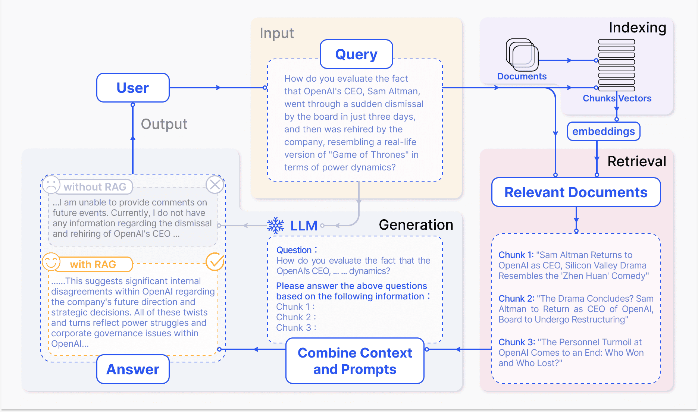
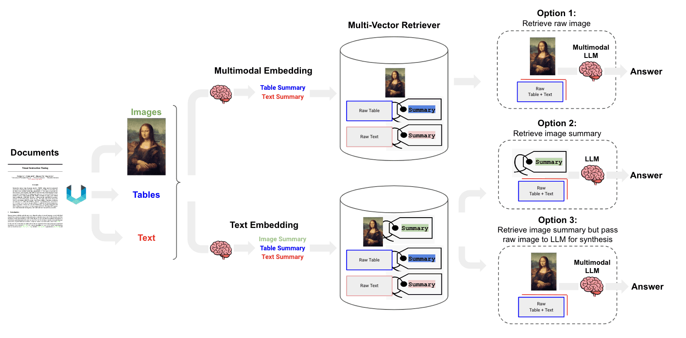

(rag-evaluation)=

# RAG Evaluation Survey: Framework, Metrics, and Methods

## RAG (Retrieval-Augmented Generation) Process

## Framework
### 1. **LlamaIndex**
[Multimodal RAG Evaluation Tutorial](https://docs.llamaindex.ai/en/stable/examples/evaluation/multi_modal/multi_modal_rag_evaluation/) 

> introduces how to evaluate multimodal retrieval-augmented generation (RAG) systems, focusing on how to use the evaluation tools in the llama-index library to assess the retriever and generator. It demonstrates how to load data, build an index, set up the RAG system, and conduct retrieval and generation evaluations using the American Sign Language (ASL) alphabet images and text descriptions as a case study.

### 2. **LangChain**
* [Multimodal (Image-Text) RAG Tutorial](https://github.com/langchain-ai/langchain/blob/master/cookbook/Multi_modal_RAG.ipynb) 

* [Semi-structured (Image-Text-Table) Multimodal RAG Tutorial](https://github.com/langchain-ai/langchain/blob/master/cookbook/Semi_structured_and_multi_modal_RAG.ipynb) 

* Multi-modal RAG

### 3. **Ragas**
* [GitHub](https://github.com/explodinggradients/ragas) 
* [Docs](https://docs.ragas.io/en/latest/getstarted/index.html) 
* Tutorial: [Evaluating RAG Applications with RAGAs](https://towardsdatascience.com/evaluating-rag-applications-with-ragas-81d67b0ee31a) 

> Introduction: RAGAs is an evaluation framework for assessing retrieval-augmented generation (RAG) applications, with its core goal being to provide a comprehensive set of evaluation metrics and methods to quantitatively assess the performance of the RAG pipeline at different component levels. RAGAs is particularly suitable for RAG systems that combine the two main components of retrieval and generation, supporting Langchain and Llama-Index.

* **Evaluation Process**
    1. Start: Initiate the process of preparing and setting up the RAG application.
    2. Data Preparation: Load and chunk the documents.
    3. Set Up Vector Database: Generate vector embeddings and store them in a vector database.
    4. Set Up Retriever Component: Set up the retriever based on the vector database.
    5. Combine RAG Pipeline: Combine the retriever, prompt templates, and LLM to form the RAG pipeline.
    6. Prepare Evaluation Data: Prepare questions and corresponding true answers.
    7. Build Dataset: Prepare data through inference and build a dataset for evaluation.
    8. Evaluate RAG Application: Import evaluation metrics and evaluate the RAG application.
    9. End: Complete the evaluation process.

* **Evaluation System**
    * No-reference Evaluation: RAGAs was initially designed as a "no-reference" evaluation framework, meaning it does not rely on human-annotated true labels but instead uses large language models (LLMs) for evaluation.
    * Component-Level Evaluation: RAGAs allows for separate evaluation of the two main components of the RAG pipeline—the retriever and the generator. This separated evaluation approach helps to precisely identify performance bottlenecks in the pipeline.
    * Comprehensive Evaluation Metrics: RAGAs provides a range of evaluation metrics, including Context Precision, Context Recall, Faithfulness, and Answer Relevancy. These metrics together form the RAGAs score, used to comprehensively assess the performance of the RAG pipeline.

### 4. **RAGChecker**
* [GitHub](https://github.com/amazon-science/RAGChecker) 
> Introduction: RAGChecker is an advanced automatic evaluation framework designed to evaluate and diagnose retrieval-augmented generation (RAG) systems. It offers a comprehensive set of metrics and tools for in-depth analysis of RAG performance. The framework includes overall evaluation, diagnostic metrics, fine-grained evaluation, benchmark datasets, and meta-evaluation.

### 5. **TruLens**
* [GitHub](https://github.com/truera/trulens) 
* [Docs](https://www.trulens.org/trulens/getting_started/quickstarts/quickstart/) 
> Introduction: After developers build a prototype, they can monitor and record with TruLens, specify the desired feedback, and iterate and compare application versions in the user interface, supporting Langchain and Llama-Index.

### 6. **FlagEmbedding**
* [GitHub](https://github.com/FlagOpen/FlagEmbedding) 
* Tutorial: [Evaluation Tutorial](https://github.com/FlagOpen/FlagEmbedding/blob/master/Tutorials/4_Evaluation).
> Introduction: FlagEmbedding is a project focused on retrieval-augmented large language models (LLMs), including several sub-projects such as long-text LLM, fine-tuned LM, embedding models, re-ranking models, and benchmarking. However, it does not provide an evaluation framework. 

### 7. **Continuous Eval**
* [GitHub](https://github.com/relari-ai/continuous-eval) 
> Introduction: continuous-eval is an open-source software package designed to provide data-driven evaluation for applications based on large language models (LLMs). It supports fine-grained evaluation of LLM applications through modular evaluation, comprehensive metric libraries, leveraging user feedback, synthetic dataset generation, and more. The tool also supports custom metrics and batch processing optimization, as well as synthetic dataset generation through Relari Cloud.

## Related Articles
* [Awesome-RAG-Evaluation](https://github.com/YHPeter/Awesome-RAG-Evaluation/blob/main/README_cn.md) 

* [RAG Survey Interpretation](https://zhuanlan.zhihu.com/p/673392898) 

* [Excerpts from Popular RAG Articles](https://zhuanlan.zhihu.com/p/673392898) 

* [RAG Survey](https://arxiv.org/abs/2312.10997): Retrieval-Augmented Generation for Large Language Models: A Survey
