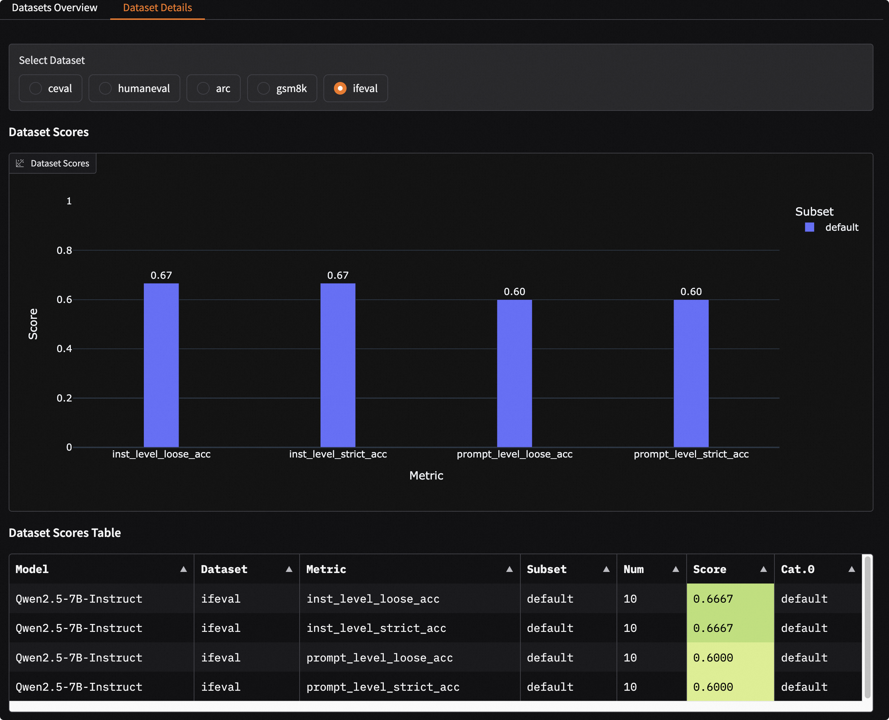

# Visualization

The visualization feature supports in-depth analysis and comparison of evaluation results for single or multiple models, and is compatible with displaying mixed dataset evaluations.

```{important}
This visualization tool is specifically designed for displaying model **evaluation** results and is not suitable for model **stress test** results. For visualizing stress test reports, please refer to the [Stress Test Result Visualization Guide](../user_guides/stress_test/quick_start.md#visualizing-test-results).
```

## Installation and Startup

### 1. Install Dependencies

Install the required dependencies for visualization.
```bash
pip install 'evalscope[app]' -U
```
```{note}
The visualization feature requires evaluation reports generated by `evalscope>=0.10.0`. If your version is too old, please upgrade first and re-run the evaluation.
```

### 2. Start Service

Run the following command to start the visualization web service.
```bash
evalscope app
```
After the service starts, open `http://127.0.0.1:7860` in your browser to access it.

Supported command line parameters:
- `--outputs`: Root directory for evaluation reports, default is `./outputs`.
- `--lang`: Interface language, supports `zh` (default) and `en`.
- `--share`: Create a publicly accessible link.
- `--server-name`: Server listening address, default is `0.0.0.0`.
- `--server-port`: Server port, default is `7860`.

## Quick Experience

We provide an evaluation sample containing multiple models and datasets to help you quickly experience the visualization features.

```bash
git clone https://github.com/modelscope/evalscope
evalscope app --outputs evalscope/examples/viz
```
This sample contains evaluation results of Qwen2.5-0.5B and Qwen2.5-7B models on C-Eval, HumanEval, ARC, GSM8K and other datasets.

## Feature Introduction

### Select Evaluation Report

Follow the steps shown in the image below to select and load evaluation reports:

```{image} ./images/setting.png
:alt: Select evaluation report
:width: 60%
:align: center
```

1.  **Input Root Directory**: Specify the root directory where evaluation reports are located, default is `./outputs`. The program will automatically scan all reports in this directory.
2.  **Select Reports**: Choose one or more evaluation reports from the dropdown menu.
3.  **Load and View**: Click the `Load and View` button to start analysis.

### Single Model Evaluation Results

In the "Single Model" tab, you can perform in-depth analysis of a single model's performance.

- **Dataset Overview**: Through sunburst charts and tables, intuitively display the model's overall performance across all evaluation datasets. Each layer of the sunburst chart represents datasets, categories, and subsets respectively, with sector size indicating sample volume and color depth representing score levels.
  

- **Dataset Details**: After selecting a specific dataset, you can view the model's scores on different metrics and subsets for that dataset. You can also further filter to view detailed input, model output (Generated), standard answer (Gold), and final score for each sample.
  

### Multi-Model Evaluation Result Comparison

In the "Multi-Model" tab, you can horizontally compare the performance of multiple models.

- **Model Overview**: Through radar charts and comparison tables, quickly understand the strengths and weaknesses of each model across different capability dimensions.
  

- **Model Comparison Details**: Select two models for "one-on-one" comparison, viewing their specific performance differences side-by-side on the same dataset and same questions.
  

### Mixed Dataset Evaluation Visualization

This dashboard also supports visualization of [mixed dataset evaluations](../advanced_guides/collection/index.md), displaying results in layers according to your defined mixing structure (Schema).

For example, for a Schema with the following structure:
```python
schema = CollectionSchema(name='math&reasoning', datasets=[
            CollectionSchema(name='math', datasets=[
               DatasetInfo(name='gsm8k', weight=1, task_type='math', tags=['en', 'math']),
               DatasetInfo(name='competition_math', weight=1, task_type='math', tags=['en', 'math']),
               DatasetInfo(name='cmmlu', weight=2, task_type='math', tags=['zh', 'math'], args={'subset_list': ['college_mathematics', 'high_school_mathematics']}),
               DatasetInfo(name='ceval', weight=3, task_type='math', tags=['zh', 'math'], args={'subset_list': ['advanced_mathematics', 'high_school_mathematics', 'discrete_mathematics', 'middle_school_mathematics']}),
            ]),
            CollectionSchema(name='reasoning', datasets=[
               DatasetInfo(name='arc', weight=1, task_type='reasoning', tags=['en', 'reasoning']),
               DatasetInfo(name='ceval', weight=1, task_type='reasoning', tags=['zh', 'reasoning'], args={'subset_list': ['logic']}),
               DatasetInfo(name='race', weight=1, task_type='reasoning', tags=['en', 'reasoning']),
            ]),
         ])
```

The visualization report will present a hierarchical structure consistent with the Schema:
```text
math&reasoning
├── math
│   ├── gsm8k
│   ├── competition_math
│   ├── cmmlu
│   ├── ceval
├── reasoning
│   ├── arc
│   ├── ceval
│   ├── race
```
