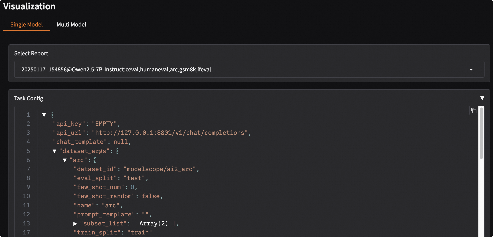
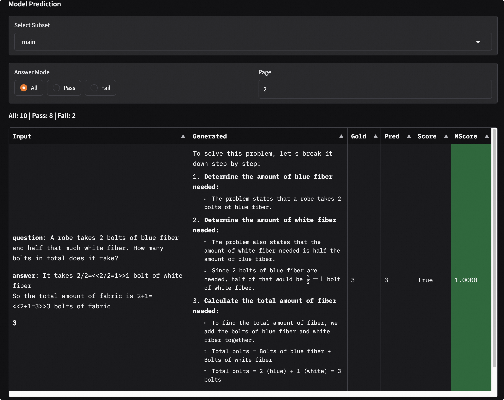

# Visualization

Visualization supports single model evaluation results and multi-model comparison, as well as visualization of mixed dataset evaluations.

```{important}
This visualization tool is specifically designed for displaying model evaluation results. It is not intended for visualizing stress test results of model inference services. For visualization of stress test results for model inference services, please refer to the [Stress Test Visualization Guide](../user_guides/stress_test/quick_start.md#visualizing-test-results).
```

## Install Dependencies

Install the dependencies required for visualization, including gradio, plotly, etc.
```bash
pip install 'evalscope[app]' -U
```

```{note}
Visualization requires `evalscope>=0.10.0` output evaluation reports. If the version is less than `0.10.0`, please upgrade `evalscope` first.
```

## Start Visualization Service

Run the following command to start the visualization service.
```bash
evalscope app
```
The supported command-line arguments are as follows:

- `--outputs`: A string type used to specify the root directory of the evaluation report, with a default value of `./outputs`.
- `--lang`: A string type used to specify the interface language, with a default value of `zh`, supports `zh` and `en`.
- `--share`: A flag indicating whether to share the application, default value is `False`.
- `--server-name`: A string type with a default value of `0.0.0.0`, used to specify the server name.
- `--server-port`: An integer type with a default value of `7860`, used to specify the server port.
- `--debug`: A flag indicating whether to debug the application, default value is `False`.

You can access the visualization service in the browser if the following output appears.
```text
* Running on local URL:  http://127.0.0.1:7860

To create a public link, set `share=True` in `launch()`.
```

### Quick Start

Run the following commands to download the sample and quickly experience the visualization feature. The sample includes evaluation results of the Qwen2.5-0.5B and Qwen2.5-7B models on several datasets for some examples.

```bash
git clone https://github.com/modelscope/evalscope
evalscope app --outputs evalscope/examples/viz
```

## Features Introduction

### Selecting an Evaluation Report

Follow the steps shown below to select an evaluation report:

```{image} ./images/setting.png
:alt: alt text
:width: 60%
:align: center
```

1. Enter the root directory of the evaluation report. The default value is `./outputs`. The directory structure to locate the evaluation report JSON files is as follows:
   ```text
   outputs/
   ├── time_stamp_1
   │   ├── reports
   │   │   ├── model_name_1
   │   │   │   ├── report1.json
   │   │   │   ├── report2.json
   ├── time_stamp_2
   │   ├── reports
   │   │   ├── model_name_1
   │   │   │   ├── report1.json
   │   │   │   ├── report2.json
   ```

2. Select an evaluation report by clicking the dropdown menu. If not selected, a warning will pop up.

3. Click the `Load and View` button to view the visualization.

### Single Model Evaluation Result Visualization
1. Click the `Single Model` tab button.
2. Choose the loaded evaluation report in the `Select Report` dropdown menu to automatically display the overview of the evaluation report.
3. Click `Task Config` to view task configuration details.
   

**Evaluation Report Overview**

1. Displays the composition of the evaluation datasets: from inside to outside, it represents dataset name, dataset category, and sub-dataset name; the size of the sector indicates the number of samples in the dataset; the color represents the dataset score.
2. Scores of each dataset are shown using bar charts and tables.
   

**Details of a Single Dataset**
1. Select a dataset to display the model's evaluation results on that dataset.
2. Use bar charts and tables to display the model's evaluation results on different metrics and sub-datasets.
   
3. Choose a sub-dataset to display the model's evaluation results on that sub-dataset. You can filter the model output results by clicking `Answer Mode`. Among them:
   - `Input` denotes the model input;
   - `Generated` denotes the model output;
   - `Gold` denotes the standard answer;
   - `Pred` denotes the post-processed model prediction result;
   - `Score` denotes the model score;
   - `NScore` denotes the normalized model score, indicating whether the model score passed.

   

### Comparative Visualization of Multi-Model Evaluation Results

1. Click the `Multi-Model` tab button.
2. Choose the loaded evaluation reports in the `Select Report` dropdown menu to automatically display the overview of the evaluation reports. Multiple selections are possible.
3. Display using radar charts and comparative tables.
   

### Mixed Dataset Evaluation Visualization

This dashboard also supports visualization for [mixed dataset evaluation](../advanced_guides/collection/index.md), which will be displayed according to the structure of the data mix schema.

For example, the schema with the following structure:

```python
schema = CollectionSchema(name='math&reasoning', datasets=[
            CollectionSchema(name='math', datasets=[
               DatasetInfo(name='gsm8k', weight=1, task_type='math', tags=['en', 'math']),
               DatasetInfo(name='competition_math', weight=1, task_type='math', tags=['en', 'math']),
               DatasetInfo(name='cmmlu', weight=2, task_type='math', tags=['zh', 'math'], args={'subset_list': ['college_mathematics', 'high_school_mathematics']}),
               DatasetInfo(name='ceval', weight=3, task_type='math', tags=['zh', 'math'], args={'subset_list': ['advanced_mathematics', 'high_school_mathematics', 'discrete_mathematics', 'middle_school_mathematics']}),
            ]),
            CollectionSchema(name='reasoning', datasets=[
               DatasetInfo(name='arc', weight=1, task_type='reasoning', tags=['en', 'reasoning']),
               DatasetInfo(name='ceval', weight=1, task_type='reasoning', tags=['zh', 'reasoning'], args={'subset_list': ['logic']}),
               DatasetInfo(name='race', weight=1, task_type='reasoning', tags=['en', 'reasoning']),
            ]),
         ])
```

The visualization report is as follows, where the structure is consistent with the schema:
```text
math&reasoning
├── math
│   ├── gsm8k
│   ├── competition_math
│   ├── cmmlu
│   ├── ceval
├── reasoning
│   ├── arc
│   ├── ceval
│   ├── race
```
