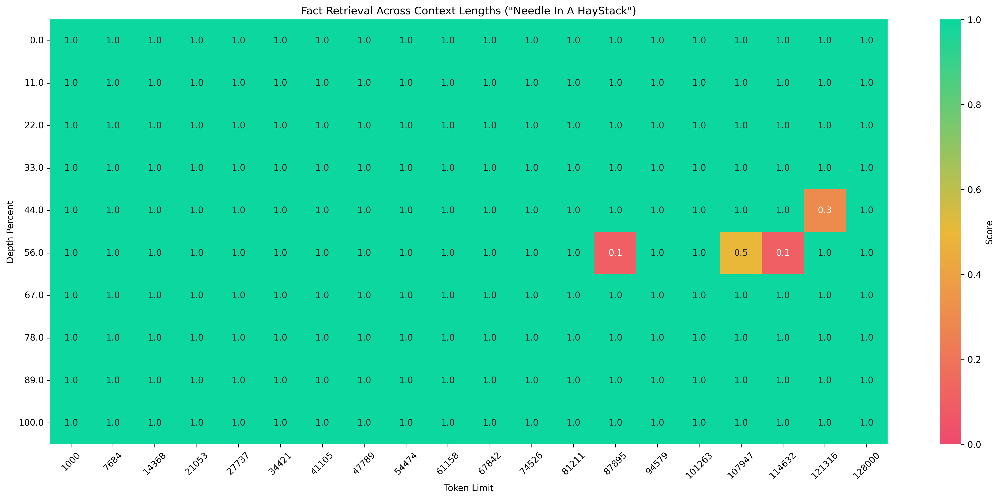
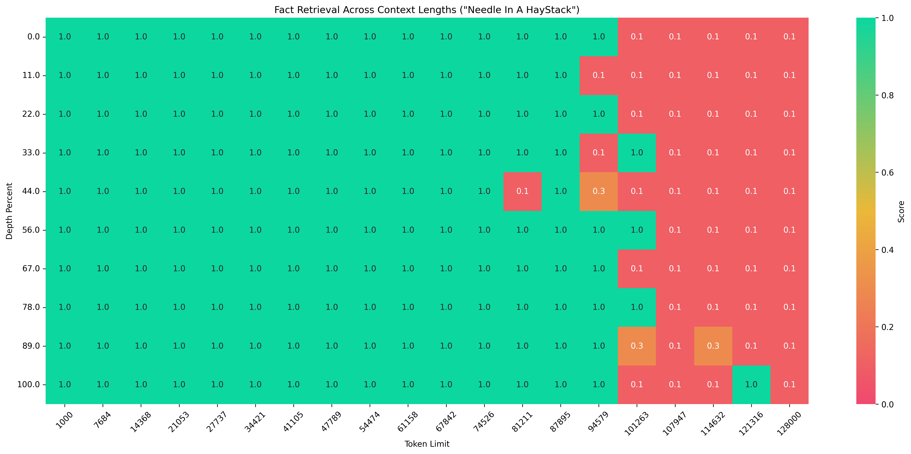

# Needle in a Haystack

## Description
The "Needle in a Haystack" task involves identifying specific, often minimal, relevant information within a text filled with a large amount of irrelevant data.

The implementation logic of this code is inspired by [LLMTest_NeedleInAHaystack](https://github.com/gkamradt/LLMTest_NeedleInAHaystack).

## Dataset

Dataset [link](https://modelscope.cn/datasets/AI-ModelScope/Needle-in-a-Haystack-Corpus/summary), contains texts in both Chinese and English:
- **Chinese Text**: Extracted from "Journey to the West"
- **English Text**: Extracted from articles by Paul Graham

## Usage

### Single Needle Task

Run the following code to initiate the Needle in a Haystack task. The example below evaluates the qwen-plus model on a range of 1k-128k lengths for the single needle task.

**Note: You must set the judge model, otherwise the evaluation will fail.**

```python
import os
from evalscope import TaskConfig, run_task

task_cfg = TaskConfig(
    model='qwen-plus',
    api_url='https://dashscope.aliyuncs.com/compatible-mode/v1',
    api_key=os.getenv('DASHSCOPE_API_KEY'),
    eval_type='openai_api',  # Using API model service
    datasets=['needle_haystack'],
    eval_batch_size=10,
    dataset_args={
        'needle_haystack': {
            'subset_list': ['chinese', 'english'],  # Optional, specify to use Chinese or English subset
            # Supported configuration parameters
            'extra_params':{
                # Question
                'retrieval_question': 'What is the best thing to do in San Francisco?',
                # Inserted text (can be multiple)
                'needles':['\nThe best thing to do in San Francisco is eat a sandwich and sit in Dolores Park on a sunny day.\n'],
                # Minimum length of the corpus
                'context_lengths_min': 1000,
                # Maximum length of the corpus
                'context_lengths_max': 128000,
                # Number of intervals for corpus length
                'context_lengths_num_intervals': 20,
                # Minimum position for inserted text (percentage)
                'document_depth_percent_min': 0,
                # Maximum position for inserted text (percentage)
                'document_depth_percent_max': 100,
                # Number of intervals for inserted text position
                'document_depth_percent_intervals': 10,
                # Path to tokenizer (can specify modelscope ID)
                'tokenizer_path': 'Qwen/Qwen3-0.6B',
                'show_score': True,  # Whether to display scores on the heatmap
            }
        }
    },
    generation_config={
        'max_tokens': 512,  # Maximum number of tokens to generate
    },
    judge_worker_num=5,
    judge_model_args={
        'model_id': 'qwen2.5-72b-instruct',
        'api_url': 'https://dashscope.aliyuncs.com/compatible-mode/v1',
        'api_key': os.getenv('DASHSCOPE_API_KEY'),
    }
)
run_task(task_cfg=task_cfg)
```

The output is as follows (truncated):
```text
+-----------+-----------------+--------------------------+----------+-------+---------+---------+
| Model     | Dataset         | Metric                   | Subset   |   Num |   Score | Cat.0   |
+===========+=================+==========================+==========+=======+=========+=========+
| qwen-plus | needle_haystack | Context#128000 Depth#33  | english  |     1 |     0.1 | default |
+-----------+-----------------+--------------------------+----------+-------+---------+---------+
| qwen-plus | needle_haystack | Context#128000 Depth#11  | chinese  |     1 |     1   | default |
+-----------+-----------------+--------------------------+----------+-------+---------+---------+
| qwen-plus | needle_haystack | Context#128000 Depth#11  | english  |     1 |     0.1 | default |
+-----------+-----------------+--------------------------+----------+-------+---------+---------+
| qwen-plus | needle_haystack | Context#121316 Depth#56  | chinese  |     1 |     1   | default |
+-----------+-----------------+--------------------------+----------+-------+---------+---------+
| qwen-plus | needle_haystack | Context#121316 Depth#56  | english  |     1 |     0.1 | default |
+-----------+-----------------+--------------------------+----------+-------+---------+---------+
| qwen-plus | needle_haystack | Context#128000 Depth#44  | chinese  |     1 |     1   | default |
+-----------+-----------------+--------------------------+----------+-------+---------+---------+
| qwen-plus | needle_haystack | Context#128000 Depth#44  | english  |     1 |     0.1 | default |
+-----------+-----------------+--------------------------+----------+-------+---------+---------+
| qwen-plus | needle_haystack | Context#128000 Depth#67  | chinese  |     1 |     1   | default |
+-----------+-----------------+--------------------------+----------+-------+---------+---------+
| qwen-plus | needle_haystack | Context#128000 Depth#67  | english  |     1 |     0.1 | default |
+-----------+-----------------+--------------------------+----------+-------+---------+---------+
| qwen-plus | needle_haystack | Context#128000 Depth#0   | chinese  |     1 |     1   | default |
+-----------+-----------------+--------------------------+----------+-------+---------+---------+
| qwen-plus | needle_haystack | Context#128000 Depth#0   | english  |     1 |     0.1 | default |
+-----------+-----------------+--------------------------+----------+-------+---------+---------+
| qwen-plus | needle_haystack | Context#128000 Depth#22  | chinese  |     1 |     1   | default |
+-----------+-----------------+--------------------------+----------+-------+---------+---------+
| qwen-plus | needle_haystack | Context#128000 Depth#22  | english  |     1 |     0.1 | default |
+-----------+-----------------+--------------------------+----------+-------+---------+---------+
| qwen-plus | needle_haystack | Context#128000 Depth#100 | chinese  |     1 |     1   | default |
+-----------+-----------------+--------------------------+----------+-------+---------+---------+
| qwen-plus | needle_haystack | Context#128000 Depth#100 | english  |     1 |     0.1 | default |
+-----------+-----------------+--------------------------+----------+-------+---------+---------+
| qwen-plus | needle_haystack | Context#128000 Depth#89  | chinese  |     1 |     1   | default |
+-----------+-----------------+--------------------------+----------+-------+---------+---------+
| qwen-plus | needle_haystack | Context#128000 Depth#89  | english  |     1 |     0.1 | default |
+-----------+-----------------+--------------------------+----------+-------+---------+---------+ 
```

Evaluation reports and corresponding heatmaps will be generated in the outputs/xxx/reports directory, as shown below:


*Chinese Test*


*English Test*

It can be observed that the model's performance varies with different context lengths and insertion positions, and it performs better in the Chinese context.

### Multi-Needle Task
The multi-needle task is similar to the single needle task, with the only difference being that you set multiple texts in `extra_params` under `needles`. Below is a 3-needle test conducted over a context length of 1k-32k.

```python
import os
from evalscope import TaskConfig, run_task

task_cfg = TaskConfig(
    model='qwen-plus',
    api_url='https://dashscope.aliyuncs.com/compatible-mode/v1',
    api_key=os.getenv('DASHSCOPE_API_KEY'),
    eval_type='openai_api',  # Using API model service
    datasets=['needle_haystack'],
    eval_batch_size=10,
    dataset_args={
        'needle_haystack': {
            'subset_list': ['chinese', 'english'],  # Optional, specify to use Chinese or English subset
            'extra_params':{
                'retrieval_question': 'What is the secret ingredient needed to build the perfect pizza?',
                'needles': [
                    " Figs are one of the secret ingredients needed to build the perfect pizza. ", 
                    " Prosciutto is one of the secret ingredients needed to build the perfect pizza. ", 
                    " Goat cheese is one of the secret ingredients needed to build the perfect pizza. "
                ],
                'context_lengths_min': 1000,
                'context_lengths_max': 32000,
                'context_lengths_num_intervals': 10,
                'document_depth_percent_min': 0,
                'document_depth_percent_max': 100,
                'document_depth_percent_intervals': 10,
                'tokenizer_path': 'Qwen/Qwen3-0.6B',
                'show_score': True,
            }
        }
    },
    generation_config={
        'max_tokens': 512,  # Maximum number of tokens to generate
    },
    judge_worker_num=5,
    judge_model_args={
        'model_id': 'qwen2.5-72b-instruct',
        'api_url': 'https://dashscope.aliyuncs.com/compatible-mode/v1',
        'api_key': os.getenv('DASHSCOPE_API_KEY'),
    }
)
run_task(task_cfg=task_cfg)
```

The output example is similar to the one above.