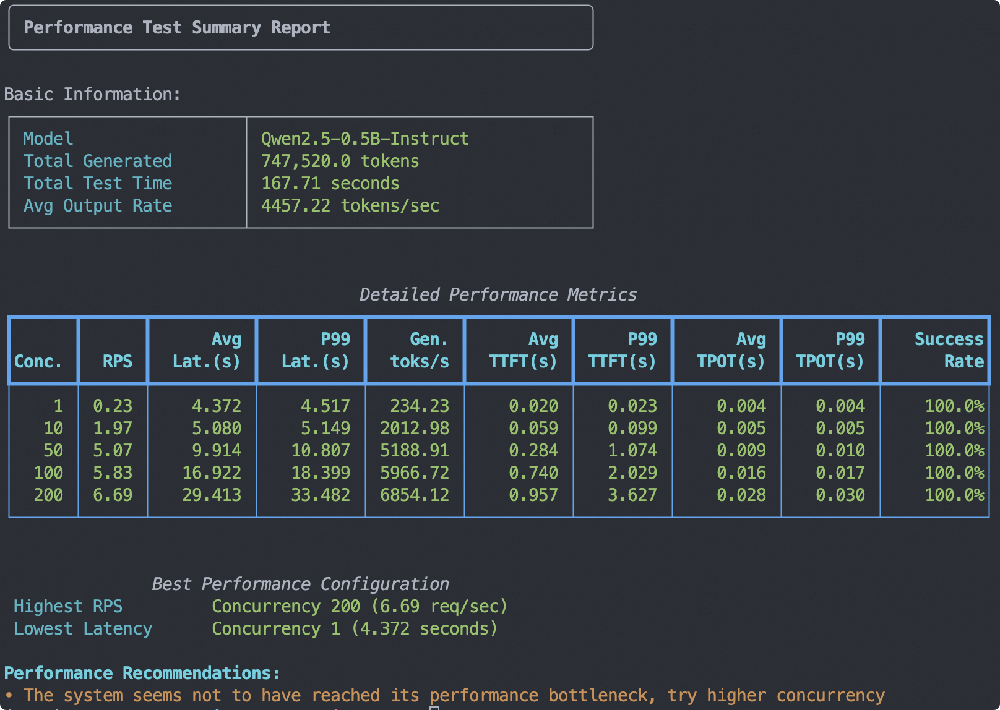

# Quick Start
Below is a quick guide for using EvalScope to conduct model inference performance testing. It supports OpenAI API format model services and various dataset formats, making it convenient for users to perform performance evaluations.

## Environment Preparation

EvalScope supports usage in Python environments. Users can install EvalScope via pip or from source. Here are examples of both installation methods:

::::{tab-set}
:::{tab-item} pip installation
```shell
# Install additional dependencies
pip install evalscope[perf] -U
```
:::

:::{tab-item} Source installation
```shell
git clone https://github.com/modelscope/evalscope.git
cd evalscope
pip install -e '.[perf]'
```
:::
::::

## Basic Usage
You can start the model inference performance testing tool using the following two methods (command line/Python script):

The example below demonstrates performance testing of the Qwen2.5-0.5B-Instruct model using the vLLM framework on an A100, with fixed input of 1024 tokens and output of 1024 tokens. Users can modify parameters according to their needs.

::::{tab-set}
:::{tab-item} Command line startup
```bash
evalscope perf \
  --parallel 1 10 50 100 200 \
  --number 10 20 100 200 400 \
  --model Qwen2.5-0.5B-Instruct \
  --url http://127.0.0.1:8801/v1/chat/completions \
  --api openai \
  --dataset random \
  --max-tokens 1024 \
  --min-tokens 1024 \
  --prefix-length 0 \
  --min-prompt-length 1024 \
  --max-prompt-length 1024 \
  --tokenizer-path Qwen/Qwen2.5-0.5B-Instruct \
  --extra-args '{"ignore_eos": true}'
```
:::

:::{tab-item} Python script startup
```python
from evalscope.perf.main import run_perf_benchmark
from evalscope.perf.arguments import Arguments

task_cfg = Arguments(
    parallel=[1, 10, 50, 100, 200],
    number=[10, 20, 100, 200, 400],
    model='Qwen2.5-0.5B-Instruct',
    url='http://127.0.0.1:8801/v1/chat/completions',
    api='openai',
    dataset='random',
    min_tokens=1024,
    max_tokens=1024,
    prefix_length=0,
    min_prompt_length=1024,
    max_prompt_length=1024,
    tokenizer_path='Qwen/Qwen2.5-0.5B-Instruct',
    extra_args={'ignore_eos': True}
)
results = run_perf_benchmark(task_cfg)
```
:::
::::

**Parameter description**:

- `parallel`: Number of concurrent requests, multiple values can be passed, separated by spaces
- `number`: Number of total requests for each concurrency, multiple values can be passed, separated by spaces (corresponding one-to-one with `parallel`)
- `url`: Request URL address
- `model`: Name of the model used
- `api`: API service used, default is `openai`
- `dataset`: Dataset name, here it's `random`, indicating randomly generated dataset, for specific usage instructions [refer to](./examples.md#using-the-random-dataset); for more available (multimodal) datasets, please refer to [Dataset Configuration](./parameters.md#dataset-configuration)
- `tokenizer-path`: Model's tokenizer path, used to calculate the number of tokens (necessary for random datasets)
- `extra-args`: Additional parameters in the request, passed as a JSON format string, e.g., `{"ignore_eos": true}` indicates ignoring the end token

```{seealso}
[Complete parameter description](./parameters.md)
```

### Output Results

The output test report summary is shown in the image below, including basic information, metrics for each concurrency, and performance test suggestions:



```{note}
- The stress test report in the diagram is a summary of test results across multiple concurrency levels, allowing users to compare model performance under different concurrency settings. No summary report is generated for a single concurrency level.
- This report will be saved in `outputs/<timestamp>/<model>/performance_summary.txt`, which users can view as needed.
- For explanations of the metrics in the table below, please refer to the "Metric Descriptions" section that follows. Results will be saved in `outputs/<timestamp>/<model>/benchmark.log`.
```

Additionally, the test results for each concurrency level are output separately, including metrics such as the number of requests, successful requests, failed requests, average latency, and average latency per token for each concurrency level.

```text
Benchmarking summary:
┌───────────────────────────┬───────────────┐
│ Metric                    │         Value │
├───────────────────────────┼───────────────┤
│ ── General ──             │               │
│ Test Duration (s)         │         38.31 │
│ Concurrency               │           200 │
│ Request Rate (req/s)      │         -1.00 │
│ Total / Success / Failed  │ 400 / 400 / 0 │
│ Req Throughput (req/s)    │         10.44 │
│ ── Latency ──             │               │
│ Avg Latency (s)           │         18.78 │
│ TTFT (ms)                 │        717.63 │
│ TPOT (ms)                 │         17.66 │
│ ITL (ms)                  │         17.64 │
│ ── Tokens ──              │               │
│ Avg Input Tokens          │       1024.00 │
│ Avg Output Tokens         │       1024.00 │
│ Output Throughput (tok/s) │      10692.45 │
│ Total Throughput (tok/s)  │      21384.91 │
└───────────────────────────┴───────────────┘
                                                                                         
Percentile results:
┌────────────────┬─────────┬─────────┬─────────┬─────────┬─────────┬─────────┬─────────┬─────────┬─────────┐
│ Metric         │      1% │      5% │     10% │     25% │     50% │     75% │     90% │     95% │     99% │
├────────────────┼─────────┼─────────┼─────────┼─────────┼─────────┼─────────┼─────────┼─────────┼─────────┤
│ Latency (s)    │   17.25 │   17.46 │   17.74 │   18.14 │   18.71 │   19.23 │   20.28 │   20.62 │   20.84 │
│ TTFT (ms)      │  176.30 │  212.60 │  246.76 │  279.87 │  333.79 │ 1082.24 │ 1812.13 │ 2097.23 │ 2319.52 │
│ ITL (ms)       │    0.00 │    0.01 │    0.01 │   10.62 │   15.67 │   20.37 │   26.97 │   32.50 │   50.11 │
│ TPOT (ms)      │   16.61 │   16.80 │   17.02 │   17.31 │   17.76 │   18.06 │   18.18 │   18.28 │   18.36 │
│ Input tokens   │ 1024.00 │ 1024.00 │ 1024.00 │ 1024.00 │ 1024.00 │ 1024.00 │ 1024.00 │ 1024.00 │ 1024.00 │
│ Output tokens  │ 1024.00 │ 1024.00 │ 1024.00 │ 1024.00 │ 1024.00 │ 1024.00 │ 1024.00 │ 1024.00 │ 1024.00 │
│ Output (tok/s) │   49.15 │   49.75 │   50.55 │   53.33 │   54.79 │   56.48 │   57.73 │   58.73 │   59.45 │
│ Total (tok/s)  │   98.30 │   99.50 │  101.09 │  106.66 │  109.58 │  112.97 │  115.46 │  117.45 │  118.89 │
│ Decode (tok/s) │   54.46 │   54.74 │   55.07 │   55.38 │   56.31 │   57.80 │   58.77 │   59.55 │   60.24 │
└────────────────┴─────────┴─────────┴─────────┴─────────┴─────────┴─────────┴─────────┴─────────┴─────────┘
```

### Metric Descriptions

**Metrics**

| Metric | Explanation | Formula |
|--------|-------------|---------|
| Test Duration (s) | Total time from the start to the end of the test process | Last request end time - First request start time |
| Concurrency | Number of clients sending requests simultaneously | Preset value |
| Request Rate (req/s) | Target request sending rate, -1 means unlimited | Preset value |
| Total / Success / Failed | Total number of requests sent during the test and their success/failure counts | Successful requests + Failed requests |
| Req Throughput (req/s) | Average number of successful requests processed per second | Successful requests / Test Duration |
| Avg Latency (s) | Average time from sending a request to receiving a complete response | Total latency / Successful requests |
| TTFT (ms) | Average time from sending a request to receiving the first response token | Total first chunk latency / Successful requests |
| TPOT (ms) | Average time required to generate each output token (excluding first token) | Total time per output token / Successful requests |
| ITL (ms) | Average time interval between generating each output token | Total inter-token latency / Successful requests |
| Avg Input Tokens | Average number of input tokens per request | Total input tokens / Successful requests |
| Avg Output Tokens | Average number of output tokens per request | Total output tokens / Successful requests |
| Output Throughput (tok/s) | Average number of output tokens processed per second | Total output tokens / Test Duration |
| Total Throughput (tok/s) | Average number of tokens (input + output) processed per second | (Total input tokens + Total output tokens) / Test Duration |
| Avg Input Turns | Average number of historical dialogue turns per request in multi-turn conversations (1 for single-turn) | Total input turns / Successful requests |
| KV Cache Hit Rate (%) | Estimated prefix cache hit rate based on the ratio of cached tokens to input tokens (requires prefix caching enabled on the server and `cached_tokens` field returned) | Total cached tokens / Total input tokens × 100% |
| Avg Decoded Tokens/Iter | In speculative decoding, the average number of tokens accepted per model forward pass (iteration), reflecting draft model accuracy | (Total output tokens − 1) / (Total chunks − 1) |
| Spec Decode Acceptance (%) | Approximate token acceptance rate for speculative decoding, derived from decoded tokens per iter; closer to 1 means a more accurate draft model | 1 − 1 / (Avg Decoded Tokens/Iter) |

**Percentile Metrics**

| Metric | Explanation |
|--------|-------------|
| Latency (s) | The time from sending a request to receiving a complete response (in seconds): TTFT + TPOT * Output tokens. |
| TTFT (ms) | The time from sending a request to generating the first token (in milliseconds), assessing the initial packet delay. |
| ITL (ms) | The time interval between generating each output token (in milliseconds), assessing the smoothness of output. |
| TPOT (ms) | The time required to generate each output token (excluding the first token, in milliseconds), assessing decoding speed. |
| Input tokens | The number of tokens input in the request. |
| Output tokens | The number of tokens generated in the response. |
| Output (tok/s) | The number of tokens output per second: Output tokens / Latency. |
| Total (tok/s) | The number of tokens processed per second: (Input tokens + Output tokens) / Latency. |
| Decode (tok/s) | The number of decoded output tokens per second. |


## Visualizing Test Results

### Using WandB

First, install wandb and obtain the corresponding [API Key](https://wandb.ai/settings):
```bash
pip install wandb
```

To upload the test results to the wandb server and visualize them, add the following parameters when launching the evaluation:
```bash
# ...
--visualizer wandb
--name 'name_of_wandb_log'
```

For example:


### Using SwanLab

First, install SwanLab and obtain the corresponding [API Key](https://swanlab.cn/space/~/settings):
```bash
pip install swanlab
```

To upload the test results to the swanlab server and visualize them, add the following parameters when launching the evaluation:
```bash
# ...
--visualizer swanlab
--name 'name_of_swanlab_log'
```

For example:


If you prefer to use [SwanLab in local dashboard mode](https://docs.swanlab.cn/guide_cloud/self_host/offline-board.html), install swanlab dashboard first:

```bash
pip install 'swanlab[dashboard]'
```

and set the following parameters instead:
```bash
--swanlab-api-key local
```

Then, use `swanlab watch <log_path>` to launch the local visualization dashboard.

### Using ClearML
Please install ClearML using the following command:
```bash
pip install clearml
```

Initialize the ClearML server:
```bash
clearml-init
```

Add the following parameters before starting the test:
```bash
# You can use the CLEARML_PROJECT_NAME environment variable to specify the project name
--visualizer clearml
--name 'name_of_clearml_task'
```


