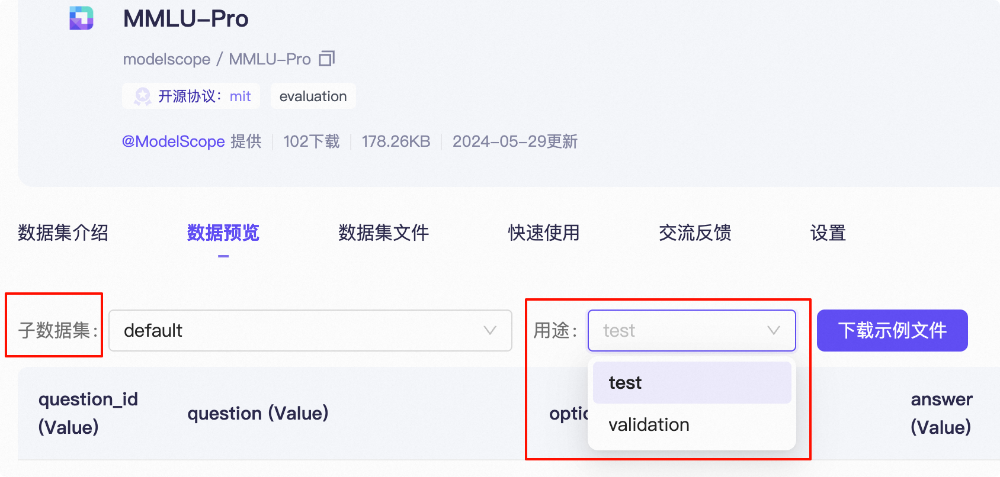

# 👍 贡献基准评测

EvalScope作为[ModelScope](https://modelscope.cn)的官方评测工具，其基准评测功能正在持续优化中！我们诚邀您参考本教程，轻松添加自己的评测基准，并与广大社区成员分享您的贡献。一起助力EvalScope的成长，让我们的工具更加出色！

下面以`MMLU-Pro`为例，介绍如何添加基准评测，主要包含上传数据集、注册数据集、编写评测任务三个步骤。

## 1. 准备基准评测数据集

您有两种方式准备基准评测数据集：

1. **上传到ModelScope（推荐）**：将数据集上传到ModelScope平台，这样其他用户可以一键加载您的数据集，使用更加便捷，也能让更多用户受益于您的贡献。

2. **本地使用**：您也可以直接使用本地数据集进行评测，适合数据集尚在开发阶段或含有敏感信息的情况。

```{seealso}
如需上传到ModelScope，可参考：[modelscope/MMLU-Pro](https://modelscope.cn/datasets/modelscope/MMLU-Pro/summary)示例，以及[数据集上传教程](https://www.modelscope.cn/docs/datasets/create)。
```

无论选择哪种方式，请确保数据的格式正确且可被加载。如使用ModelScope，可通过以下代码测试：

```python
from modelscope import MsDataset

dataset = MsDataset.load("modelscope/MMLU-Pro")  # 替换为你的数据集
```

若使用本地数据集，需要在后续注册基准评测时相应调整`dataset_id`参数和重写`load_from_disk`方法。

## 2. 注册基准评测

在EvalScope中添加基准评测。

### 创建文件结构

首先[Fork EvalScope](https://github.com/modelscope/evalscope/fork) 仓库，即创建一个自己的EvalScope仓库副本，将其clone到本地。

然后，在`evalscope/benchmarks/`目录下添加基准评测，结构如下：

```text
evalscope/benchmarks/
├── benchmark_name
│   ├── __init__.py
│   ├── benchmark_name_adapter.py
│   └── ...
```
具体到`MMLU-Pro`，结构如下：

```text
evalscope/benchmarks/
├── mmlu_pro
│   ├── __init__.py
│   ├── mmlu_pro_adapter.py
│   └── ...
```

### 注册`Benchmark`

我们需要在`benchmark_name_adapter.py`中注册`Benchmark`，使得EvalScope能够加载我们添加的基准测试。以`MMLU-Pro`为例，主要包含以下内容：

- 导入`Benchmark`和`DataAdapter`
- 注册`Benchmark`，指定：
    - `name`：基准测试名称
    - `pretty_name`：基准测试的可读名称
    - `tags`：基准测试标签，用于分类和搜索
    - `description`：基准测试描述，可以使用Markdown格式，建议使用英文
    - `dataset_id`：基准测试数据集ID，用于加载基准测试数据集
    - `model_adapter`：基准测试模型默认适配器。支持两种：
        - `OutputType.GENERATION`：通用文本生成模型评测，通过输入prompt，返回模型生成的文本
        - `OutputType.MULTIPLE_CHOICE`：多选题评测，通过logits来计算选项的概率，返回最大概率选项
    - `output_types`：基准测试输出类型，支持多选：
        - `OutputType.GENERATION`：通用文本生成模型评测
        - `OutputType.MULTIPLE_CHOICE`：多选题评测输出logits
    - `subset_list`：基准测试数据集的子数据集
    - `metric_list`：基准测试评估指标
    - `few_shot_num`：评测的In Context Learning样本数量
    - `train_split`：基准测试训练集，用于采样ICL样例
    - `eval_split`：基准测试评估集
    - `prompt_template`：基准测试提示模板
- 创建`MMLUProAdapter`类，继承自`DataAdapter`。

```{tip}
默认`subset_list`, `train_split`, `eval_split` 可以从数据集预览中获取，例如[MMLU-Pro预览](https://modelscope.cn/datasets/modelscope/MMLU-Pro/dataPeview)


```

代码示例如下：

```python
from evalscope.benchmarks import Benchmark, DataAdapter
from evalscope.constants import EvalType, OutputType

SUBSET_LIST = [
    'computer science', 'math', 'chemistry', 'engineering', 'law', 'biology', 'health', 'physics', 'business',
    'philosophy', 'economics', 'other', 'psychology', 'history'
]  # 自定义的子数据集列表

@Benchmark.register(
    name='mmlu_pro',
    pretty_name='MMLU-Pro',
    tags=['MCQ', 'Knowledge'],
    description=
    'MMLU-Pro is a benchmark for evaluating language models on multiple-choice questions across various subjects. It includes questions from different domains, where the model must select the correct answer from given options.',  # noqa: E501
    dataset_id='modelscope/MMLU-Pro',
    model_adapter=OutputType.GENERATION,
    output_types=[OutputType.MULTIPLE_CHOICE, OutputType.GENERATION],
    subset_list=SUBSET_LIST,
    metric_list=['AverageAccuracy'],
    few_shot_num=5,
    train_split='validation',
    eval_split='test',
    prompt_template=
    'The following are multiple choice questions (with answers) about {subset_name}. Think step by step and then finish your answer with \"the answer is (X)\" where X is the correct letter choice.\n{query}',  # noqa: E501
)
class MMLUProAdapter(DataAdapter):

    def __init__(self, **kwargs):
        super().__init__(**kwargs)
```


## 3. 编写评测逻辑

在完成`Benchmark`注册后，接下来需要编写`DataAdapter`类中的核心方法，以实现评测功能。这些方法控制着数据的加载、处理以及评分流程。

### 评测流程概述

EvalScope评测流程主要包含以下步骤：

1. **数据加载**：通过`load`方法加载数据集
2. **生成提示**：通过`gen_prompts`调用`gen_prompt`生成模型输入
3. **模型推理**：通过模型adapter的`predict`方法对生成的提示进行推理
4. **答案解析**：通过`parse_pred_result`解析模型输出
5. **答案评分**：通过`match`或`llm_match`方法评估预测结果
6. **指标计算**：通过`compute_metric`计算评估指标
7. **报告生成**：通过`gen_report`和`post_process_report`生成评估报告


### 必须实现的核心方法

以下是必须实现的核心方法，每个方法都有明确的功能和作用：

1. **`gen_prompt`**：将数据集样本转换为模型可接受的输入格式
   - 处理few-shot示例
   - 格式化问题和选项
   - 应用提示模板

2. **`get_gold_answer`**：从数据集样本中提取标准答案
   - 通常返回数据集中的答案字段

3. **`parse_pred_result`**：解析模型输出，提取有效答案
   - 对于文本生成模型，通常需要提取答案选项
   - 对于多选题直接输出，可以直接返回结果

4. **`match`**：比较预测答案与标准答案，计算得分
   - 通常使用精确匹配（exact_match）等方法


### 可选实现的方法

除了必须实现的方法外，还可以根据需要实现或重写以下方法：

1. **`llm_match`**：使用大语言模型作为评判器评估答案质量
   - 适用于开放式问题或需要复杂理解的评测任务
   - 需要在配置中指定评判模型
   - 相比简单规则匹配，能更好地评估答案质量

   ```python
   def llm_match(self, gold: Any, pred: Any, judge: Optional[LLMJudge] = None, **kwargs) -> float:
       """
       使用LLM作为评判器评估预测答案
       
       Args:
           gold: 标准答案
           pred: 预测答案
           judge: LLM评判器实例
           
       Returns:
           评分结果，通常为0到1之间的浮点数
       """
       # 默认评判器处理
       if judge is None:
           return 0
           
       # 构建评判提示并获取评分
       prompt = judge.build_prompt(pred, gold, kwargs.get('raw_input', {}).get('question'))
       score = judge(prompt)
       return judge.get_score(score)
   ```

2. **`post_process_report`**：处理评测报告，添加自定义分析或可视化

3. **`load`**：重写数据加载流程，适用于需要自定义数据加载逻辑的场景
   - 适合处理特殊格式的数据集
   - 可以实现自定义的子集划分逻辑
   - 可以添加数据预处理或过滤步骤

   ```python
   def load(self, dataset_name_or_path: str = None, subset_list: list = None, work_dir: Optional[str] = DEFAULT_DATASET_CACHE_DIR, **kwargs) -> dict:
       """
       自定义数据集加载逻辑
       
       Args:
           dataset_name_or_path: 数据集路径或名称
           subset_list: 子集列表
           work_dir: 工作目录
           
       Returns:
           数据字典，格式为: {'subset_name': {'train': train_dataset, 'test': test_dataset}}
       """
       # 可以在这里实现自定义的数据加载和处理逻辑
       # 例如：从本地文件加载数据、过滤数据、重新组织数据结构等
       
       # 调用父类方法加载基础数据
       data_dict = super().load(dataset_name_or_path, subset_list, work_dir, **kwargs)
       
       # 进行自定义处理，如根据特定字段进行子集划分
       return self.reformat_subset(data_dict, subset_key='your_category_field')
   ```

4. **`load_from_disk`**：专门用于从本地磁盘加载数据集
   - 当使用本地数据集而非ModelScope托管数据集时，需要重写此方法
   - 可以处理自定义格式的本地数据文件

   ```python
   def load_from_disk(self, dataset_path, subset_list, work_dir, **kwargs) -> dict:
       """
       从本地磁盘加载数据集
       
       Args:
           dataset_path: 本地数据集路径
           subset_list: 子集列表
           work_dir: 工作目录
           
       Returns:
           数据字典，格式为: {'subset_name': {'train': train_dataset, 'test': test_dataset}}
       """
       # 示例：从本地JSON文件加载数据
       import json
       import os
       
       data_dict = {}
       for subset in subset_list:
           data_dict[subset] = {}
           
           # 加载训练集（few-shot示例）
           if self.train_split:
               train_path = os.path.join(dataset_path, f"{subset}_{self.train_split}.json")
               if os.path.exists(train_path):
                   with open(train_path, 'r', encoding='utf-8') as f:
                       data_dict[subset][self.train_split] = json.load(f)
           
           # 加载测试集
           if self.eval_split:
               test_path = os.path.join(dataset_path, f"{subset}_{self.eval_split}.json")
               if os.path.exists(test_path):
                   with open(test_path, 'r', encoding='utf-8') as f:
                       data_dict[subset][self.eval_split] = json.load(f)
       
       return data_dict
   ```

### 代码示例与解释

下面是MMLU-Pro适配器的完整实现，包含详细注释：

```python
class MMLUProAdapter(DataAdapter):

    def __init__(self, **kwargs):
        super().__init__(**kwargs)
        # 定义选项标识符，用于构建选项
        self.choices = ['A', 'B', 'C', 'D', 'E', 'F', 'G', 'H', 'I', 'J']
    
    def load(self, **kwargs):
        """
        重写加载方法，实现自定义的数据集加载和子集划分逻辑
        
        在这个例子中，我们根据'category'字段对数据集进行子集划分
        """
        # 先使用默认方式加载所有数据
        kwargs['subset_list'] = ['default']
        data_dict = super().load(**kwargs)
        # 使用'category'字段作为子集键值进行重新格式化
        return self.reformat_subset(data_dict, subset_key='category')
    
    def gen_prompt(self, input_d: Dict, subset_name: str, few_shot_list: list, **kwargs) -> Any:
        """
        生成模型输入的提示文本
        
        Args:
            input_d: 当前样本数据
            subset_name: 子集名称，用于模板填充
            few_shot_list: few-shot示例列表
        
        Returns:
            格式化后的提示文本
        """
        # 处理few-shot示例
        if self.few_shot_num > 0:
            prefix = self.format_fewshot_examples(few_shot_list)
        else:
            prefix = ''
        
        # 构建当前问题文本
        query = prefix + 'Q: ' + input_d['question'] + '\n' + \
            self.__form_options(input_d['options']) + '\n'

        # 应用提示模板
        full_prompt = self.prompt_template.format(subset_name=subset_name, query=query)
        return self.gen_prompt_data(full_prompt)
    
    def format_fewshot_examples(self, few_shot_list):
        """
        格式化few-shot示例
        
        将每个示例格式化为一致的格式，包括问题、选项和思考过程
        """
        prompts = ''
        for index, d in enumerate(few_shot_list):
            prompts += 'Q: ' + d['question'] + '\n' + \
                self.__form_options(d['options']) + '\n' + \
                d['cot_content'] + '\n\n'  # 包含思考过程
        return prompts
    
    def __form_options(self, options: list):
        """
        格式化选项列表
        
        将选项数组转换为格式化的文本，每个选项前添加标识符(A)、(B)等
        """
        option_str = 'Options are:\n'
        for opt, choice in zip(options, self.choices):
            option_str += f'({choice}): {opt}' + '\n'
        return option_str
    
    def get_gold_answer(self, input_d: dict) -> str:
        """
        提取标准答案
        
        从数据样本中提取正确答案，通常是'A'、'B'、'C'、'D'等选项标识符
        
        Args:
            input_d: 输入数据样本
        
        Returns:
            标准答案字符串
        """
        return input_d['answer']  # 直接返回数据集中的answer字段

    def parse_pred_result(self, result: str, raw_input_d: dict = None, eval_type: str = EvalType.CHECKPOINT) -> str:
        """
        解析模型预测结果
        
        根据模型类型不同，使用不同的解析方法：
        - 对于直接输出选项的模型，直接返回结果
        - 对于生成文本的模型，需要从文本中提取选项
        
        Args:
            result: 模型预测结果
            raw_input_d: 原始输入数据
            eval_type: 评测类型
        
        Returns:
            解析后的答案选项
        """
        if self.model_adapter == OutputType.MULTIPLE_CHOICE:
            # 多选题直接输出模式，直接返回结果
            return result
        else:
            # 文本生成模式，从文本中提取首个选项字母
            return ResponseParser.parse_first_option(result)

    def match(self, gold: str, pred: str) -> float:
        """
        比较预测答案与标准答案
        
        Args:
            gold: 标准答案，如'A'
            pred: 预测答案，如'B'
        
        Returns:
            匹配得分：正确为1.0，错误为0.0
        """
        return exact_match(gold=gold, pred=pred)  # 使用精确匹配
```

### 提示和最佳实践

- 在设计few-shot示例时，确保格式一致且包含足够信息
- 仔细设计提示模板，确保模型能理解任务要求
- 对于复杂任务，考虑在`match`方法中实现更灵活的评分逻辑
- 添加足够的注释和文档，方便其他开发者理解和维护代码
- 考虑使用`llm_match`方法进行更复杂的答案评估，尤其是对于开放式问题


## 4. 运行评测

调试代码，看看是否能正常运行。

```python
from evalscope import run_task, TaskConfig
task_cfg = TaskConfig(
    model='Qwen/Qwen2.5-0.5B-Instruct',
    datasets=['mmlu_pro'],
    limit=10,
    dataset_args={'mmlu_pro': {'subset_list': ['computer science', 'math']}},
    debug=True
)
run_task(task_cfg=task_cfg)
```

输出如下：

```text
+-----------------------+-----------+-----------------+------------------+-------+---------+---------+
| Model                 | Dataset   | Metric          | Subset           |   Num |   Score | Cat.0   |
+=======================+===========+=================+==================+=======+=========+=========+
| Qwen2.5-0.5B-Instruct | mmlu_pro  | AverageAccuracy | computer science |     10 |       0.1 | default |
+-----------------------+-----------+-----------------+------------------+-------+---------+---------+
| Qwen2.5-0.5B-Instruct | mmlu_pro  | AverageAccuracy | math             |     10 |       0.1 | default |
+-----------------------+-----------+-----------------+------------------+-------+---------+---------+ 
```

## 5. 基准评测文档生成

完成基准评测实现后，您可以使用EvalScope提供的工具生成标准文档。这将确保您的基准评测有一致的文档格式，并能够被其他用户轻松理解和使用。

要生成中英文文档，请运行以下命令，将根据注册信息生成文档：

```bash
# 进入evalscope根目录
cd /path/to/evalscope

# 生成基准评测文档
python docs/generate_dataset_md.py
```

完成这些方法的实现和文档生成后，您的基准评测就准备就绪了！可以提交[PR](https://github.com/modelscope/evalscope/pulls)了，我们将尽快合并你的贡献，让更多用户来使用你贡献的基准评测。如果你不知道如何提交PR，可以查看我们的[指南](https://github.com/modelscope/evalscope/blob/main/CONTRIBUTING.md)，快来试一试吧🚀
