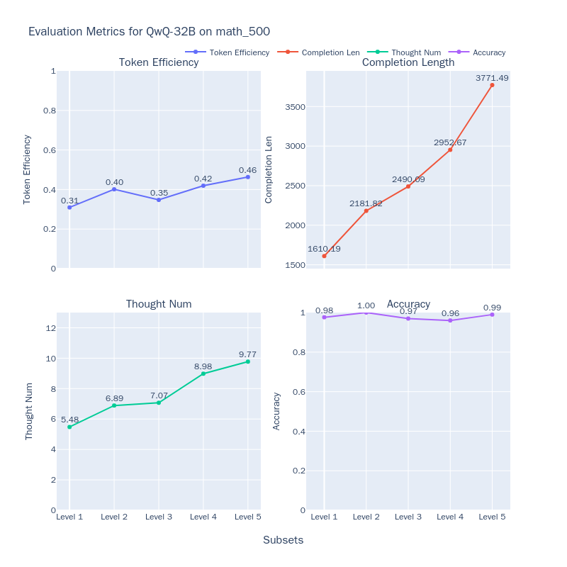

# QwQ模型评测最佳实践

今天（2025年3月6日），Qwen团队发布了QwQ-32B模型，该模型在一系列基准测试中比肩DeepSeek-R1-671B。下面的结果展示了QwQ-32B与其他领先模型的性能对比。


在这篇最佳实践中，我们将使用[EvalScope](https://github.com/modelscope/evalscope)模型评测框架，自己来测试QwQ-32B模型的推理能力以及模型的思考效率。

本最佳实践的流程包括安装相关依赖、准备模型、评测模型以及评测结果的可视化。让我们开始吧。

## 安装依赖

首先，安装[EvalScope](https://github.com/modelscope/evalscope)模型评估框架：

```bash
pip install 'evalscope[app,perf]' -U
```

## 模型推理

### 准备评测模型

首先，我们需要通过OpenAI API兼容的推理服务接入模型能力，以进行评测。值得注意的是，EvalScope也支持使用transformers进行模型推理评测，详细信息可参考EvalScope文档。

除了将模型部署到支持OpenAI接口的云端服务外，还可以选择在本地使用vLLM、ollama等框架直接启动模型。这些推理框架能够很好地支持并发多个请求，从而加速评测过程。特别是对于R1类模型，其输出通常包含较长的思维链，输出token数量往往超过1万。使用高效的推理框架部署模型可以显著提高推理速度。

```bash
VLLM_USE_MODELSCOPE=True CUDA_VISIBLE_DEVICES=0 python -m vllm.entrypoints.openai.api_server --model Qwen/QwQ-32B  --served-model-name QwQ-32B --trust_remote_code --port 8801
```

**模型推理速度测试**

```{seealso}
[QwQ-32B-Preview模型推理速度测试](../experiments/speed_benchmark/QwQ-32B-Preview.md)
```

### 评测模型数学推理能力

运行以下命令，即可让模型在MATH-500数据集上进行推理，并获得模型在每个问题上的输出结果，以及整体答题正确率：

```python
from evalscope import TaskConfig, run_task

task_config = TaskConfig(
    api_url='http://0.0.0.0:8801/v1',  # 推理服务地址
    model='Qwen/QwQ-32B',  # 模型名称 (需要与部署时的模型名称一致)
    eval_type='openai_api',  # 评测类型，'openai_api'表示评测推理服务
    datasets=['math_500'],  # 数据集名称
    dataset_args={'math_500': {'few_shot_num': 0}},  # 数据集参数
    eval_batch_size=32,  # 发送请求的并发数
    generation_config={
        'max_tokens': 32000,  # 最大生成token数，建议设置为较大值避免输出截断
        'temperature': 0.6,  # 采样温度 (qwen 报告推荐值)
        'top_p': 0.95,  # top-p采样 (qwen 报告推荐值)
        'top_k': 40,  # top-k采样 (qwen 报告推荐值)
        'n': 1,  # 每个请求产生的回复数量
    },
)
run_task(task_config)
```

输出结果如下，可以看到模型在每个等级问题上的模型回答正确率：

```text
+---------+-----------+---------------+----------+-------+---------+---------+
| Model   | Dataset   | Metric        | Subset   |   Num |   Score | Cat.0   |
+=========+===========+===============+==========+=======+=========+=========+
| QwQ-32B | math_500  | AveragePass@1 | Level 1  |    43 |  0.9535 | default |
+---------+-----------+---------------+----------+-------+---------+---------+
| QwQ-32B | math_500  | AveragePass@1 | Level 2  |    90 |  1      | default |
+---------+-----------+---------------+----------+-------+---------+---------+
| QwQ-32B | math_500  | AveragePass@1 | Level 3  |   105 |  0.9714 | default |
+---------+-----------+---------------+----------+-------+---------+---------+
| QwQ-32B | math_500  | AveragePass@1 | Level 4  |   128 |  0.9375 | default |
+---------+-----------+---------------+----------+-------+---------+---------+
| QwQ-32B | math_500  | AveragePass@1 | Level 5  |   134 |  0.9403 | default |
+---------+-----------+---------------+----------+-------+---------+---------+ 
```

如果想运行[其他数据集](../get_started/supported_dataset/index.md)，可以修改上述配置中的`datasets`和`dataset_args`参数，例如：

```python
# ...
datasets=[
    # 'math_500',  # 数据集名称
    'gpqa_diamond',
    'aime24'
],
dataset_args={
    # 'math_500': {'few_shot_num': 0 } ,
    'gpqa_diamond': {'few_shot_num': 0},
    'aime24': {'few_shot_num': 0}
},
```

结果如下：
```text
+---------+-----------+---------------+--------------+-------+---------+---------+
| Model   | Dataset   | Metric        | Subset       |   Num |   Score | Cat.0   |
+=========+===========+===============+==============+=======+=========+=========+
| QwQ-32B | aime24    | AveragePass@1 | default      |    30 |     0.8 | default |
+---------+-----------+---------------+--------------+-------+---------+---------+ 
| QwQ-32B | gpqa      | AveragePass@1 | gpqa_diamond |   198 |  0.6717 | default |
+---------+-----------+---------------+--------------+-------+---------+---------+
```

### 评测代码能力

我们使用[LiveCodeBench](https://www.modelscope.cn/datasets/AI-ModelScope/code_generation_lite)来评测模型的代码能力，需进行如下配置：

```python
# ...
datasets=['live_code_bench'],
dataset_args={
    'live_code_bench': {
        'extra_params': {
            'start_date': '2024-08-01',
            'end_date': '2025-02-28'
        },
        "filters": {"remove_until": "</think>"}  # 过滤掉模型推理过程中的思考部分
    }
},
```

输出结果如下：

```text
+---------+-----------------+----------+----------------+-------+---------+---------+
| Model   | Dataset         | Metric   | Subset         |   Num |   Score | Cat.0   |
+=========+=================+==========+================+=======+=========+=========+
| qwq-32b | live_code_bench | Pass@1   | release_latest |   279 |  0.6237 | default |
+---------+-----------------+----------+----------------+-------+---------+---------+
```

## 评测结果可视化

EvalScope支持可视化结果，可以查看模型具体的输出。

运行以下命令，可以启动可视化界面：

```bash
evalscope app --lang en
```

选择评测报告，点击加载，即可看到模型在每个问题上的输出结果，以及整体答题正确率：


## 思考效率评测

这些推理模型在推理过程中可能存在两个极端问题：**Underthinking（思考不足）** 和**Overthinking（过度思考）** ：

- **Underthinking（思考不足）** 现象指的是模型在推理过程中频繁地进行思路跳转，反复使用“alternatively”、“but wait”、“let me reconsider”等词，无法将注意力集中在一个正确的思路上并深入思考，从而得到错误答案。这种现象类似于人类的"注意力缺陷多动障碍"，影响了模型的推理质量。

- **Overthinking（过度思考）** 现象则表现为模型在不必要的情况下生成过长的思维链，浪费了大量的计算资源。例如，对于简单的"2+3=？"这样的问题，某些长推理模型可能会消耗超过900个token来探索多种解题策略。尽管这种思维链策略对于复杂问题的解答非常有帮助，但在应对简单问题时，反复验证已有的答案和进行过于宽泛的探索显然是一种计算资源的浪费。

这两种现象都凸显了一个关键问题：如何在保证答案质量的同时，提高模型的思考效率？换句话说，**我们希望模型能够在尽可能短的输出中获取正确的答案**。我们接下来将在使用[MATH-500](https://www.modelscope.cn/datasets/AI-ModelScope/MATH-500)数据集上衡量QwQ-32B等模型的思考效率，从以下六个维度来评估模型的表现：

- 模型推理token数（Reasoning Tokens） $T$：模型推理过程中reasoning content总数，一般为`</think>`标签之前到部分。
- 首次正确token数（First Correct Tokens） $\hat{T}$：模型推理过程中，从起始位置到第一个可以识别为正确答案位置的token数。
- 剩余反思token数（Reflection Tokens）：$T-\hat{T}$，即从第一个正确答案位置到推理结束的token数。
- token效率（Token Efficiency）：$\hat{T}/T$，即从起始位置到第一个正确答案位置的token数占总token数的比例。
- 子思维链数量（Thought Num）：模型推理过程中，子思维链的数量，通过统计一些关键词（如`alternatively`、`but wait`、`let me reconsider`等）来判断。
- 准确率（Accuracy）：模型推理过程中，正确样本的数量占总样本数量的比例。

具体评测方法可参考[ThinkEval](./think_eval.md)。

运行以下命令，即可启动思考效率评测：

```python
from evalscope.third_party.thinkbench import run_task

judge_config = dict(  # 评测服务配置
    api_key='EMPTY',
    base_url='http://0.0.0.0:8801/v1',
    model_name='Qwen2.5-72B-Instruct',
)

model_config = dict(
    report_path = './outputs/2025xxxx',  # 上一步模型推理结果路径
    model_name = 'QwQ-32B',  # 模型名称
    tokenizer_path = 'Qwen/QwQ-32B',  # 模型tokenizer路径，用于计算token数量
    dataset_name = 'math_500',  # 上一步数据集名称
    subsets = ['Level 1', 'Level 2', 'Level 3', 'Level 4', 'Level 5'],  # 上一步数据集子集
    split_strategies='separator',  # 推理步骤分割策略，可选值为separator、keywords、llm
    judge_config=judge_config
)

max_tokens = 20000  # 筛选token数量小于max_tokens的输出，用于提升评测效率
count = 200  # 每个子集筛选count条输出，用于提升评测效率

# 评测模型思考效率
run_task(model_config, output_dir='outputs', max_tokens=max_tokens, count=count)
```

结果如下图所示：



同时我们也测试了DeepSeek-R1-671B模型，DeepSeek-R1-Distill-Qwen-32B模型，整合结果如下图所示：


使用相同的方法，我们还对另外4个款推理模型QwQ-32B、QwQ-32B-Preview、DeepSeek-R1、DeepSeek-R1-Distill-Qwen-32B，以及一个非推理模型Qwen2.5-Math-7B-Instruct（将模型输出的所有token视为思考过程），以便观察不同类型模型的表现。具体结果整理如下：

1. 随着问题难度的增加，大多数模型的正确率呈现下降趋势，但QwQ-32B和DeepSeek-R1表现出色，在高难度问题上仍保持很高的准确率，其中QwQ-32B在最高难度级别上取得了最佳表现。
2. 对于o1/R1类的推理模型，随着问题难度的提升，虽然输出长度稳定变长，但token的效率也有所提高（DeepSeek-R1从36%增长到54%，QwQ-32B从31%增长到49%）
3. 所有模型的输出长度都随问题难度增加而增加，这表明模型在解答更复杂问题时需要更长的"思考时间"，与Inference-Time Scaling现象相符。 
4. 在相对简单的问题中，各类Reasoning模型均存在一定程度的token浪费现象，对已输出的答案进行反复验证
    
综上，如何更准确、更细粒度的评估模型的Reasoning效率，是一个非常值得深入探讨的问题；同时，相关的测试结论，也对GRPO和SFT训练过程有非常重要的参考意义，有助于开发出"更高效"且能根据问题难度"自适应推理"的模型。
