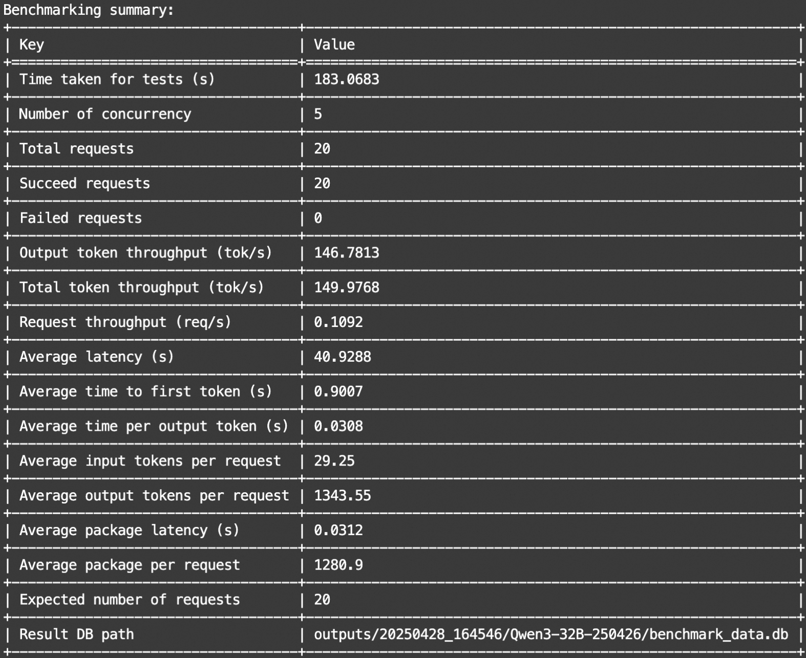
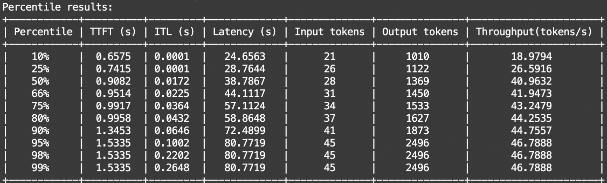
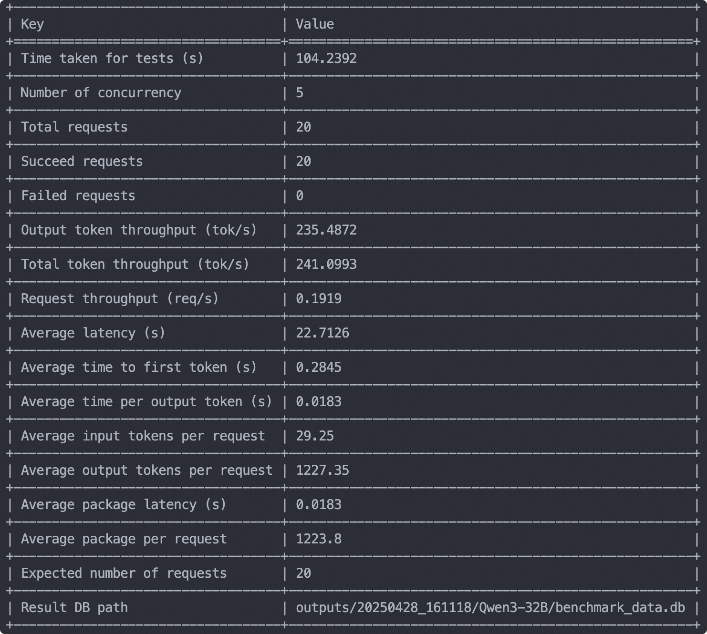
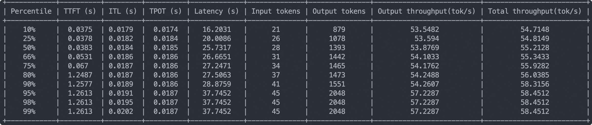
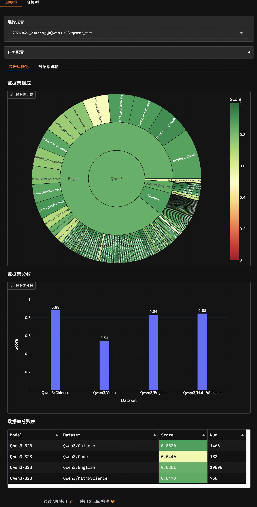
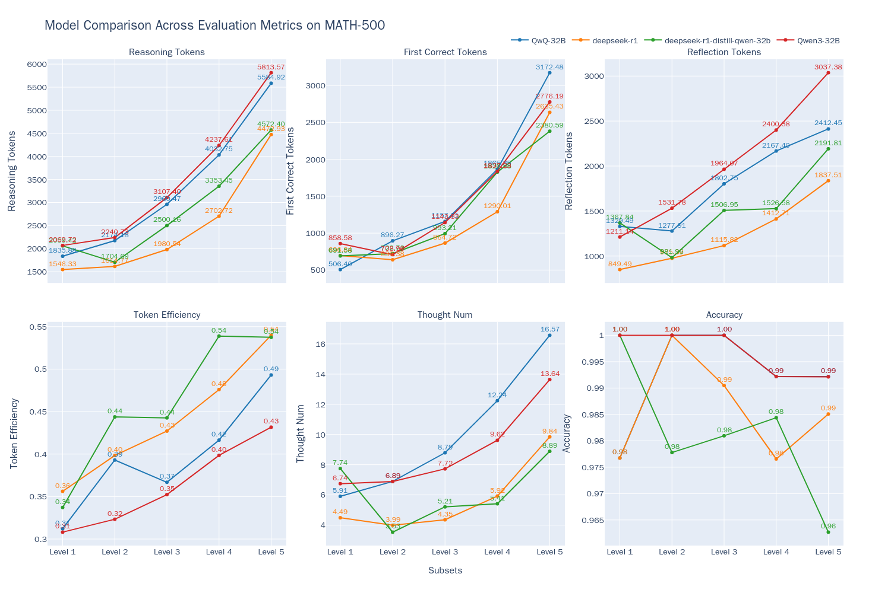

# Qwen3 模型评测最佳实践

Qwen3 是 Qwen 系列最新一代的大语言模型，提供了一系列密集和混合专家（MoE）模型。基于广泛的训练，Qwen3 在推理、指令跟随、代理能力和多语言支持方面取得了突破性的进展，支持思考模式和非思考模式的无缝切换。在这篇最佳实践中，我们将使用EvalScope框架以Qwen3-32B模型为例进行全面评测，覆盖模型服务推理性能评测、模型能力评测、以及模型思考效率的评测。

## 安装依赖

首先，安装[EvalScope](https://github.com/modelscope/evalscope)模型评估框架：

```bash
pip install 'evalscope[app,perf]' -U
```

## 模型服务推理性能评测

首先，我们需要通过OpenAI API兼容的推理服务接入模型能力，以进行评测。值得注意的是，EvalScope也支持使用transformers进行模型推理评测，详细信息可参考[文档](https://evalscope.readthedocs.io/zh-cn/latest/get_started/basic_usage.html#id2)。

除了将模型部署到支持OpenAI接口的云端服务外，还可以选择在本地使用vLLM、ollama等框架直接启动模型。这些推理框架能够很好地支持并发多个请求，从而加速评测过程。特别是对于推理模型，其输出通常包含较长的思维链，输出token数量往往超过1万。使用高效的推理框架部署模型可以显著提高推理速度。

### ModelScope API Inference服务性能评测

用户可通过ModelScope提供的线上模型推理服务来访问Qwen3，具体可参考：[https://modelscope.cn/docs/model-service/API-Inference/intro](https://modelscope.cn/docs/model-service/API-Inference/intro)

> **Client侧调用示例**

```python
from openai import OpenAI

client = OpenAI(
    api_key="MODELSCOPE_SDK_TOKEN", # 请替换成您的ModelScope SDK Token, 参考： https://modelscope.cn/my/myaccesstoken
    base_url="https://api-inference.modelscope.cn/v1/"
)


response = client.chat.completions.create(
    model="Qwen/Qwen3-32B",    # ModelScope model_id
    messages=[
        {
            'role': 'system',
            'content': 'You are a helpful assistant.'
        },
        {
            'role': 'user',
            'content': '用python写一下快排'
        }
    ],
    stream=True
)

for chunk in response:
    if chunk.choices[0].delta.reasoning_content:
        print(chunk.choices[0].delta.reasoning_content, end='', flush=True)
    else:
        print(chunk.choices[0].delta.content, end='', flush=True)
```

> **压测命令**

```shell
evalscope perf \
    --model Qwen/Qwen3-32B \
    --url "https://api-inference.modelscope.cn/v1/chat/completions" \
    --api-key "YOUR_MODELSCOPE_SDK_TOKEN" \
    --parallel 5 \
    --number 20 \
    --api openai \
    --dataset openqa \
    --stream \
    --wandb-api-key "YOUR_WANDB_API_KEY"  # Optional
```

*   获取YOUR\_MODELSCOPE\_SDK\_TOKEN 可参考：[https://modelscope.cn/my/myaccesstoken](https://modelscope.cn/my/myaccesstoken)
    

输出示例如下：





### 本地模型服务性能评测

使用vLLM框架（需要vLLM版本大于等于0.8.5）在本地拉起模型服务的命令如下（默认为**思考模式**）：

```bash
VLLM_USE_MODELSCOPE=True CUDA_VISIBLE_DEVICES=0 vllm serve Qwen/Qwen3-32B --gpu-memory-utilization 0.9 --served-model-name Qwen3-32B --trust_remote_code --port 8801
```

> **压测命令**

```shell
evalscope perf \
    --url "http://127.0.0.1:8801/v1/chat/completions" \
    --parallel 5 \
    --model Qwen3-32B \
    --number 20 \
    --api openai \
    --dataset openqa \
    --stream 
```

参数说明具体可参考[性能评测](https://evalscope.readthedocs.io/zh-cn/latest/user_guides/stress_test/quick_start.html)

输出示例如下：





## 模型能力评测

下面开始进行模型能力评测流程。

注意：后续评测流程都基于vLLM拉起的模型服务，你可以根据上一步模型服务性能评测的步骤拉起模型服务，或使用本地模型服务。模型默认使用思考模式。

### 构建评测集合（可选）

为了全面评测模型的各方面能力，我们可以混合EvalScope已支持的benchmark，构建一个全面的评测集合。下面是一个评测集合的例子，覆盖了主流的benchmark，评测了模型的代码能力(LiveCodeBench)、数学能力(AIME2024, AIME2025)、知识能力(MMLU-Pro, CEVAL)、指令遵循(IFEval)等。

运行如下代码即可根据定义的Schema自动下载并混合数据集，并将构建的评测集合保存在本地的jsonl文件中。当然你也可以跳过这个步骤，直接使用我们放在了[ModelScope仓库](https://modelscope.cn/datasets/evalscope/Qwen3-Test-Collection/summary)中处理好的数据集合。

```python
from evalscope.collections import CollectionSchema, DatasetInfo, WeightedSampler
from evalscope.utils.io_utils import dump_jsonl_data

schema = CollectionSchema(name='Qwen3', datasets=[
    CollectionSchema(name='English', datasets=[
        DatasetInfo(name='mmlu_pro', weight=1, task_type='exam', tags=['en'], args={'few_shot_num': 0}),
        DatasetInfo(name='mmlu_redux', weight=1, task_type='exam', tags=['en'], args={'few_shot_num': 0}),
        DatasetInfo(name='ifeval', weight=1, task_type='instruction', tags=['en'], args={'few_shot_num': 0}),
    ]),
    CollectionSchema(name='Chinese', datasets=[
        DatasetInfo(name='ceval', weight=1, task_type='exam', tags=['zh'], args={'few_shot_num': 0}),
        DatasetInfo(name='iquiz', weight=1, task_type='exam', tags=['zh'], args={'few_shot_num': 0}),
    ]),
    CollectionSchema(name='Code', datasets=[
        DatasetInfo(name='live_code_bench', weight=1, task_type='code', tags=['en'], args={'few_shot_num': 0, 'subset_list': ['v5_v6'], 'extra_params': {'start_date': '2025-01-01', 'end_date': '2025-04-30'}}),
    ]),
    CollectionSchema(name='Math&Science', datasets=[
        DatasetInfo(name='math_500', weight=1, task_type='math', tags=['en'], args={'few_shot_num': 0}),
        DatasetInfo(name='aime24', weight=1, task_type='math', tags=['en'], args={'few_shot_num': 0}),
        DatasetInfo(name='aime25', weight=1, task_type='math', tags=['en'], args={'few_shot_num': 0}),
        DatasetInfo(name='gpqa_diamond', weight=1, task_type='knowledge', tags=['en'], args={'few_shot_num': 0})
    ])
])

# get the mixed data
mixed_data = WeightedSampler(schema).sample(100000000)  # set a large number to ensure all datasets are sampled
# dump the mixed data to a jsonl file
dump_jsonl_data(mixed_data, 'outputs/qwen3_test.jsonl')
```

### 运行评测任务

运行如下代码即可评测Qwen3-32B在**思考模式**下的模型性能：

```python
from evalscope import TaskConfig, run_task
task_cfg = TaskConfig(
    model='Qwen3-32B',
    api_url='http://127.0.0.1:8801/v1/chat/completions',
    eval_type='openai_api',
    datasets=[
        'data_collection',
    ],
    dataset_args={
        'data_collection': {
            'dataset_id': 'evalscope/Qwen3-Test-Collection',
            'filters': {'remove_until': '</think>'}  # 过滤掉思考的内容
        }
    },
    eval_batch_size=128,
    generation_config={
        'max_tokens': 30000,  # 最大生成token数，建议设置为较大值避免输出截断
        'temperature': 0.6,  # 采样温度 (qwen 报告推荐值)
        'top_p': 0.95,  # top-p采样 (qwen 报告推荐值)
        'top_k': 20,  # top-k采样 (qwen 报告推荐值)
        'n': 1,  # 每个请求产生的回复数量
    },
    timeout=60000,  # 超时时间
    stream=True,  # 是否使用流式输出
    limit=100,  # 设置为100条数据进行测试
)

run_task(task_cfg=task_cfg)
```

输出结果如下：

注意：下面的结果是取了1000条数据的结果，只用于评测流程测试。在正式评测时需要去掉该限制。

```text
+-------------+-------------------------+-----------------+---------------+-------+
|  task_type  |         metric          |  dataset_name   | average_score | count |
+-------------+-------------------------+-----------------+---------------+-------+
|    code     |         Pass@1          | live_code_bench |     0.544     |  182  |
|    exam     |     AverageAccuracy     |      ceval      |     0.88      |  125  |
|    exam     |     AverageAccuracy     |      iquiz      |    0.8417     |  120  |
|    exam     |     AverageAccuracy     |    mmlu_pro     |    0.6867     |  83   |
|    exam     |     AverageAccuracy     |   mmlu_redux    |    0.9277     |  83   |
| instruction |  inst_level_loose_acc   |     ifeval      |    0.9157     |  83   |
| instruction |  inst_level_strict_acc  |     ifeval      |    0.8775     |  83   |
| instruction | prompt_level_loose_acc  |     ifeval      |    0.8675     |  83   |
| instruction | prompt_level_strict_acc |     ifeval      |    0.8193     |  83   |
|  knowledge  |      AveragePass@1      |      gpqa       |      0.6      |  65   |
|    math     |      AveragePass@1      |    math_500     |    0.9516     |  62   |
|    math     |      AveragePass@1      |     aime24      |      0.7      |  30   |
|    math     |      AveragePass@1      |     aime25      |    0.7667     |  30   |
+-------------+-------------------------+-----------------+---------------+-------+
```

测试**非思考模式**下的模型性能（注意generation config 的变化）：

```python
from evalscope import TaskConfig, run_task

task_cfg = TaskConfig(
    model='Qwen3-32B',
    api_url='http://127.0.0.1:8801/v1/chat/completions',
    eval_type='openai_api',
    datasets=[
        'data_collection',
    ],
    dataset_args={
        'data_collection': {
            'dataset_id': 'evalscope/Qwen3-Test-Collection',
        }
    },
    eval_batch_size=128,
    generation_config={
        'max_tokens': 20000,  # 最大生成token数，建议设置为较大值避免输出截断
        'temperature': 0.7,  # 采样温度 (qwen 报告推荐值)
        'top_p': 0.8,  # top-p采样 (qwen 报告推荐值)
        'top_k': 20,  # top-k采样 (qwen 报告推荐值)
        'n': 1,  # 每个请求产生的回复数量
        'extra_body':{'chat_template_kwargs': {'enable_thinking': False}}  # 关闭思考模式
    },
    timeout=60000,  # 超时时间
    stream=True,  # 是否使用流式输出
    limit=1000,  # 设置为1000条数据进行测试
)

run_task(task_cfg=task_cfg)
```

输出结果如下：
```text
+-------------+-------------------------+-----------------+---------------+-------+                                                                                                                                                                           
|  task_type  |         metric          |  dataset_name   | average_score | count |                                                                                                                                                                           
+-------------+-------------------------+-----------------+---------------+-------+                                                                                                                                                                           
|    code     |         Pass@1          | live_code_bench |    0.2857     |  182  |                                                                                                                                                                           
|    exam     |     AverageAccuracy     |      ceval      |     0.808     |  125  |                                                                                                                                                                           
|    exam     |     AverageAccuracy     |      iquiz      |     0.775     |  120  |                                                                                                                                                                           
|    exam     |     AverageAccuracy     |    mmlu_pro     |    0.6145     |  83   |                                                                                                                                                                           
|    exam     |     AverageAccuracy     |   mmlu_redux    |    0.8313     |  83   |                                                                                                                                                                           
| instruction |  inst_level_loose_acc   |     ifeval      |    0.6948     |  83   |                                                                                                                                                                           
| instruction |  inst_level_strict_acc  |     ifeval      |    0.6888     |  83   |                                                                                                                                                                           
| instruction | prompt_level_loose_acc  |     ifeval      |    0.6265     |  83   |                                                                                                                                                                           
| instruction | prompt_level_strict_acc |     ifeval      |    0.6145     |  83   |                                                                                                                                                                           
|  knowledge  |      AveragePass@1      |      gpqa       |    0.4154     |  65   |                                                                                                                                                                           
|    math     |      AveragePass@1      |    math_500     |    0.4355     |  62   |                                                                                                                                                                           
|    math     |      AveragePass@1      |     aime24      |    0.2333     |  30   |                                                                                                                                                                           
|    math     |      AveragePass@1      |     aime25      |    0.1333     |  30   |                                                                                                                                                                           
+-------------+-------------------------+-----------------+---------------+-------+ 
```

### 评测结果可视化

EvalScope支持可视化结果，可以查看模型具体的输出。

运行以下命令，可以启动基于Gradio的可视化界面：

```shell
evalscope app
```

选择评测报告，点击加载，即可看到模型在每个问题上的输出结果，以及整体答题正确率：



## 模型思考效率评测

我们接下来将在使用[MATH-500](https://www.modelscope.cn/datasets/AI-ModelScope/MATH-500)数据集上衡量Qwen-32B模型的思考效率，并与其他3个模型（DeepSeek-R1, QwQ-32B, ）进行比较。我们从以下六个维度来评估模型的表现：

*   模型推理token数（Reasoning Tokens） $T$：模型推理过程中reasoning content总数，一般为`</think>`标签之前到部分。
    
*   首次正确token数（First Correct Tokens） $\hat{T}$：模型推理过程中，从起始位置到第一个可以识别为正确答案位置的token数。
    
*   剩余反思token数（Reflection Tokens）：$T-\hat{T}$，即从第一个正确答案位置到推理结束的token数。
    
*   token效率（Token Efficiency）：$\hat{T}/T$，即从起始位置到第一个正确答案位置的token数占总token数的比例。
    
*   子思维链数量（Thought Num）：模型推理过程中，子思维链的数量，通过统计一些关键词（如`alternatively`、`but wait`、`let me reconsider`等）来判断。
    
*   准确率（Accuracy）：模型推理过程中，正确样本的数量占总样本数量的比例。
    

测试结果如下：



从图中我们可以得出以下结论：

*  Qwen3-32B模型在思考模式下，其准确率与QwQ-32B相当（在Accuracy折线上两者重合），都达到了最好的水平。
*  随着问题难度的增加，模型的输出长度都随问题难度增加而增加，这表明模型在解答更复杂问题时需要更长的"思考时间"，与Inference-Time Scaling现象相符。
*  随着问题难度的提升，虽然输出长度稳定变长，但token的效率也有所提高（Qwen3-32B从31%增长到43%，QwQ-32B从31%增长到49%）。这表明推理类型的模型，在更复杂的问题上其token的消耗会更加“物有所值”。而在相对简单的问题中，可能更多的存在不必须的token浪费：即使在简单问题上也可能不必要的对答案进行反复验证。其中Qwen-32B输出的token数量相较其他模型更多，这使得该模型在Level 5这种高难度问题上也能保持较高正确率，但另一方面也说明该模型可能存在过度分析的问题。

具体评测方法和更多结论请参考：[模型思考效率评测最佳实践](https://evalscope.readthedocs.io/zh-cn/latest/best_practice/think_eval.html)
