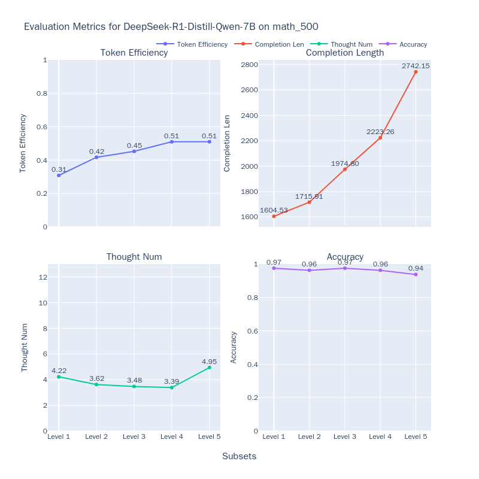
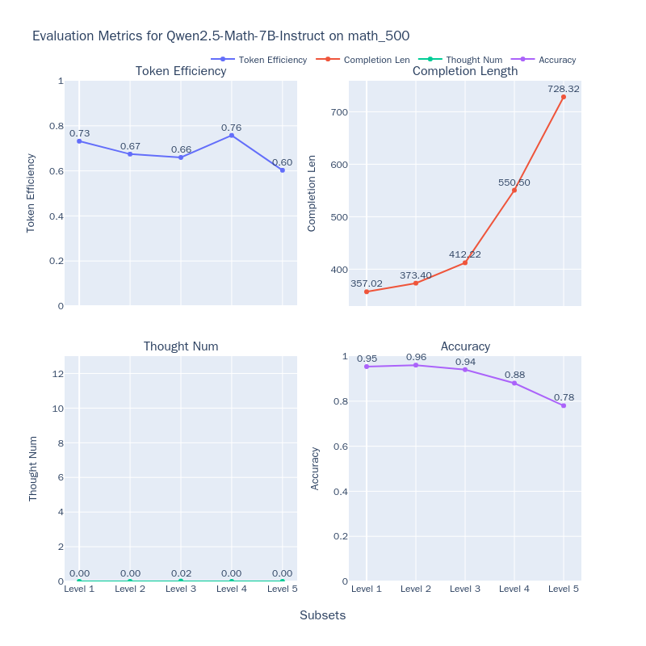

# 模型思考效率评测最佳实践

随着大语言模型的迅速发展，模型的推理能力得到了显著提升。特别是长推理模型（Long Reasoning Models），如OpenAI的o1、QwQ-32B-Preview、DeepSeek-R1-671B和Kimi K1.5等，因其展现出类似人类的深度思考能力而备受关注。这些模型通过长时间推理（Inference-Time Scaling），能够在解码阶段不断思考并尝试新的思路来得到正确的答案。

然而，随着研究的深入，科研人员发现这些模型在推理过程中存在两个极端问题：**Underthinking（思考不足）** 和**Overthinking（过度思考）** ：

- **Underthinking（思考不足）**[^1] 现象指的是模型在推理过程中频繁地进行思路跳转，反复使用“alternatively”、“but wait”、“let me reconsider”等词，无法将注意力集中在一个正确的思路上并深入思考，从而得到错误答案。这种现象类似于人类的"注意力缺陷多动障碍"，影响了模型的推理质量。

- **Overthinking（过度思考）**[^2] 现象则表现为模型在不必要的情况下生成过长的思维链，浪费了大量的计算资源。例如，对于简单的"2+3=？"这样的问题，某些长推理模型可能会消耗超过900个token来探索多种解题策略。尽管这种思维链策略对于复杂问题的解答非常有帮助，但在应对简单问题时，反复验证已有的答案和进行过于宽泛的探索显然是一种计算资源的浪费。[^3]

这两种现象都凸显了一个关键问题：如何在保证答案质量的同时，提高模型的思考效率？换句话说，**我们希望模型能够在尽可能短的输出中获取正确的答案**。而在本最佳实践中，我们将在使用[MATH-500](https://www.modelscope.cn/datasets/AI-ModelScope/MATH-500)数据集上衡量DeepSeek-R1-Distill-Qwen-7B等模型的思考效率，从token效率、模型思考长度、子思维链数量和准确率四个维度来评估模型的表现，让我们一起开始吧。


## 安装依赖

首先，安装[EvalScope](https://github.com/modelscope/evalscope)模型评估框架：

```bash
pip install 'evalscope' -U
```

## 评测模型

下面我们将开始正式评测，整个过程分为两个主要步骤：
1. 模型推理评估：使用EvalScope框架让模型在MATH-500数据集上进行推理。该数据集包含500个数学问题，每个问题由一个数学表达式和对应答案组成，难度从1级(简单)到5级(复杂)不等。这一步将获得模型对每个问题的推理结果，以及整体答题正确率。
2. 模型思考效率评测：使用EvalScope框架中的EvalThink组件对模型的输出进行深入分析，从token效率、模型思考长度、子思维链数量等维度进一步评测模型的思考效率。

### 模型推理

**准备评测模型**

首先，我们需要通过OpenAI API兼容的推理服务接入模型能力，以进行评测。值得注意的是，EvalScope也支持使用transformers进行模型推理评测，详细信息可参考EvalScope文档。

除了将模型部署到支持OpenAI接口的云端服务外，还可以选择在本地使用vLLM、ollama等框架直接启动模型。这些推理框架能够很好地支持并发多个请求，从而加速评测过程。特别是对于R1类模型，其输出通常包含较长的思维链，输出token数量往往超过1万。使用高效的推理框架部署模型可以显著提高推理速度。

下面以DeepSeek-R1-Distill-Qwen-7B为例，介绍如何使用vLLM部署模型：

```bash
VLLM_USE_MODELSCOPE=True CUDA_VISIBLE_DEVICES=0 python -m vllm.entrypoints.openai.api_server --model deepseek-ai/DeepSeek-R1-Distill-Qwen-7B  --served-model-name DeepSeek-R1-Distill-Qwen-1.5B --trust_remote_code --port 8801
```

**使用EvalScope评测模型**

运行以下命令，即可让模型在MATH-500数据集上进行推理，并获得模型在每个问题上的输出结果，以及整体答题正确率：

```python
from evalscope import TaskConfig, run_task

task_config = TaskConfig(
    api_url='http://0.0.0.0:8801/v1/chat/completions',  # 推理服务地址
    model='DeepSeek-R1-Distill-Qwen-7B',  # 模型名称 (需要与部署时的模型名称一致)
    eval_type='service',  # 评测类型，SERVICE表示评测推理服务
    datasets=['math_500'],  # 数据集名称
    dataset_args={'math_500': {'few_shot_num': 0, 'subset_list': ['Level 1', 'Level 2', 'Level 3', 'Level 4', 'Level 5']}},  # 数据集参数
    eval_batch_size=32,  # 发送请求的并发数
    generation_config={
        'max_tokens': 20000,  # 最大生成token数，建议设置为较大值避免输出截断
        'temperature': 0.6,  # 采样温度 (deepseek 报告推荐值)
        'top_p': 0.95,  # top-p采样 (deepseek 报告推荐值)
        'n': 1,  # 每个请求产生的回复数量
    },
)
run_task(task_config)
```

输出结果如下，可以看到模型在每个等级问题上的模型回答正确率：

```text
+-----------------------------+-----------+---------------+----------+-------+---------+---------+
| Model                       | Dataset   | Metric        | Subset   |   Num |   Score | Cat.0   |
+=============================+===========+===============+==========+=======+=========+=========+
| DeepSeek-R1-Distill-Qwen-7B | math_500  | AveragePass@1 | Level 1  |    43 |  0.9535 | default |
+-----------------------------+-----------+---------------+----------+-------+---------+---------+
| DeepSeek-R1-Distill-Qwen-7B | math_500  | AveragePass@1 | Level 2  |    90 |  0.9667 | default |
+-----------------------------+-----------+---------------+----------+-------+---------+---------+
| DeepSeek-R1-Distill-Qwen-7B | math_500  | AveragePass@1 | Level 3  |   105 |  0.9587 | default |
+-----------------------------+-----------+---------------+----------+-------+---------+---------+
| DeepSeek-R1-Distill-Qwen-7B | math_500  | AveragePass@1 | Level 4  |   128 |  0.9115 | default |
+-----------------------------+-----------+---------------+----------+-------+---------+---------+
| DeepSeek-R1-Distill-Qwen-7B | math_500  | AveragePass@1 | Level 5  |   134 |  0.8557 | default |
+-----------------------------+-----------+---------------+----------+-------+---------+---------+ 
```

### 模型思考效率评估

在获取模型的推理结果后，我们便可以着手评估其思考效率。在开始之前，我们需要介绍评估过程中涉及的几个关键指标：token效率、模型思考长度以及子思维链数量。

- **模型思考长度**：这是指模型在推理过程中生成的长思维链的token数量。对于O1/R1类型的推理模型，该指标表示`</think>`标志前的token数量。

- **子思维链数量**：这一指标表示模型在推理过程中生成的不同思维路径的数量。具体来说，是通过统计模型生成的标志词（如`alternatively`、`but wait`、`let me reconsider`等）的出现次数来计算的。这反映了模型在推理中切换思路的频率。

- **token效率**：指的是从模型开始回复到生成第一个正确答案部分所需的token数量与整个思考长度的比值，其计算公式如下：

    $$
    M_{token} = \frac{1}{N} \sum^{N}_{i=1}  \frac{\hat{T_i}}{T_i}
    $$

    其中，$N$ 为问题数量，$\hat{T_i}$ 是从模型回复开始到第一个可识别为正确答案部分的token数量，$T_i$ 是模型的思考长度。如果模型答案错误，则$\hat{T_i}$ 为0。指标值越高，表示模型有效思考占比越高。

    在本评估框架中，我们参考[ProcessBench](https://github.com/QwenLM/ProcessBench)的构建方式，使用额外的模型`Qwen2.5-72B-Instruct`来检测推理过程中最早出现的正确答案位置。为了实现这一点，我们首先将模型输出分解为多个步骤，对每个步骤进行编号，然后使用`Qwen2.5-72B-Instruct`模型对这些步骤进行检验，找出第一个正确答案的token位置。我们实现了三种分解策略：

    - **`separator`**：使用`\n\n`标志进行分解。
    - **`keywords`**：使用标志词（如`alternatively`、`but wait`、`let me reconsider`）进行分解。
    - **`llm`**：去除回复中的`\n`标志，使用LLM重写回复并插入`\n\n`标志进行分解。

下面以`Qwen2.5-72B-Instruct`作为检测模型进行评估，只需运行以下命令，即可启动评估并获取结果：

```python
from evalscope.third_party.thinkbench import run_task

judge_config = dict(  # 评测服务配置
    api_key='EMPTY',
    base_url='http://0.0.0.0:8801/v1',
    model_name='Qwen2.5-72B-Instruct',
)

model_config = dict(
    report_path = './outputs/2025xxxx',  # 上一步模型推理结果路径
    model_name = 'DeepSeek-R1-Distill-Qwen-7B',  # 模型名称
    tokenizer_path = 'deepseek-ai/DeepSeek-R1-Distill-Qwen-7B',  # 模型tokenizer路径，用于计算token数量
    dataset_name = 'math_500',  # 上一步数据集名称
    subsets = ['Level 1', 'Level 2', 'Level 3', 'Level 4', 'Level 5'],  # 上一步数据集子集
    split_strategies='separator',  # 推理步骤分割策略，可选值为separator、keywords、llm
    judge_config=judge_config
)

max_tokens = 8000  # 筛选token数量小于max_tokens的输出，用于提升评测效率
count = 50  # 每个子集筛选count条输出，用于提升评测效率

# 评测模型思考效率
run_task(model_config, output_dir='outputs', max_tokens=max_tokens, count=count)
```

输出结果如下，可以看到模型在每个等级问题上的token效率、模型思考长度和子思维链数量：


*图1：DeepSeek-R1-Distill-Qwen-7B思考效率*

使用相同的方法，我们还对另一款推理模型QwQ-32B-Preview进行了评测。此外，我们也评测了一个非推理模型Qwen2.5-Math-7B-Instruct（将模型输出的所有token视为思考过程），以便观察不同类型模型的表现。具体结果如下：


*图2：QwQ-32B-Preview思考效率*


*图3：Qwen2.5-Math-7B-Instruct思考效率*

通过分析这些折线图，我们可以得出一些有趣的结论：

- **问题难度与模型表现**：随着问题难度的增加，三个模型的正确率都有所下降，同时输出长度不断增加。这表明模型在解答更复杂的问题时需要更长的“思考时间”，这与Inference-Time Scaling现象一致。

- **O1/R1类推理模型的表现**：对于O1/R1推理模型，随着问题难度的提升，token效率也有所提高（DeepSeek-R1-Distill-Qwen-7B从35%增长到51%，QwQ-32B-Preview从44%增长到61%）。这表明模型在简单问题上容易出现过度思考，即对答案进行反复验证。在复杂问题上，模型生成更多的子思维链，显示其尝试多种不同方法来解决问题。这提示我们需要让模型在简单问题上更加高效，避免资源浪费；同时，在复杂问题上，可以探索多种推理策略，以便更快锁定正确解答路径并提升整体解题效率。

- **非推理模型的表现**：非推理模型的token效率没有表现出明显的递增趋势，但由于缺乏子思维链，其token效率相比推理模型更高，输出token数量仅为推理模型的三分之一。这表明，像Qwen2.5-Math-7B-Instruct这样专门训练的数学模型在数学问题上效率上优于通用推理模型，这提示我们在特定领域中训练垂直领域模型可能是一种更有效的方法。通过专注于特定任务和领域，这些模型能够更高效地完成任务，避免不必要的复杂推理过程。

## Tips

:::{card}

💡 在撰写这篇最佳实践的过程中，我积累了一些心得与大家分享：

1. **关于思考效率评测指标的定义**：
    - 本文借鉴了文献[^1]和文献[^2]对“过度思考”（overthinking）和“思考不足”（underthinking）的定义，提出了token效率这一指标。然而，这个指标主要关注生成token数量这一方面，未能涵盖模型思考过程的全部细节。
    - 子思维链数量的计算采用了启发式方法，即通过预定义一些常见关键词来识别。需要注意的是，不同模型可能需要不同的关键词集合，以准确捕捉其思考方式。

2. **关于指标的适用范围**：
    - 目前，这些指标主要在数学推理数据集上应用，因此可能无法全面反映模型在其他应用场景下的表现。例如，在开放性问答或需要创造性回复的场景中，这些指标可能不够充分。

3. **关于token效率指标的计算**：
    - 在实现过程中，我们依赖一个额外的Judge模型来判断模型推理步骤的正确性。参考ProcessBench[^4]的工作，这一任务对现有模型来说颇具挑战性，通常需要一个能力较强的模型来进行判断。
    - 如果Judge模型做出错误判断，可能会影响到token效率指标的准确性，这也意味着在选择Judge模型时需格外谨慎。

:::

## 总结

通过本最佳实践，我们了解了如何使用EvalScope评测模型的思考效率。希望本最佳实践能够帮助大家更好地理解模型的思考效率，并为大家的科研工作提供参考，训练出更高效的模型。

## 参考文献

[^1]: Wang, Y. et al. Thoughts Are All Over the Place: On the Underthinking of o1-Like LLMs. Preprint at https://doi.org/10.48550/arXiv.2501.18585 (2025).
[^2]: Chen, X. et al. Do NOT Think That Much for 2+3=? On the Overthinking of o1-Like LLMs. Preprint at https://doi.org/10.48550/arXiv.2412.21187 (2025).
[^3]: Think Less, Achieve More: Cut Reasoning Costs by 50% Without Sacrificing Accuracy. https://novasky-ai.github.io/posts/reduce-overthinking/.
[^4]: Zheng, C. et al. ProcessBench: Identifying Process Errors in Mathematical Reasoning. Preprint at https://doi.org/10.48550/arXiv.2412.06559(2024).