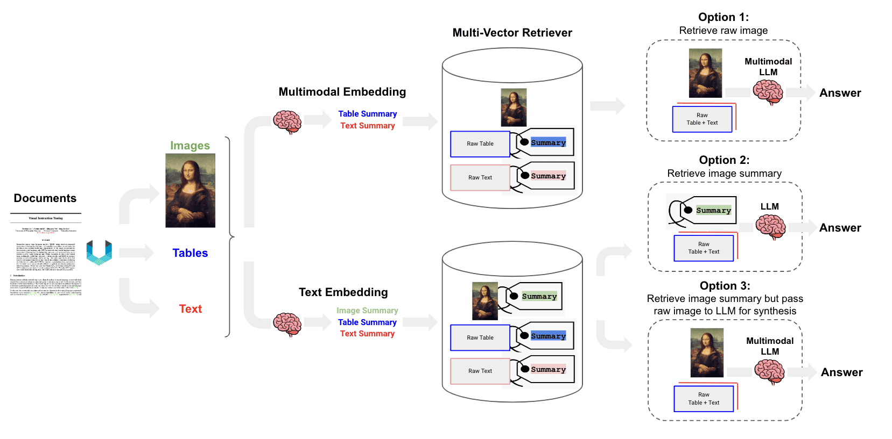

(rag-evaluation)=

# RAG 评测调研：框架、指标和方法

## RAG（检索增强生成）流程

## 框架

### 1. **LlamaIndex**

* [多模态RAG评测教程](https://docs.llamaindex.ai/en/stable/examples/evaluation/multi_modal/multi_modal_rag_evaluation/)

> 简介： 介绍了如何评测多模态检索生成（RAG）系统，重点展示了如何使用llama-index库中的评测工具对检索器和生成器进行评测。通过美国手语（ASL）字母表的图像和文本描述作为用例，演示了如何加载数据、构建索引、设置RAG系统，并进行检索和生成评测。

### 2. **LangChain**

* [多模态(图文)RAG教程](https://github.com/langchain-ai/langchain/blob/master/cookbook/Multi_modal_RAG.ipynb)

* [半结构化(图文表)多模态RAG教程](https://github.com/langchain-ai/langchain/blob/master/cookbook/Semi_structured_and_multi_modal_RAG.ipynb)

* Multi-modal RAG

### 3. **Ragas**
* [GitHub](https://github.com/explodinggradients/ragas)
* [Docs](https://docs.ragas.io/en/latest/getstarted/index.html)
* 教程：[Evaluating RAG Applications with RAGAs](https://towardsdatascience.com/evaluating-rag-applications-with-ragas-81d67b0ee31a)
> 简介：  RAGAs是一个用于评测检索增强生成（RAG）应用的评测框架，它的核心目标是提供一套综合性的评测指标和方法，以量化地评测RAG管道(RAG Pipeline)在不同组件层面上的性能。RAGAs特别适用于那些结合了检索（Retrieval）和生成（Generation）两个主要组件的RAG系统，支持Langchain 和 Llama-Index。

* **评测流程**
    1. 开始：启动准备和设置RAG应用的过程。
    2. 数据准备：加载和分块处理文档。
    3. 设置向量数据库：生成向量嵌入并存储在向量数据库中。
    4. 设置检索器组件：基于向量数据库设置检索器。
    5. 组合RAG管道：结合检索器、提示模板和LLM组成RAG管道。
    6. 准备评测数据：准备问题和对应的真实答案。
    7. 构建数据集：通过推理准备数据并构建用于评测的数据集。
    8. 评测RAG应用：导入评测指标并对RAG应用进行评测。
    9. 结束：完成评测过程。

* **评测体系**
    *    无参考评测：RAGAs最初设计为一种“无参考”评测框架，意味着它不依赖于人工注释的真实标签，而是利用大型语言模型（LLM）进行评测。
    *    组件级评测：RAGAs允许对RAG管道的两个主要组件——检索器和生成器——分别进行评测。这种分离评测方法有助于精确地识别管道中的性能瓶颈。
    *    综合性评测指标：RAGAs提供了一系列评测指标，包括上下文精度(Context Precision)、上下文召回(Context Recall)、忠实度(Faithfulness)和答案相关性(Answer Relevancy)。这些指标共同构成了RAGAs评分，用于全面评测RAG管道的性能。

### 4. **RAGChecker**
* [GitHub](https://github.com/amazon-science/RAGChecker)
> 简介： RAGChecker 是一个高级自动评测框架，旨在评测和诊断检索增强生成（RAG）系统。它提供了一套全面的指标和工具，用于深入分析 RAG 性能。该框架包括整体评测、诊断指标、细粒度评测、基准数据集和元评测。

### 5. **TruLens**
* [GitHub](https://github.com/truera/trulens)
* [Docs](https://www.trulens.org/trulens/getting_started/quickstarts/quickstart/)
> 简介： 开发者构建原型后，通过TruLens进行监测和记录，指定所需的反馈，并在用户界面中迭代和比较应用版本，支持Langchain 和 Llama-Index。

### 6. **FlagEmbedding**
* [GitHub](https://github.com/FlagOpen/FlagEmbedding)
* 评测教程 [Evaluation Tutorial](https://github.com/FlagOpen/FlagEmbedding/blob/master/Tutorials/4_Evaluation)
> 简介： FlagEmbedding是一个专注于检索增强型大型语言模型（LLMs）的项目，包含多个子项目，如长文本LLM、微调LM、嵌入模型、重排模型和基准测试。

### 7. **Continuous Eval**
* [GitHub](https://github.com/relari-ai/continuous-eval)
> 简介： continuous-eval 是一个开源软件包，旨在为基于大型语言模型（LLM）的应用程序提供数据驱动的评测。它通过模块化评测、综合度量库、利用用户反馈、合成数据集生成等功能，支持对LLM应用进行细粒度的评测。该工具还支持自定义指标和批量处理优化，以及通过Relari Cloud生成合成数据集。

## 相关文章
* [Awesome-RAG-Evaluation](https://github.com/YHPeter/Awesome-RAG-Evaluation/blob/main/README_cn.md)

* [RAG 综述解读](https://zhuanlan.zhihu.com/p/673392898)

* [热门RAG文章摘译](https://zhuanlan.zhihu.com/p/673392898)

* [RAG Survey](https://arxiv.org/abs/2312.10997): Retrieval-Augmented Generation for Large Language Models: A Survey
