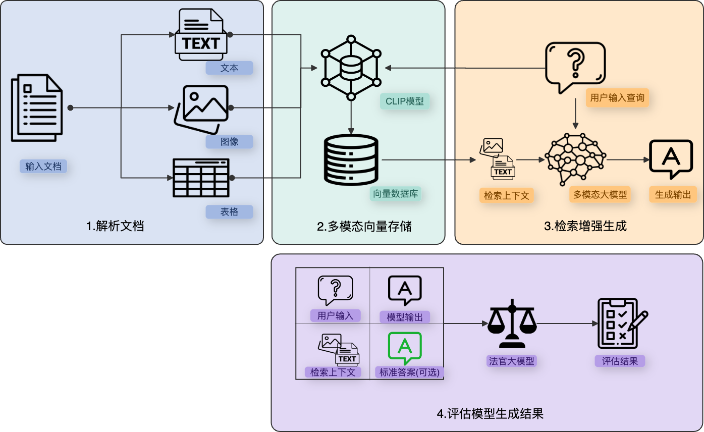
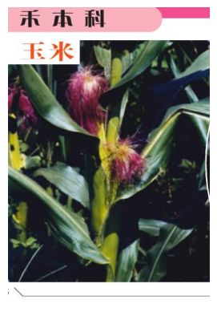
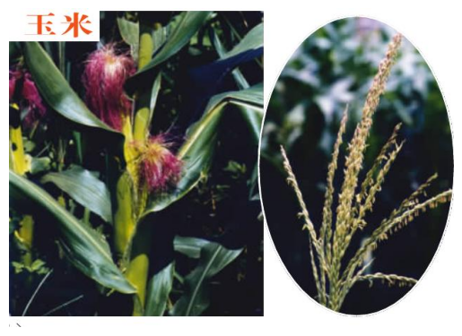
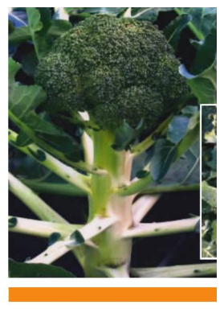
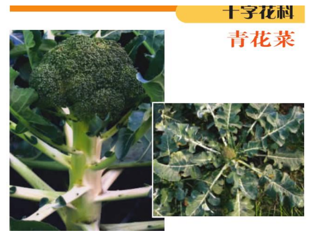
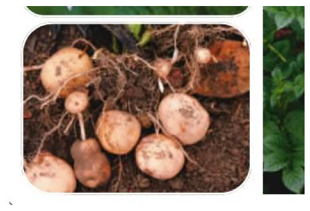
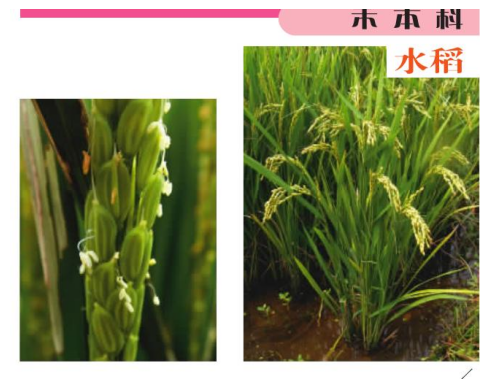
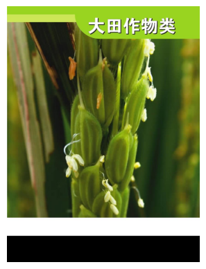
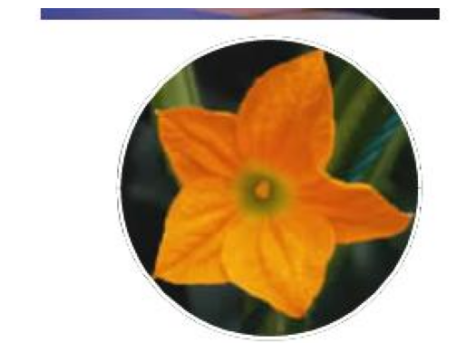

(multimodal_rag)=

# 打破文本边界：如何进行多模态RAG评测

## 整体介绍

在现代信息处理与检索系统中，如何有效地从这些包括了文本，图像，视频等多模态混合内容中，提取和利用信息是一个重要的研究方向。一般的检索增强生成（RAG，Retrieval-Augmented Generation）方法主要依赖于文本数据，常常忽略了图像中的丰富信息。多模态大型语言模型（MLLM）的出现.为这一问题提供了新的解决方案。例如，GPT-4o和Qwen-VL等多模态大模型，不仅能够理解和生成自然语言，还能解释和描述图像内容，为RAG系统在处理多模态内容时带来了新的可能性。伴之而来的问题，是如何确保多模态RAG系统在实际应用中的有效性和可靠性。

本文多模态RAG使用[EvalScope](https://github.com/modelscope/evalscope)， Ragas等框架，提供一套完整的多模态RAG评测实践指南，协助开发者全面评测图文多模态RAG流程。

### 评测流程

本文所使用的多模态RAG流程和评测流程如下：



1.  解析文档：使用工具（本文使用[Unstructured](https://github.com/Unstructured-IO/unstructured)，也可使用[MinerU](https://www.modelscope.cn/models/OpenDataLab/PDF-Extract-Kit)等其他工具）将输入的文档解析为文本、表格、图像等部分。
    
2.  多模态向量存储：使用多模态嵌入模型（例如CLIP）计算图像和文本向量，并存储到向量数据库中。
    
3.  检索增强生成：使用相似性搜索来检索图像和文本，并将召回结果传递给多模态LLM进行答案生成。
    
4.  评测模型生成结果：使用EvalScope框架，将**用户输入**、**检索上下文**、**模型输出**和**标准答案(可选)** 这四部分输入给法官大模型，模型将根据给定的指标评测整个RAG生成的效果。
    

### 评测指标

EvalScope支持RAG和多模态RAG的**独立评测**和**端到端评测**：

*   **独立评测**：单独评测检索模块，评测指标包括指标包括 **命中率**(Hit Rate)、**平均排名倒数**(Mean Reciprocal Rank, MRR)、**归一化折扣累积增益**(Normalized Discounted Cumulative Gain, NDCG)、**准确率**(Precision) 等，这些指标用于测量系统在根据查询或任务排名项目方面的有效性。
    
*   **端到端评测**：评测RAG模型对给定输入生成的输出内容，包括模型生成答案与输入查询的相关性和对齐程度。从内容生成目标视角来评测可以将评测划分为**无参考答案**和**有参考答案**：无参考答案评测指标包括**上下文相关性**(Context Relevance)、**忠实度**(Faithfulness) 等；而有参考答案评测指标包括**正确性**(Answer Correctness)、**BLEU**、**ROUGE**等。
    

:::
注意：**本文主要介绍多模态RAG的端到端生成评测**，如果想要进行CLIP模型检索性能的评测，可以参考EvalScope所支持的[CLIP Benchmark](https://evalscope.readthedocs.io/zh-cn/latest/user_guides/backend/rageval_backend/clip_benchmark.html#clip-benchmark)，提供自定义图文检索评测支持。
:::

下面详细介绍本文评测所使用指标及其计算方法：

#### 忠实度 

> 衡量**模型输出**与**检索上下文**中的**事实一致性**。如果答案中所有的陈述都可以从提供的视觉或文本上下文中推断出来，则认为生成的答案是忠实的。答案的得分范围为 (0,1)，得分越高表示忠实度越好。

:::{card}
示例：
^^^
**用户输入**: 特斯拉 Model X 怎么样？

**检索上下文**: 
```{figure} images/f2754af7-d09b-47f4-8525-7ef478fb8f56.jpg
:alt: 一张特斯拉 Model X 的图片
:scale: 50%

一张特斯拉 Model X 的图片
```
**高忠实度输出**: 特斯拉 Model X 是一款由特斯拉制造的电动SUV。

**低忠实度输出**: 猫很可爱。

解释："猫很可爱" 无法从特斯拉 Model X 的图片中推断出来，因此忠实度得分为 0。
:::

#### 相关度

> 标衡量**模型输出**与**检索上下文**以及**用户输入**的相关性。答案的得分范围为 (0,1)，得分越高表示相关性越好。


:::{card}
示例：
^^^
**用户输入**: 这幅画是谁画的？

**检索上下文**:
```{figure} images/c8d41922-f821-46db-a908-76d644f1e5e5.jpg
:alt: 一幅毕加索的画
:scale: 50%

一幅毕加索的画
```
**高相关性输出**: 这幅画是毕加索画的。

**低相关性输出**: 这是一幅美丽的画。

解释："这是一幅美丽的画" 虽然描述了画的特性，但没有回答问题，因此相关性得分为 0。
:::

#### 正确性

> 评测涉及将**模型输出**与**标准答案**进行比对，以衡量其**准确性**。评分范围从0到1，分数越高，表示生成的回答与标准答案的匹配度越高，正确性更好。该指标不涉及图像模态。


:::{card} 
示例：
^^^
**用户输入**: 爱因斯坦什么时候出生？

**标准答案**：爱因斯坦于1879年在德国出生。

**高正确性回答**：爱因斯坦于1879年在德国出生。

**低正确性回答**：爱因斯坦于1879年在西班牙出生。


解释：将标准答案和回答拆分成事实子句，并使用以下概念进行计算：

- TP（True Positive）：在标准答案和生成的回答中都存在的事实或陈述。
- FP（False Positive）：存在于生成的回答中但不存在于标准答案中的事实或陈述。
- FN（False Negative）：存在于标准答案中但不存在于生成的回答中的事实或陈述。

在该例子中：

- TP: \[爱因斯坦于1879年出生\]
- FP: \[爱因斯坦于西班牙出生\]
- FN: \[爱因斯坦于德国出生\]

计算公式：

$$\text{F1 Score} = {|\text{TP}| \over {(|\text{TP}| + 0.5 \times (|\text{FP}| + |\text{FN}|))}}$$

因此，低正确性回答的F1 score为0.5，而高正确性回答的F1为1。
:::

更多常见评测指标可参考[EvalScope使用指南](https://evalscope.readthedocs.io/zh-cn/latest/user_guides/backend/rageval_backend/ragas.html#id5)。

---

下面将详细介绍如何获得评测数据以及如何使用EvalScope进行评测：

## 环境准备

请安装以下依赖包，

```python
pip install evalscope[rag] # 提供RAG评测依赖
```

## 评测数据准备

本教程使用[《常见植物彩图册》](https://sail-moe.oss-cn-hangzhou.aliyuncs.com/yunlin/sub_plants.pdf)作为数据来源，其中包含800多张植物图片，本文节选其中“大田作物类”章节，共42页pdf文档作为示例，本文只使用其中的图片。当然，您也可以跳过下面的**文档解析**步骤，直接从modelscope下载并使用该[数据集](https://modelscope.cn/datasets/modelscope/plants-image)：

```shell
modelscope download --dataset modelscope/plants-image
```

### 文档解析

我们需要先使用`unstructured`库将其解析为RAG流程能够使用的格式，也即抽取出文档中的文本、图片、表格，安装如下依赖：

```python
pip install "unstructured[all-docs]"
apt install poppler-utils tesseract-ocr -y
```

运行如下文档解析代码：

```python
from unstructured.partition.pdf import partition_pdf
import os
import json

file_path = "./pdf/plants.pdf"  # PDF文件路径
image_path = "./pdf/images"  # 图片存储路径

def extract_pdf_elements(file_path, output_image_path):
    """
    从PDF文件中提取图片、表格和文本块。
    output_image_path: 文件路径，用于存储图片（.jpg）
    file_path: 文件名
    """
    os.makedirs(output_image_path, exist_ok=True)
    return partition_pdf(
        filename=file_path,
        strategy="hi_res",
        extract_images_in_pdf=True,
        infer_table_structure=False,
        chunking_strategy="by_title",
        max_characters=1000,
        new_after_n_chars=1000,
        combine_text_under_n_chars=1000,
        hi_res_model_name="yolox",
        extract_image_block_output_dir=output_image_path,
    )
```

上述代码中，我们定义了一个函数`extract_pdf_elements`，该函数从PDF文件中提取图片、表格和文本块，并将图片存储到指定路径。通过这些步骤，我们可以将PDF文档解析并转换为RAG流程能够使用的格式。

### 构建检索器

构建一个高效的检索器是实现图文多模态RAG模型的关键步骤之一。检索器负责从大规模的数据集中，找到与用户查询最相关的文档片段或图像，从而为生成模型提供上下文信息。

```python
import os
import numpy as np
from langchain_chroma import Chroma
from evalscope.backend.rag_eval import VisionModel

# 创建 Chroma 实例
vectorstore = Chroma(
    collection_name="mm_rag_clip",
    # 使用ModelScope上的CLIP模型计算向量
    embedding_function=VisionModel.load(model_name="AI-ModelScope/chinese-clip-vit-large-patch14-336px")  
)

# 获取所有.jpg扩展名的图片URI
image_uris = sorted(
    [
        # 获取.jpg扩展名的文件
        os.path.join(image_path, image_name)
        for image_name in os.listdir(image_path)  
        if image_name.endswith(".jpg")  
    ]
)

# 添加图片到Chroma向量存储，也可通过add_texts添加文本向量，本文不需要
vectorstore.add_images(uris=image_uris)

# 创建检索器实例
retriever = vectorstore.as_retriever(
        search_type="similarity",  # 使用相似性搜索类型
        search_kwargs={'k': 2}  # 搜索结果返回前2个最相似项（top_k = 2）
)
```

这段代码通过使用 `EvalScope` 从 `ModelScope` 加载预训练的 CLIP 模型（`AI-ModelScope/chinese-clip-vit-large-patch14-336px`），创建一个基于开源Chroma向量数据库的多模态检索系统。代码首先获取并添加指定路径下的所有 `.jpg` 图片和文本放到 Chroma 向量存储中，然后通过相似性搜索机制构建一个检索器实例，使得系统能够根据图像相似性搜索，返回最相关的top 2两张图片。

**合理性检查**

在完成检索器的构建之后，下一步是进行合理性检查，以确保模型能够准确地根据给定查询返回相关的图片。这一步对于验证模型的有效性和调整参数至关重要。

```python
docs = retriever.invoke("玉米") 
```

|  |  |
|:---------------------------------------------------------:|:---------------------------------------------------------:|
| 图像1 | 图像2 |

检索返回的图像经过了base64编码，以上展示了解码后的检索图片。通过上述代码，我们可以看到针对“玉米”这一查询词，检索器返回了最相关的两个图片，而且图片中正是“玉米”，说明我们构建的检索器是合理的。

### 构建RAG流程

接下来我们使用langchain来搭建一个简易的RAG流程：

```python
import os
import json
import base64
import matplotlib.pyplot as plt
from io import BytesIO
from PIL import Image
from langchain_core.messages import HumanMessage
from langchain_core.output_parsers import StrOutputParser
from langchain_core.runnables import RunnableLambda, RunnablePassthrough

class RAGPipeline:
    def __init__(self, retriever, model):
        self.retriever = retriever
        self.model = model
        self.question = None
        self.context = None
        self.response = None

    def split_image_text_types(self, docs):
        """
        将文档内容分为图片和文本两类。
        docs: 文档列表
        """
        images = []
        text = []
        for doc in docs:
            doc = doc.page_content  # 提取文档内容
            if self.is_base64(doc):
                images.append(doc)
            else:
                text.append(doc)
        self.context = {"images": images, "texts": text}
        return self.context

    def prompt_func(self, data_dict):
        """
        生成提示信息，将上下文文本合并为一个字符串。
        data_dict: 包含上下文信息的数据字典
        """
        # 将上下文文本合并为一个字符串
        formatted_texts = "\n".join(data_dict["context"]["texts"])
        messages = [{"type": "text", "text": (
            f"""你是一位植物图鉴科普者，专门回答有关各种植物的问题。请根据用户输入的问题和检索到的图像提供详细且准确的回答，详细描述检索到的图片细节，结合这些细节，请确保你的回答足够详细，以方便用户理解。以下是用户的问题和相关的上下文信息：
用户问题: {self.question}
检索到的上下文信息:
{formatted_texts}
"""
        )}]

        # 如果有图片，将其添加到消息中
        for image_base64 in data_dict["context"]["images"]:
            messages.append({
                "type": "image_url",
                "image_url": {"url": f"data:image/jpeg;base64,{image_base64}"}
            })

        return [HumanMessage(content=messages)]


    def is_base64(self, s):
        """
        检查字符串是否为base64编码。
        s: 输入字符串
        """
        try:
            return base64.b64encode(base64.b64decode(s)) == s.encode()
        except Exception:
            return False

    def invoke(self, question):
        """
        调用链式操作执行检索和生成回答。
        question: 用户问题
        """
        self.question = question
        chain = (
            {
                "context": self.retriever | RunnableLambda(self.split_image_text_types),
                "question": RunnablePassthrough(),
            }
            | RunnableLambda(self.prompt_func)
            | self.model
            | StrOutputParser()
        )
        
        self.response = chain.invoke(question)
        return self.response
    
    def show_result(self):
        """
        显示最终结果，包括问题、上下文和生成的回答。
        """
        print(f"Question: {self.question}")
        print(f"Context: {self.context}")
        print(f"Response: {self.response}")
        for image_base64 in self.context.get("images", []):
            self.plt_img_base64(image_base64)

    def save_case(self, file_path):
        """
        保存案例数据到指定文件路径。
        file_path: 保存路径
        """
        case_data = {
            "user_input": self.question,
            "retrieved_contexts": self.context['texts'] + self.context['images'],
            "response": self.response
        }
        
        if os.path.exists(file_path):
            # 读取现有的案例数据
            with open(file_path, 'r', encoding='utf-8') as f:
                cases = json.load(f)
        else:
            cases = []

        # 添加新的案例数据
        cases.append(case_data)

        # 写回所有案例数据
        with open(file_path, 'w', encoding='utf-8') as f:
            json.dump(cases, f, ensure_ascii=False, indent=4)
```

这段代码实现了一个多模态（图像和文本）检索的RAG流程，代码包含了初始化、分离图像和文本、生成提示信息、显示图像、检查base64编码、执行检索与生成回答、显示结果以及保存案例数据的功能。

### 获得评测数据

运行下面这段代码即可得到多模态RAG评测所需要的数据，这里我们使用`qwen-vl-plus`作为生成模型：

```python
from evalscope.backend.rag_eval import LLM

model = LLM.load(
            model_name="qwen-vl-plus",
            api_base="https://dashscope.aliyuncs.com/compatible-mode/v1",
            api_key=os.getenv("DASHSCOPE_API_KEY"),
        )

pipeline = RAGPipeline(retriever, model)
for prompt in ["玉米", "西兰花", "洋芋", "水稻", "汽车"]:
    response = pipeline.invoke(f"{prompt}是什么？")
    pipeline.show_result()
    pipeline.save_case("./pdf/output.json")
```

示例如下：

```json
[
    {
        "user_input": "玉米是什么？",
        "retrieved_contexts": [
          "/9j/4AAQSkZJRgABAQAAAQABAAD/2wBDAAgGB...", // base64 图像
          "/9j/4AAQSkZJRgABAQAAAQABAAD/2wBDAAgGB...", // base64 图像
        ],
        "response": "玉米是一种禾本科作物，在全球范围内广泛种植作为粮食、饲料或工业原料使用。\n\n在第一张图片中，我们可以看到一个正在生长中的玉米植株。它的叶子是绿色的，并带有明显的叶脉结构。茎部呈现出鲜艳的黄色，这是由于它含有丰富的类胡萝卜素色素所致。在这根茎上，我们还可以观察到一些红色的毛状物，这实际上是玉米花序的一部分，也就是将来会发育成玉米棒的地方。\n\n第二张图片则展示了两个不同阶段的玉米植株。左边是一颗已经开花并开始形成穗轴（即玉米棒）的成熟期玉米；右边则是另一棵刚刚进入抽穗生长期的小苗，可以看到其叶片较小而颜色较浅，与成熟的玉米相比显得更为稚嫩。\n\n总的来说，无论是从形态还是生命周期的角度来看，这两幅图片都为我们提供了关于玉米这种重要农作物的重要视觉参考点。"
    },
  // ...
]
```

可以看到每组数据包含以下三个主要字段：

*   **user\_input（用户输入）**：
    
    *   这个字段包含了用户提出的问题或查询。例如，“玉米是什么？”
        
*   **retrieved\_contexts（检索到的上下文）**：
    
    *   这个字段包含了系统检索到的与用户输入相关的上下文信息。在这个例子中，retrieved\_contexts 是一些 base64 编码的图像数据。
        
*   **response（模型输出）**：
    
    *   这是系统根据用户的输入以及检索到的图片上下文信息生成的回答。例如，关于玉米的回答描述了其定义以及两张图片中的内容。
        

*   **reference（标准答案），可选字段**
    
    *   在评测答案正确性时需要该字段，可以使用GPT-4o等模型来模拟生成。
        

## 多模态RAG评测

对图文多模态RAG流程进行端到端的性能评测，是确保模型能够准确、有效地响应用户查询的至关重要的一个步骤。接下来我们使用EvalScope框架来执行一系列的评测任务。

### 配置评测参数

在执行评测任务之前需要配置一系列参数，具体如下：

*   指定了评测后端为 `RAGEval`，使用开源的 `RAGAS` 工具，并配置了测试集文件路径。
    
*   评测使用的评测法官模型为通过API调用的 `qwen-vl-max` ；嵌入模型为`AI-ModelScope/bge-large-zh`，该模型可自动从ModelScope加载。
    
*   定义了使用的评测指标，包括多模态忠实度 (`MultiModalFaithfulness`) 、多模态相关性 (`MultiModalRelevance`)和回答正确性（`AnswerCorrectness`），我们已经把这些多模态评测指标都贡献到了`RAGAS` 工具里。
    
*   设定评测语言为中文，框架会自动将prompt翻译为目标语言。
    

```python
multi_modal_task_cfg = {
    "eval_backend": "RAGEval",
    "eval_config": {
        "tool": "RAGAS",
        "eval": {
            "testset_file": "./pdf/output.json",
            "critic_llm": {
                "model_name": "qwen-vl-max",
                "api_base": "https://dashscope.aliyuncs.com/compatible-mode/v1",
                "api_key": os.getenv("DASHSCOPE_API_KEY"),
            },
            "embeddings": {
                "model_name_or_path": "AI-ModelScope/bge-large-zh",
            },
            "metrics": [
                "MultiModalFaithfulness",
                "MultiModalRelevance",
                "AnswerCorrectness"
            ],
            "language": "chinese"
        },
    },
}
```

### 执行评测

运行如下代码即可完成评测：

```python
from evalscope.run import run_task

run_task(task_cfg=multi_modal_task_cfg)
```

输出结果如下：

|  **输入(user\_input)**  |  **上下文(retrieved\_contexts)**  |  **输出(response)**  |  **参考答案(reference)**  |  **忠实度**  |  **相关性**  |  **正确性**  |
| --- | --- | --- | --- | --- | --- | --- |
|  玉米是什么？  |     |  玉米是一种禾本科作物，在全球范围内广泛种植作为粮食、饲料或工业原料使用。 在第一张图片中，我们可以看到一个正在生长中的玉米植株……第二张图片则展示了两个不同阶段的玉米植株。左边是……  |  玉米（学名：Zea mays）是一种高大的一年生草本植物，属于禾本科。根据检索到的图片，玉米的主要特征包括：……  |  1  |  1  |  0.69  |
|  西兰花是什么？  |     |  西兰花是一种十字花科蔬菜作物，在世界各地广泛种植并以其丰富的营养价值而闻名。 在提供的两张图片中可以看到青花菜（也称为西兰花）的不同生长阶段： 第一张图片展示了一颗成熟的绿色西兰花头……第二张图片显示了年轻的、未成熟时的西兰花植株……  |  西兰花，又称青花菜，是十字花科植物的一种。根据检索到的图片，可以看到西兰花的几个重要特征：……  |  1  |  1  |  0.56  |
|  洋芋是什么？  |     |  洋芋是马铃薯的一个别称，在中国北方地区较为常见。 在提供的两张图片中： 第一张图片展示的是新鲜出土、带有根须的土豆块茎……第二张图片则展示了紫色花朵盛开的马铃薯植株以及其地下部分……  |  洋芋是马铃薯的另一种称呼，学名为Solanum tuberosum，是一种常见的根茎类植物，属于茄科。根据检索到的图片，洋芋（马铃薯）有以下几个明显的特征……  |  1  |  1  |  0.66  |
|  水稻是什么？  |     |  水稻是一种重要的粮食作物，在全球范围内广泛种植。它属于禾本科（Poaceae）下的一个属——Oryza。在自然状态下，水稻有多个品种或变种。 从您提供的两张图片来看： 第一张图片展示的是水稻的一个特写镜头，可以看到……第二张图片则展示了另一种类型的水稻植株……  |  水稻是一种栽培稻，属于禾本科稻属植物，是世界上最重要的粮食作物之一。水稻通常在水田中种植……  |  1  |  1  |  0.86  |
|  汽车是什么？  |     |  很抱歉，您提供的图片内容与您的问题并不相关。在您提供的图片中，第一张是一朵橙色南瓜花的照片，第二张是绿色叶子的特写照片。关于“汽车”的定义，它是一种机动车辆...  |  图片中展示的是一种植物的花和叶子。第一张图片显示了一朵橙色的花，花瓣呈五角星形……至于“汽车是什么”，这个问题似乎与植物无关，汽车是一种交通工具，用于运输人和货物。  |  0  |  0  |  0.59  |

本案例中的**参考答案**由GPT-4o生成。

下面分析一下评测结果：

*   根据答案正确性来看，模型的回答都有良好的正确性，正确描述了图片中的相关特征，包括第5个问题和图像不相关的案例。
    
*   前4个问题中，生成的答案准确描述了对应植物，并且与视觉上下文一致，相关性和忠实性得分为1。
    
*   第5个问题，由于检索库中没有汽车相关的图片，检索器返回了一些植物的图片，生成的答案与用户输入以及提供的上下文相关度较低，因此相关性和忠实性得分为 0。
    

## 总结

多模态RAG系统的评测，与基于纯文本的RAG系统评测比较，有其独特的特点与挑战。通过选取组合不同模型，以及利用EvalScope，RAGAS，Langchain等开源框架，使得我们能够较为全面的评测多模态RAG系统的忠实度、相关性和正确性等指标，从而反映多模态RAG流程生成的性能。本文的实践总结，希望通过具体的场景例子，分析各个组件在这个链路上的作用，从而帮助更多的开发者来根据其实际场景，来针对性的改进多模态RAG流程，从而实现多模态RAG任务的真正落地应用。
