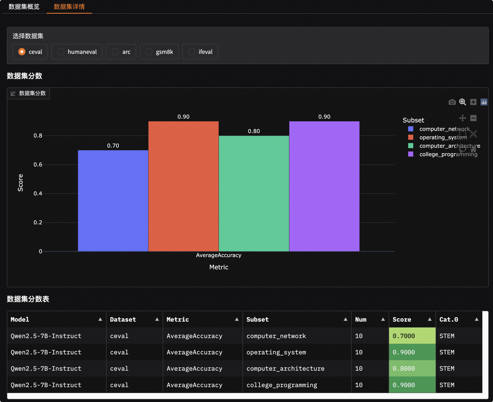
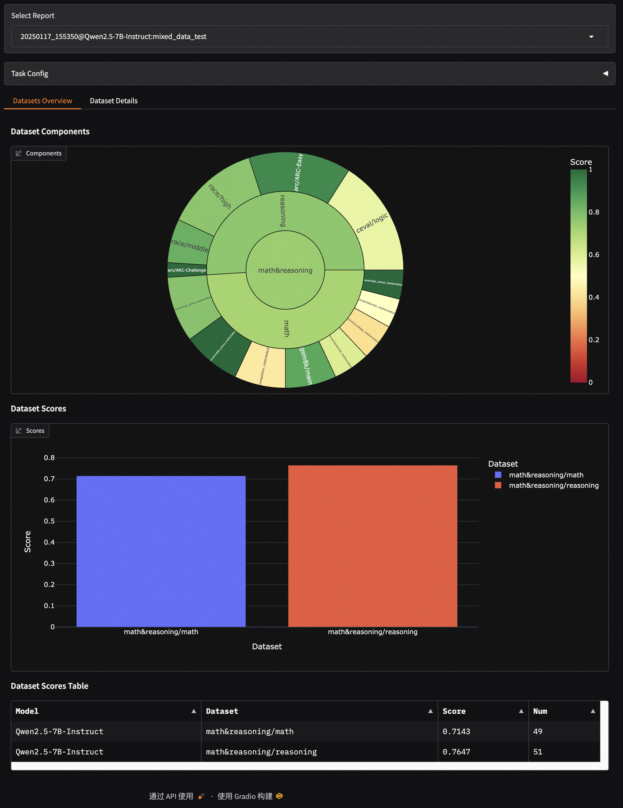

# 可视化

可视化功能支持对单个或多个模型的评测结果进行深入分析和对比，并兼容数据集混合评测的展示。

```{important}
该可视化工具专用于展示模型**评测**结果，不适用于模型**压测**结果。如需可视化压测报告，请参考[压测结果可视化指南](../user_guides/stress_test/quick_start.md#可视化测试结果)。
```

## 安装与启动

### 1. 安装依赖

安装可视化所需的依赖库。
```bash
pip install 'evalscope[app]' -U
```
```{note}
可视化功能需要 `evalscope>=0.10.0` 生成的评测报告。若版本过低，请先升级并重新运行评测。
```

### 2. 启动服务

运行以下命令启动可视化 Web 服务。
```bash
evalscope app
```
服务启动后，在浏览器中打开 `http://127.0.0.1:7860` 即可访问。

支持的命令行参数如下：
- `--outputs`: 评测报告根目录，默认为 `./outputs`。
- `--lang`: 界面语言，支持 `zh` (默认) 和 `en`。
- `--share`: 创建一个公开可访问的链接。
- `--server-name`: 服务器监听地址，默认为 `0.0.0.0`。
- `--server-port`: 服务器端口，默认为 `7860`。

## 快速体验

我们提供了一份包含多个模型和数据集的评测样例，让您能快速体验可视化功能。

```bash
git clone https://github.com/modelscope/evalscope
evalscope app --outputs evalscope/examples/viz
```
该样例包含了 Qwen2.5-0.5B 和 Qwen2.5-7B 模型在 C-Eval、HumanEval、ARC、GSM8K 等数据集上的评测结果。

## 功能介绍

### 选择评测报告

按下图所示步骤选择并加载评测报告：

```{image} ./images/setting.png
:alt: 选择评测报告
:width: 60%
:align: center
```

1.  **输入根目录**：指定评测报告所在的根目录，默认为 `./outputs`。程序会自动扫描该目录下的所有报告。
2.  **选择报告**：从下拉框中选择一个或多个评测报告。
3.  **加载查看**：点击`加载并查看`按钮，开始分析。

### 单模型评测结果

在“单模型”选项卡中，您可以深入分析单个模型的表现。

- **数据集概览**：通过旭日图和表格，直观展示模型在所有评测数据集上的整体表现。旭日图的每一层分别代表数据集、类别和子集，扇区大小表示样本量，颜色深浅表示得分高低。
  

- **数据集详情**：选择特定数据集后，可以查看模型在该数据集上不同指标和子集的分数。您还可以进一步筛选，查看每个样本的详细输入（Input）、模型输出（Generated）、标准答案（Gold）和最终得分（Score）。
  

### 多模型评测结果对比

在“多模型”选项卡中，您可以横向对比多个模型的性能。

- **模型概览**：通过雷达图和对比表格，快速了解各模型在不同能力维度上的优劣。
  

- **模型对比详情**：选择两个模型进行“一对一”比较，并排查看它们在同一数据集、同一题目上的具体表现差异。
  

### 数据集混合评测可视化

本看板也支持[数据集混合评测](../advanced_guides/collection/index.md)的可视化，将按照您定义的混合结构（Schema）进行分层展示。

例如，对于如下结构的 Schema：
```python
schema = CollectionSchema(name='math&reasoning', datasets=[
            CollectionSchema(name='math', datasets=[
               DatasetInfo(name='gsm8k', weight=1, task_type='math', tags=['en', 'math']),
               DatasetInfo(name='competition_math', weight=1, task_type='math', tags=['en', 'math']),
               DatasetInfo(name='cmmlu', weight=2, task_type='math', tags=['zh', 'math'], args={'subset_list': ['college_mathematics', 'high_school_mathematics']}),
               DatasetInfo(name='ceval', weight=3, task_type='math', tags=['zh', 'math'], args={'subset_list': ['advanced_mathematics', 'high_school_mathematics', 'discrete_mathematics', 'middle_school_mathematics']}),
            ]),
            CollectionSchema(name='reasoning', datasets=[
               DatasetInfo(name='arc', weight=1, task_type='reasoning', tags=['en', 'reasoning']),
               DatasetInfo(name='ceval', weight=1, task_type='reasoning', tags=['zh', 'reasoning'], args={'subset_list': ['logic']}),
               DatasetInfo(name='race', weight=1, task_type='reasoning', tags=['en', 'reasoning']),
            ]),
         ])
```

可视化报告将呈现出与 Schema 一致的层级结构：
```text
math&reasoning
├── math
│   ├── gsm8k
│   ├── competition_math
│   ├── cmmlu
│   ├── ceval
├── reasoning
│   ├── arc
│   ├── ceval
│   ├── race
```

