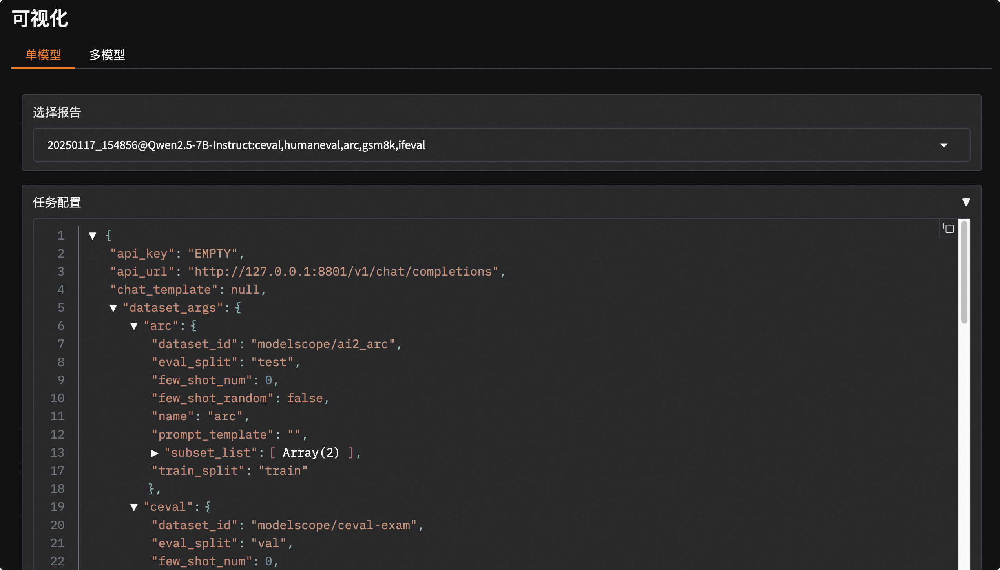
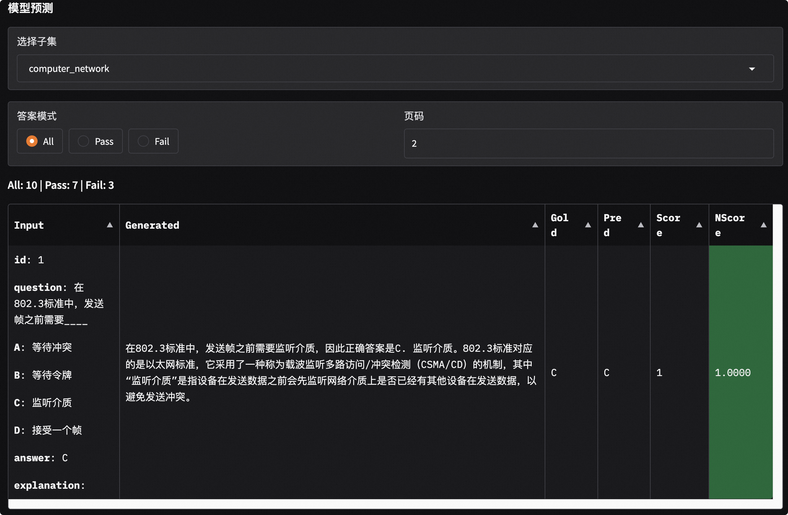

# 可视化

可视化功能支持单模型评测结果和多模型评测结果对比，支持数据集混合评测可视化。

```{important}
该可视化工具专门用于展示模型评测结果，不适用于模型推理服务的压测结果可视化。如需查看模型推理服务的压测结果可视化，请参考[压测结果可视化指南](../user_guides/stress_test/quick_start.md#可视化测试结果)。
```

## 安装依赖

安装可视化所需的依赖，包括gradio、plotly等。

```bash
pip install 'evalscope[app]' -U
```
```{note}
可视化功能需要`evalscope>=0.10.0`输出的评测报告，若版本小于`0.10.0`，请先升级`evalscope`进行模型评测。
```

## 启动可视化服务

运行如下命令启动可视化服务。
```bash
evalscope app
```

支持的命令行参数如下：

- `--outputs`: 类型为字符串，用于指定评测报告所在的根目录，默认值为`./outputs`。
- `--lang`: 类型为字符串，用于指定界面语言，默认值为中文`zh`，支持`zh`和`en`。
- `--share`: 作为标志参数，是否共享应用程序，默认值为`False`。
- `--server-name`: 类型为字符串，默认值为`0.0.0.0`，用于指定服务器名称。
- `--server-port`: 类型为整数，默认值为`7860`，用于指定服务器端口。
- `--debug`: 作为标志参数，是否调试应用程序，默认值为`False`。

输出如下内容即可在浏览器中访问可视化服务。
```text
* Running on local URL:  http://127.0.0.1:7860

To create a public link, set `share=True` in `launch()`.
```

### 快速体验

运行如下命令，即可下载样例并快速体验可视化功能，样例中包含Qwen2.5-0.5B和Qwen2.5-7B模型在ceval, humaneval, arc, gsm8k, ifeval数据集上部分示例的评测结果。

```bash
git clone https://github.com/modelscope/evalscope
evalscope app --outputs evalscope/examples/viz
```

## 功能介绍

### 选择评测报告

按下图所示步骤选择评测报告：

```{image} ./images/setting.png
:alt: alt text
:width: 60%
:align: center
```


1. 输入评测报告的根目录，默认值为`./outputs`，会根据如下目录结构来寻找评测报告json文件：
   ```text
   outputs/
   ├── time_stamp_1
   │   ├── reports
   │   │   ├── model_name_1
   │   │   │   ├── report1.json
   │   │   │   ├── report2.json
   ├── time_stamp_2
   │   ├── reports
   │   │   ├── model_name_1
   │   │   │   ├── report1.json
   │   │   │   ├── report2.json
   ```

2. 选择评测报告，点击下拉框选择评测报告，若不选择，则弹出警告。

3. 点击`加载并查看`按钮，即可查看可视化。


### 单模型评测结果可视化
1. 点击`单模型`选项页按钮
2. 在`选择报告`下拉框中选择已加载的评测报告，将自动展示评测报告总览
3. 点击`任务配置`可查看任务配置信息
   


**评测报告总览**

1. 展示评测数据集的组成：其由内而外分别表示数据集名称、数据集类别、子数据集名称；扇形区域大小表示数据集样本数量；颜色表示数据集得分
2. 分别用条形图和表格展示各数据集打分结果
   

**单个数据集详情**
1. 选择数据集，将展示模型在该数据集上的评测结果
2. 使用条形图和表格展示模型在不同指标下、不同子数据集上的评测结果
   
3. 选择子数据集，将展示模型在该子数据集上的评测结果，可以点击`答案模式`筛选模型输出结果。其中
   - `Input`表示模型输入；
   - `Generated`表示模型输出；
   - `Gold`表示标准答案；
   - `Pred`表示经过后处理的模型预测结果；
   - `Score`表示模型得分；
   - `NScore`表示归一化的模型得分，用于表示模型得分是否通过

   


### 多模型评测结果对比可视化

1. 点击`多模型`选项页按钮
2. 在`选择报告`下拉框中选择已加载的评测报告，将自动展示评测报告总览，可以多项选择
3. 使用雷达图和对比表格进行展示
   

### 数据集混合评测可视化

本看板也支持[数据集混合评测](../advanced_guides/collection/index.md)可视化，将按照数据混合schema的结构进行可视化展示

例如如下结构的schema：

```python
schema = CollectionSchema(name='math&reasoning', datasets=[
            CollectionSchema(name='math', datasets=[
               DatasetInfo(name='gsm8k', weight=1, task_type='math', tags=['en', 'math']),
               DatasetInfo(name='competition_math', weight=1, task_type='math', tags=['en', 'math']),
               DatasetInfo(name='cmmlu', weight=2, task_type='math', tags=['zh', 'math'], args={'subset_list': ['college_mathematics', 'high_school_mathematics']}),
               DatasetInfo(name='ceval', weight=3, task_type='math', tags=['zh', 'math'], args={'subset_list': ['advanced_mathematics', 'high_school_mathematics', 'discrete_mathematics', 'middle_school_mathematics']}),
            ]),
            CollectionSchema(name='reasoning', datasets=[
               DatasetInfo(name='arc', weight=1, task_type='reasoning', tags=['en', 'reasoning']),
               DatasetInfo(name='ceval', weight=1, task_type='reasoning', tags=['zh', 'reasoning'], args={'subset_list': ['logic']}),
               DatasetInfo(name='race', weight=1, task_type='reasoning', tags=['en', 'reasoning']),
            ]),
         ])
```

可视化报告如下，可见结构与schema一致，为：
```text
math&reasoning
├── math
│   ├── gsm8k
│   ├── competition_math
│   ├── cmmlu
│   ├── ceval
├── reasoning
│   ├── arc
│   ├── ceval
│   ├── race
```
