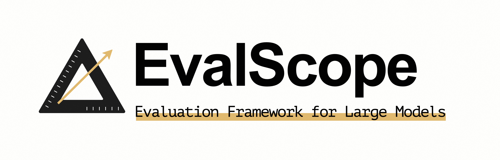

 

# 欢迎来到 EvalScope 中文教程！

## 上手路线

为了用户能够快速上手，我们推荐以下流程：

- 对于想要使用 EvalScope 的用户，我们推荐先阅读 [快速开始](get_started/introduction.md) 部分来设置环境，并启动一个迷你实验熟悉流程。
- 对于一些基础使用，我们建议用户阅读 教程部分，包括 [如何使用竞技场模式进行评测](user_guides/arena.md)、[如何使用其他评测后端](user_guides/backend/index.md)、[如何使用模型服务压测工具](user_guides/stress_test/index.md)。
- 若您想进行更多模块的自定义，例如增加数据集和模型，我们提供了 [进阶教程](advanced_guides/custom_dataset/index.md)。
- 此外，我们提供了 [第三方工具](third_party/toolbench.md) 来帮助用户快速评测模型，例如使用 ToolBench 进行评测。
- 最后，我们提供了 [最佳实践](best_practice/swift_integration.md) 来帮助用户进行评测，例如如何使用 Swift 进行评测。

我们始终非常欢迎用户的 PRs 和 Issues 来完善 EvalScope。

:::{toctree}
:hidden:
:caption: 🚀 快速开始

get_started/introduction.md
get_started/installation.md
get_started/basic_usage.md
get_started/visualization.md
get_started/parameters.md
get_started/supported_dataset/index.md
get_started/faq.md
:::

:::{toctree}
:hidden:
:caption: 🔧 教程
user_guides/backend/index.md
user_guides/stress_test/index.md
user_guides/aigc/index.md
user_guides/arena.md
user_guides/sandbox.md
user_guides/service.md
:::

:::{toctree}
:hidden:
:caption: 🛠️ 进阶教程
advanced_guides/collection/index.md
advanced_guides/custom_dataset/index.md
advanced_guides/custom_model.md
advanced_guides/add_benchmark.md
:::

:::{toctree}
:hidden:
:caption: 🧰 扩展评测基准

third_party/index.md
:::

:::{toctree}
:hidden:
:caption: 📖 最佳实践

best_practice/index.md
:::

:::{toctree}
:hidden:
:caption: 🧪 基准测试结果
experiments/benchmark/index.md
experiments/speed_benchmark/index.md
:::

:::{toctree}
:hidden:
:caption: 🌟 博客
blog/index.md
:::
