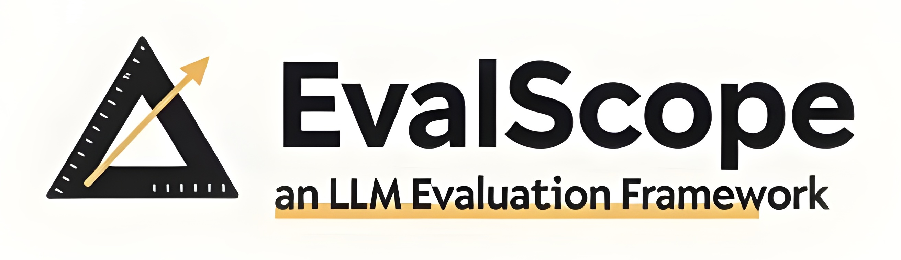

.. _pypi_downloads: https://pypi.org/project/evalscope
.. _github_pr: https://github.com/modelscope/evalscope/pulls

.. raw:: html

   

   
   
   
   

欢迎来到 EvalScope 中文教程！
==========================================

EvalScope 上手路线
-------------------------------

为了用户能够快速上手，我们推荐以下流程：

- 对于想要使用 EvalScope 的用户，我们推荐先阅读 快速开始_ 部分来设置环境，并启动一个迷你实验熟悉流程。

- 对于一些基础使用，我们建议用户阅读 教程_ 。

- 若您想进行更多模块的自定义，例如增加数据集和模型，我们提供了 进阶教程_ 。

- 若您想监控模型服务的推理性能，我们提供了 性能监控_ 。

我们始终非常欢迎用户的 PRs 和 Issues 来完善 EvalScope

.. _快速开始:
.. toctree::
   :maxdepth: 1
   :caption: 快速开始
   
   get_started/introduction.md
   get_started/installation.md
   get_started/quick_start.md

.. _教程:
.. toctree::
   :maxdepth: 1
   :caption: 教程
   

.. _进阶教程:
.. toctree::
   :maxdepth: 1
   :caption: 进阶教程
   

.. _性能监控:
.. toctree::
   :maxdepth: 1
   :caption: 性能监控
   

索引与表格
==================

* :ref:`genindex`
* :ref:`search`