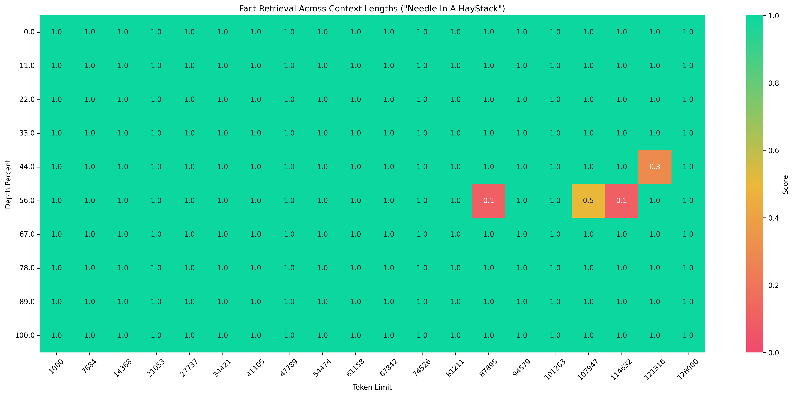
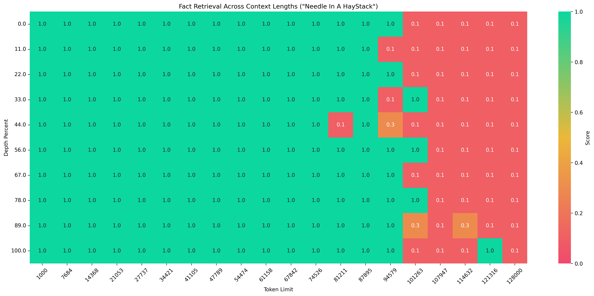

# 大海捞针测试

## 描述
大海捞针（Needle in a haystack）任务是指在一个包含大量无关信息的文本中，找到特定的、通常是非常少量的相关信息。

本代码的实现逻辑参考 [LLMTest_NeedleInAHaystack](https://github.com/gkamradt/LLMTest_NeedleInAHaystack)。

## 数据集

数据集[链接](https://modelscope.cn/datasets/AI-ModelScope/Needle-in-a-Haystack-Corpus/summary)，数据包含中文和英文两种语言的文本：
- **中文文本**：来自《西游记》
- **英文文本**：来自 保罗·格雷厄姆 的文章

## 使用方法

### 单针任务

运行下面的代码即可启动大海捞针任务。下面以评测qwen-plus模型为例，在1k-128k长度，运行单针任务。

**注意需要设置judge模型，否则评测会失败。**

```python
import os
from evalscope import TaskConfig, run_task

task_cfg = TaskConfig(
    model='qwen-plus',
    api_url='https://dashscope.aliyuncs.com/compatible-mode/v1',
    api_key=os.getenv('DASHSCOPE_API_KEY'),
    eval_type='openai_api',  # 使用API模型服务
    datasets=['needle_haystack'],
    eval_batch_size=10,
    dataset_args={
        'needle_haystack': {
            'subset_list': ['chinese', 'english'],  # 可选，指定使用中文或英文子集
            # 支持配置的参数
            'extra_params':{
                # 问题
                'retrieval_question': 'What is the best thing to do in San Francisco?',
                # 插入的文本（可以设置为多个）
                'needles':['\nThe best thing to do in San Francisco is eat a sandwich and sit in Dolores Park on a sunny day.\n'],
                # 语料的最小长度
                'context_lengths_min': 1000,
                # 语料的最大长度
                'context_lengths_max': 128000,
                # 语料的区间数
                'context_lengths_num_intervals': 20,
                # 插入文本最小位置（百分数）
                'document_depth_percent_min': 0,
                # 插入文本最大位置（百分数）
                'document_depth_percent_max': 100,
                # 插入文本位置区间数
                'document_depth_percent_intervals': 10,
                # tokenizer的路径(可以指定modelscope的id)
                'tokenizer_path': 'Qwen/Qwen3-0.6B',
                'show_score': True, # 是否在heatmap上显示分数
            }
        }
    },
    generation_config={
        'max_tokens': 512,  # 最大生成token数
    },
    judge_worker_num=5,
    judge_model_args={
        'model_id': 'qwen2.5-72b-instruct',
        'api_url': 'https://dashscope.aliyuncs.com/compatible-mode/v1',
        'api_key': os.getenv('DASHSCOPE_API_KEY'),
    }
)
run_task(task_cfg=task_cfg)
```

输出结果如下（有截断）：
```text
+-----------+-----------------+--------------------------+----------+-------+---------+---------+
| Model     | Dataset         | Metric                   | Subset   |   Num |   Score | Cat.0   |
+===========+=================+==========================+==========+=======+=========+=========+
| qwen-plus | needle_haystack | Context#128000 Depth#33  | english  |     1 |     0.1 | default |
+-----------+-----------------+--------------------------+----------+-------+---------+---------+
| qwen-plus | needle_haystack | Context#128000 Depth#11  | chinese  |     1 |     1   | default |
+-----------+-----------------+--------------------------+----------+-------+---------+---------+
| qwen-plus | needle_haystack | Context#128000 Depth#11  | english  |     1 |     0.1 | default |
+-----------+-----------------+--------------------------+----------+-------+---------+---------+
| qwen-plus | needle_haystack | Context#121316 Depth#56  | chinese  |     1 |     1   | default |
+-----------+-----------------+--------------------------+----------+-------+---------+---------+
| qwen-plus | needle_haystack | Context#121316 Depth#56  | english  |     1 |     0.1 | default |
+-----------+-----------------+--------------------------+----------+-------+---------+---------+
| qwen-plus | needle_haystack | Context#128000 Depth#44  | chinese  |     1 |     1   | default |
+-----------+-----------------+--------------------------+----------+-------+---------+---------+
| qwen-plus | needle_haystack | Context#128000 Depth#44  | english  |     1 |     0.1 | default |
+-----------+-----------------+--------------------------+----------+-------+---------+---------+
| qwen-plus | needle_haystack | Context#128000 Depth#67  | chinese  |     1 |     1   | default |
+-----------+-----------------+--------------------------+----------+-------+---------+---------+
| qwen-plus | needle_haystack | Context#128000 Depth#67  | english  |     1 |     0.1 | default |
+-----------+-----------------+--------------------------+----------+-------+---------+---------+
| qwen-plus | needle_haystack | Context#128000 Depth#0   | chinese  |     1 |     1   | default |
+-----------+-----------------+--------------------------+----------+-------+---------+---------+
| qwen-plus | needle_haystack | Context#128000 Depth#0   | english  |     1 |     0.1 | default |
+-----------+-----------------+--------------------------+----------+-------+---------+---------+
| qwen-plus | needle_haystack | Context#128000 Depth#22  | chinese  |     1 |     1   | default |
+-----------+-----------------+--------------------------+----------+-------+---------+---------+
| qwen-plus | needle_haystack | Context#128000 Depth#22  | english  |     1 |     0.1 | default |
+-----------+-----------------+--------------------------+----------+-------+---------+---------+
| qwen-plus | needle_haystack | Context#128000 Depth#100 | chinese  |     1 |     1   | default |
+-----------+-----------------+--------------------------+----------+-------+---------+---------+
| qwen-plus | needle_haystack | Context#128000 Depth#100 | english  |     1 |     0.1 | default |
+-----------+-----------------+--------------------------+----------+-------+---------+---------+
| qwen-plus | needle_haystack | Context#128000 Depth#89  | chinese  |     1 |     1   | default |
+-----------+-----------------+--------------------------+----------+-------+---------+---------+
| qwen-plus | needle_haystack | Context#128000 Depth#89  | english  |     1 |     0.1 | default |
+-----------+-----------------+--------------------------+----------+-------+---------+---------+ 
```

在outputs/xxx/reports目录下会生成评测报告以及对应的heatmap，示例如下：


*中文测试*


*英文测试*

可以看出，模型在不同的上下文长度和插入文本位置下的表现差异。同时模型在中文场景下表现更好。

### 多针任务
多针任务与单针任务类似，只需要在`extra_params`中设置`needles`为多个文本即可。下面在1k-32k上下文长度中进行3针测试。

```python
import os
from evalscope import TaskConfig, run_task

task_cfg = TaskConfig(
    model='qwen-plus',
    api_url='https://dashscope.aliyuncs.com/compatible-mode/v1',
    api_key=os.getenv('DASHSCOPE_API_KEY'),
    eval_type='openai_api',  # 使用API模型服务
    datasets=['needle_haystack'],
    eval_batch_size=10,
    dataset_args={
        'needle_haystack': {
            'subset_list': ['chinese', 'english'],  # 可选，指定使用中文或英文子集
            'extra_params':{
                'retrieval_question': 'What is the secret ingredient needed to build the perfect pizza?',
                'needles': [
                    " Figs are one of the secret ingredients needed to build the perfect pizza. ", 
                    " Prosciutto is one of the secret ingredients needed to build the perfect pizza. ", 
                    " Goat cheese is one of the secret ingredients needed to build the perfect pizza. "
                ],
                'context_lengths_min': 1000,
                'context_lengths_max': 32000,
                'context_lengths_num_intervals': 10,
                'document_depth_percent_min': 0,
                'document_depth_percent_max': 100,
                'document_depth_percent_intervals': 10,
                'tokenizer_path': 'Qwen/Qwen3-0.6B',
                'show_score': True,
            }
        }
    },
    generation_config={
        'max_tokens': 512,  # 最大生成token数
    },
    judge_worker_num=5,
    judge_model_args={
        'model_id': 'qwen2.5-72b-instruct',
        'api_url': 'https://dashscope.aliyuncs.com/compatible-mode/v1',
        'api_key': os.getenv('DASHSCOPE_API_KEY'),
    }
)
run_task(task_cfg=task_cfg)
```

输出示例同上。