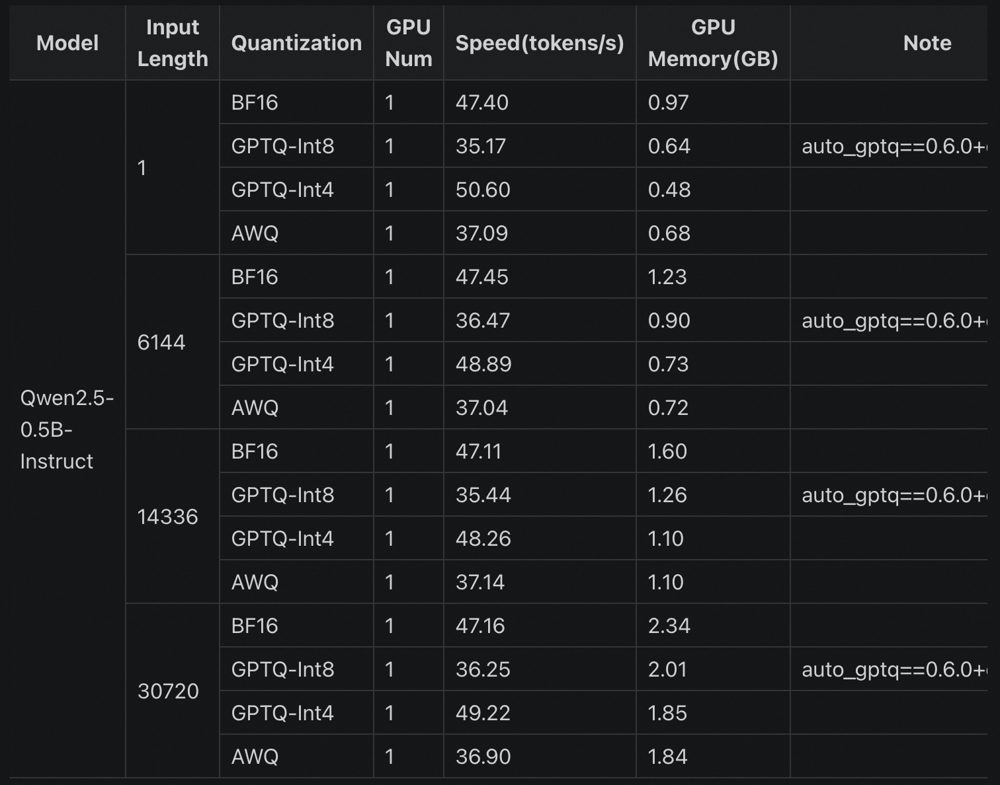

# 速度基准测试

若想进行速度测试（模型在单个请求下的标准速度），得到类似[Qwen官方](https://qwen.readthedocs.io/en/latest/benchmark/speed_benchmark.html)报告的速度基准，如下所示：



可以使用 `--dataset [speed_benchmark|speed_benchmark_long]`来指定速度测试的数据集：

- `speed_benchmark`: 测试[1, 6144, 14336, 30720]长度的prompt，固定输出2048个token。一共8个请求，每个长度的prompt各2个请求。
- `speed_benchmark_long`: 测试[63488, 129024]长度的prompt，固定输出2048个token。一共4个请求，每个长度的prompt各2个请求。


## 在线API推理

```{note}
速度测试`--url`需要使用`/v1/completions`端点，而不是`/v1/chat/completions`，避免chat template的额外处理对输入长度有影响。
```

```bash
evalscope perf \
 --parallel 1 \
 --number 8 \
 --url http://127.0.0.1:8000/v1/completions \
 --model qwen2.5 \
 --log-every-n-query 5 \
 --connect-timeout 6000 \
 --read-timeout 6000 \
 --max-tokens 2048 \
 --min-tokens 2048 \
 --api openai \
 --dataset speed_benchmark
```


## 本地Transformer推理
```bash
CUDA_VISIBLE_DEVICES=0 evalscope perf \
 --parallel 1 \
 --model Qwen/Qwen2.5-0.5B-Instruct \
 --attn-implementation flash_attention_2 \
 --log-every-n-query 5 \
 --connect-timeout 6000 \
 --read-timeout 6000 \
 --max-tokens 2048 \
 --min-tokens 2048 \
 --api local \
 --dataset speed_benchmark \
 --number 8
```

输出示例：
```text
Speed Benchmark Results:
+---------------+-----------------+----------------+
| Prompt Tokens | Speed(tokens/s) | GPU Memory(GB) |
+---------------+-----------------+----------------+
|       1       |      50.69      |      0.97      |
|     6144      |      51.36      |      1.23      |
|     14336     |      49.93      |      1.59      |
|     30720     |      49.56      |      2.34      |
+---------------+-----------------+----------------+
```

## 本地vLLM推理
```bash
CUDA_VISIBLE_DEVICES=0 evalscope perf \
 --parallel 1 \
 --number 8 \
 --model Qwen/Qwen2.5-0.5B-Instruct \
 --log-every-n-query 5 \
 --connect-timeout 6000 \
 --read-timeout 6000 \
 --max-tokens 2048 \
 --min-tokens 2048 \
 --api local_vllm \
 --dataset speed_benchmark 
```

输出示例：
```{note}
GPU使用情况通过`torch.cuda.max_memory_allocated`函数获取，因此此处不展示GPU使用情况。
```
```text
Speed Benchmark Results:
+---------------+-----------------+----------------+
| Prompt Tokens | Speed(tokens/s) | GPU Memory(GB) |
+---------------+-----------------+----------------+
|       1       |     343.08      |      0.0       |
|     6144      |     334.71      |      0.0       |
|     14336     |     318.88      |      0.0       |
|     30720     |     292.86      |      0.0       |
+---------------+-----------------+----------------+
```
